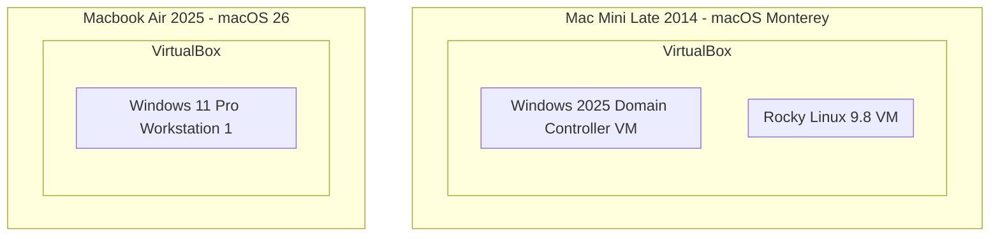

# ELK Stack SIEM Home Lab Architecture

| Field						 | Value 						  		    				|
|---------------------------|-----------------------------------------------------------|
| Document Name 	| ELK Stack SIEM Home Lab Architecture	 							|
| Document Version 	| v0.1.1 															|
| Author			| Terry Humphrey 													|
| Status 		 	| Active 															|
| Last Updated 		| 2026-07-10 														|

---

## Table of Contents
- [1. Purpose](#1-purpose)
- [2. Scope](#2-scope)
- [3. Design Philosophy](#3-design-philosophy)
- [4. Physical Architecture](#4-physical-architecture)
- [5. Deployment Architecture](#5-deployment-architecture)
- [6. Network Architecture](#6-network-architecture)
- [7. Host Inventory](#7-host-inventory)
- [8. Identity Architecture](#8-identity-architecture)
- [9. Elastic Architecture](#9-elastic-architecture)
- [10. Monitoring Architecture](#10-monitoring-architecture)
- [11. Naming Standards](#11-naming-standards)
- [12. Security Architecture](#12-security-architecture)
- [13. Backup Strategy](#13-backup-strategy)
- [14. Planned Enhancements](#14-planned-enhancements)
- [15. Related Documentation](#15-related-documentation)

---


# 1. Purpose

## Overview

The ELK Stack SIEM Home Lab is a self-hosted cybersecurity training environment designed to simulate a small enterprise network. This environment is designed to provide hands-on experience with Security Operations Center (SOC) operations, Elastic SIEM administration, Active Directory management, endpoint monitoring, threat hunting, detection engineering, and incident response.

## Goals

The primary goals of this environment are:

- Learn enterprise security monitoring
- Build practical SIEM experience
- Develop detection engineering skills
- Practice incident response workflows
- Simulate adversary activity
- Build cybersecurity portfolio experience

---

# 2. Scope

## Included Systems

The following systems are a part of this lab:

| System 					| Purpose							|
|---------------------------|-----------------------------------|
| Elastic Stack 			| Centralized logging and analysis	|
| Active Directory 			| Enterprise Identity Management 	|
| Windows Endpoints 		| User workstation simulation		|
| Linux Systems 			| Server Monitoring					|
| Attack Systems 			| Security Testing					|


## Future Systems

The following systems are planned to be included in future iterations of the lab:
- Additional Windows clients
- Additional Linux servers

---

# 3. Design Philosophy

## Principles

This lab follows these design principles:

### Centralized Visibility

All endpoints forward logs to a central Elastic Stack deployment.

### Realistic Enterprise Architecture

Systems are designed to resemble a small business environment.

### Repeatability

All configurations should be documented and reproducible.

### Security Monitoring First

Systems are deployed with logging and detection capabilities as a priority.

# 4. Physical Architecture 



---

# 5. Deployment Architecture

## Deployment Diagram

```mermaid
graph TD
	subgraph MacMini[Mac Mini Late 2014 - macOS Monterey]
  		subgraph VBOX[VirtualBox]
  			subgraph ElasticStackVM[Rocky Linux 9.8 VM]
  				subgraph DockerEngine[Docker]
  					ES[Elasticsearch Container]
  					Kibana[Kibana Container]
  				end
  				Fleet["Elastic Agent<br/>Fleet Server"]
  			end
  			subgraph Win25DC[Windows 2025 Domain Controller VM]
  			end
  		end
 	end
	subgraph MBA[Macbook Air 2025 - macOS 26]
		subgraph VBOX2[VirtualBox]
			subgraph Win11Pro1[Windows 11 Pro Workstation 1]
				W11P1AG[Fleet Agent]
			end
		end
	end
	
	Win11Pro1 --> Win25DC	
	Win11Pro1 --> Fleet
	Win25DC --> Fleet
	Fleet --> ES
	ES --> Kibana
 ```

---

# 6. Network Architecture

## Network Overview

Due to SSH connectivity requirements and existing network addressing within my home environment, the lab shares the same subnet as the production home network. Re-addressing the network was determined to be outside the scope of this project because it would require recreating numerous DHCP reservations and client configurations.

## Network Segmentation

| Network		| Address Space 	|
|---------------|-------------------|
| Home Network	| 192.168.1.0/24	|
| Lab Network 	| 192.168.1.0/24 	|

	
## IP Addresses

| Host 				| IP 							| Purpose 			|
| ------------------|-------------------------------|-------------------|
| elastic-node-01 	| 192.168.1.220 (Port 2222) 	| Elastic Stack 	| 
| WIN2025-01		| 192.168.1.53 					| Domain Controller | 
| WIN11PRO-01 		| DHCP						 	| Workstation 		|
| kali-01 			| TBD 							| Attacker			|

---

## DNS

| Setting 		| Value 							|
|---------------|-----------------------------------|
| DNS Provider	| Active Directory Integrated DNS	|
| Domain		| serenity.lab 						|

## Important Ports

| Port 	| Service 			|
|-------|-------------------|
| 9200 	| Elasticsearch	 	|
| 5601 	| Kibana			|
| 8220 	| Fleet Server	 	|

----

# 7. Host Inventory

| Hostname 			| Operating System 		| Role 							| Status 		|
|-------------------|-----------------------|-------------------------------|---------------|
| elastic-node-01	| Rocky Linux 9.8 		| Elastic Stack/Fleet Server	| Active 		|
| WIN2025-01 		| Windows Server 2025	| Domain Controller 			| Active 		|
| WIN11PRO-01 		| Windows 11 Pro 		| User Workstation 				| In Progress 	|

---

# 8. Identity Architecture 

## Overview

The ELK Stack SIEM Home Lab uses Microsoft Active Directory Domain Services (AD DS) as the centralized identity provider for the Windows environment.

The Active Directory domain provides centralized authentication, authorization, DNS integration, and Group Policy management for domain-joined Windows systems.

## Domain Information

| Setting 						| Value 							|
|---------------------------------------|---------------------------|
| Domain Name 					| serenity.lab 						|
| Forest Functional Level 		| Windows Server 2025 				|
| Domain Functional Level 		| Windows Server 2025 				|
| Primary Domain Controller 	| WIN2025-01 						|
| DNS Role						| Active Directory Integrated DNS	|


## Domain Components

| System 				| Role 								|
|-----------------------|-----------------------------------|
| Windows Server 2025 	| Domain Controller 				|
| Windows 11 Pro 		| Domain-joined Workstation 		|
| Rocky Linux 			| Standalone Linux Host 			| 
| Elastic Stack 		| Standalone Application Services 	|


## Authentication Flow

```mermaid
flowchart TD
	WU[Windows User]
	WW[Windows 11 Workstation]
	AD[Active Directory]
	KA[Kerberos Authentication]
	AG[Access Granted]
	
	WU --> WW --> AD --> KA --> AG
 ```

## Organizational Units

Planned Structure

```
serenity.lab

├── Users
├── Computers
├── Servers
├── Workstations
├── Administrators
└── Service Accounts
```

---

# 9. Elastic Architecture

## Components

| Component 		| Purpose 						| Version 	| Port 	|
|-------------------|-------------------------------|-----------|-------|
| Elasticsearch 	| Data storage and search		| 8.13.4	| 9200	|
| Kibana 			| Visualization and analysis	| 8.13.4	| 5601	|
| Fleet Server 		| Agent management 				| 8.13.4	| 8220	|
| Elastic Agent 	| Endpoint collection 			| 8.13.4	|		|


## Deployment Method

| Component 	| Method 			|
|---------------|-------------------|
| Elasticsearch | Docker Container 	|
| Kibana 		| Docker Container 	|
| Fleet Server 	| Elastic Agent 	|


## Data Flow


---

# 10. Monitoring Architecture

## Linux Monitoring

Primary Data Sources:
- CPU
- Memory
- Network
- Filesystem
- Processes
- Syslog
- Audit logs


## Windows Monitoring

Primary Data Sources:
- Security Events
- System Events
- Application Events
- PowerShell Logs
- Sysmon Events
- Defender Events

---

# 11. Naming Standards

## Hostnames

| Resource 				| Standard 						| Example 			|
|-----------------------|-------------------------------|-------------------|
| Windows Servers 		| WIN2025-XX 					| WIN2025-01		|  
| Windows Workstations	| WIN11PRO-XX 					| WIN11PRO-01		|
| Linux Servers			| lowercase descriptive names	| elastic-node-01	|
| Agent Policies		| Function-based naming			| Windows Servers	|
| Dashboards			| Functional prefix 			| SOC - Overview	|

## Agent Policies
- Windows Servers
- Windows Workstations
- Linux Servers

## Dashboards
- SOC - Overview
- Linux - Infrastructure
- Windows - Endpoints
- Fleet - Agent Health

---

# 12 . Security Architecture

## Security Controls

Current Controls:
- Centralized logging
- Endpoint monitoring
- Identity management
- Role-based access
- Security alerting
- Centralized policy management

---

# 13. Backup Strategy

- Documentation stored in GitHub
- VM Snapshots used for recovery points
- Configuration files maintained for rebuild capabilities

---

# 14. Planned Enhancements

- Kali Linux attack simulation workstation
- Additional Windows workstations
- Additional Linux servers
- Sysmon deployment
- Custom detection rules
- Threat hunting scenarios

---

# 15. Related Documentation

| Document 							| Purpose 																																						|
|-----------------------------------|---------------------------------------------------------------------------------------------------------------------------------------------------------------|
| README.md							| Provides a high-level overview of the ELK Stack SIEM Home Lab, including objectives, architecture, technologies, and documentation index.						|
| 02-Initial-Design.md				| Documents the original objectives, requirements, constraints, technology selections, and architectural decisions.												|
| 03-Elastic-Deployment.md 			| Documents the installation and deployment of Elasticsearch, Kibana, Docker, and the initial Elastic Stack environment.										|
| 04-Elastic-Fleet-Deployment.md    | Documents Elastic Fleet deployment, Fleet Server configuration, Elastic Agent enrollment, agent policies, integrations, and centralized endpoint management.  |
| 05-Windows-AD.md 					| Documents Active Directory, DNS, organizational structure, and identity management configuration.																|
| 06-Windows-Agent.md 				| Documents the deployment, enrollment, and configuration of Elastic Agents on Windows endpoints.																|
| 07-Sysmon.md 						| Documents Sysmon installation, configuration, and Windows endpoint visibility improvements.																	|
| 08-Elastic-Security.md 			| Documents Elastic Security configuration, including detections, alerts, cases, and analyst workflows.															|
| 09-Detection-Rules.md 			| Documents custom detection rules, testing procedures, and MITRE ATT&CK mappings.																				|
| 10-Incident-Response.md 			| Documents incident response workflows, investigations, evidence collection, and lessons learned.																|
| 99-Lab-Journal.md					| Documents lab progress, implementation activities, troubleshooting, decisions, and lessons learned.															|

---

# Revision History

| Version 	| Date			| Changes 										|
|-----------|---------------|-----------------------------------------------|
| v0.1.0	| 2026-07-09	| Initial architecture documentation published	|
| v0.1.1	| 2026-07-10	| Updated Related documentation section.		|

---	


