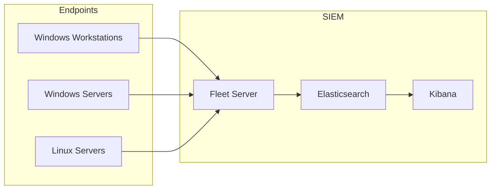

# ELK Stack SIEM Home Lab Initial Design

| Field	            | Value 									|
|-------------------|-------------------------------------------|
| Document Name     | ELK Stack SIEM Home Lab Initial Design    |
| Document Version  | v0.1.0 									|
| Author	        | Terry Humphrey 							|
| Status            | Active 								    |
| Last Updated 	    | 2026-07-09 								|

---

## Table of Contents
- [Executive Summary](#executive-summary)
- [1. Purpose](#1-purpose)
- [2. Project Objectives](#2-project-objectives)
- [3. Learning Objectives](#3-learning-objectives)
- [4. Design Assumptions](#4-design-assumptions)
- [5. Design Requirements](#5-design-requirements)
- [6. Design Constraints](#6-design-constraints)
- [7. Technology Selection](#7-technology-selection)
- [8. Architecture Decisions](#8-architecture-decisions)
- [9. Target Architecture](#9-target-architecture)
- [10. Security Monitoring Strategy](#10-security-monitoring-strategy)
- [11. Future Expansion Plan](#11-future-expansion-plan)
- [12. Success Criteria](#12-success-criteria)
- [13. Risks and Mitigation](#13-risks-and-mitigation)
- [14. Related Documentation](#14-related-documentation)

---

# Executive Summary

This document outlines the original design goals, requirements, and architectural decisions for the ELK Stack SIEM Home Lab before implementation began. The lab was designed to simulate a small enterprise environment using industry-standard technologies while remaining within the constraints of available hardware and a zero-dollar software budget. The primary objective was to build a practical environment for learning SIEM administration, security monitoring, Active Directory, and incident response through hands-on experience. This document serves as the baseline design reference for the implementation and future expansion of the lab.

---

# 1. Purpose

## Overview

The purpose of this document is to describe the original design objectives, requirements, assumptions, and architectural decisions made before the implementation of the ELK Stack SIEM Home Lab environment.

This document provides the rationale behind the final architecture and serves as a reference when making future design changes.

---

# 2. Project Objectives

## Primary Objectives

This lab was designed to provide hands-on experience with:

- Security Operations Center (SOC) workflows
- SIEM administration
- Endpoint monitoring
- Threat detection
- Incident response
- Active Directory security
- Linux administration
- Detection engineering

---

# 3. Learning Objectives

The environment is designed to provide hands-on experience with:

## SIEM Operations

- Deploying and managing Elastic Stack
- Collecting security logs
- Creating dashboards
- Searching security events
- Investigating alerts

## Endpoint Security

- Deploying Elastic Agents
- Monitoring Windows endpoints
- Monitoring Linux servers
- Collecting authentication events

## Detection Engineering

- Writing detection rules
- Mapping activity to MITRE ATT&CK
- Testing detections
- Improving visibility

## Incident Response

- Investigating suspicious activity
- Collecting evidence
- Documenting incidents
- Performing remediation

---

# 4. Design Assumptions

The following assumptions were made during the design process:

- Internet connectivity is available for downloading software and updates.
- Virtual machines may be rebuilt at any time.
- All systems are intended for educational and portfolio development purposes only.
- Hardware resources are limited and must be shared between multiple virtual machines.

---

# 5. Design Requirements

## Functional Requirements

The environment must provide:

| Requirement 		    | Description 							    	|
|-----------------------|-----------------------------------------------|
| Centralized Logging   | All systems send logs to a central platform   |
| Endpoint Visibility 	| Monitor Windows and Linux systems 			|
| Identity Services 	| Provide Active Directory authentication 		|
| Dashboarding 			| Visualize security data 						|
| Search Capability     | Investigate events 							|
| Agent Management      | Centrally manage Elastic Agents		 		|

---

## Security Requirements

The environment should support:

- Authentication monitoring
- Privilege escalation detection
- Suspicious process detection
- PowerShell monitoring
- System activity monitoring
- File integrity monitoring

---

## Operational Requirements

The environment should:

- Be recoverable
- Be documented
- Use repeatable deployment methods
- Allow experimentation
- Support future expansion

---

# 6. Design Constraints

## Hardware Constraints

The environment is limited by available hardware. Currently the following hardware is available for use:

- 2014 Mac Mini running macOS Monterey (12.7.6)
- 2025 MacBook Air running macOS Tahoe 26.5.2
 
| Resource 	| Constraint                                                | Notes                                                                                                                                 |
|-----------|-----------------------------------------------------------|---------------------------------------------------------------------------------------------------------------------------------------|
| CPU       | Intel Processor on Mac Mini, M4 Processor on Macbook Air  | Windows Server 2025 virtualization is limited on Apple Silicon hardware due to ARM-based virtualization compatibility constraints.    | 
| Memory    | Limited RAM allocation									| Mac Mini only has 16GB of RAM. Macbook Air has 32GB																	                |
| Storage	| Local storage only 										| NAS storage is too slow for sustained use in lab environment																            |	
| Budget	| Primarily free/open-source tools 							| I have a $0 budget. This must use freely available resources                                                                          |		

---

## Software Constraints

The environment should prioritize:

- Free licensing
- Open-source components
- Community-supported tools
- Industry-relevant platforms

---

# 7. Technology Selection

## SIEM Platform

Selected:

**Elastic Stack**

Alternatives Considered:

- Splunk
- Microsoft Sentinel
- Wazuh
- Graylog

Reason:

- Industry adoption
- Strong search capabilities
- Security-focused features
- Fleet management
- Extensive documentation
- Free license availability

---

## Virtualization Platform

Selected:

**VirtualBox**

Reason:

- Available on legacy versions of macOS
- Supports multiple operating systems
- Easy snapshots
- Suitable for lab environments

---

## Operating Systems

### Linux Platform

Selected:

**Rocky Linux 9**

Reason:

- Enterprise Linux compatibility
- RHEL-like environment
- Stable lifecycle
- Security-focused ecosystem

### Windows Platform

Selected:

**Windows Server 2025**

Reason:

- Enterprise Active Directory experience
- Current Microsoft platform
- Industry relevance

### Endpoint Platform

Selected:

**Windows 11 Pro**

Reason:

- Common enterprise workstation operating system
- Supports domain joining
- Supports endpoint security tooling
- Current Microsoft workstation platform

---

# 8. Architecture Decisions

## Decision: Centralized SIEM

### Choice

Deploy a centralized Elastic Stack.

### Reason

Centralized analysis is representative of enterprise SOC operations.

---

## Decision: Virtualized Environment

### Choice

Run all servers as virtual machines.

### Reason

Allows snapshots, rapid recovery, portability, and efficient hardware utilization.

---

## Decision: Containerized Elastic Deployment

### Choice

Deploy Elasticsearch and Kibana using Docker Compose containers.

### Reason

Benefits:

- Easier management
- Repeatable deployment
- Isolation
- Simplified upgrades

---

## Decision: Fleet Management

### Choice

Use Elastic Fleet and Elastic Agents.

### Reason

Provides:

- Centralized agent management
- Policy-based configuration
- Scalable endpoint onboarding

---

## Decision: Dedicated Domain Controller

### Choice

Deploy Active Directory on its own server.

### Reason

Matches enterprise deployments and simplifies identity management.

---

## Decision: Active Directory

### Choice

Deploy Windows Server as a Domain Controller.

### Reason

Provides:

- Enterprise identity simulation
- Authentication events
- Group policy experience
- Windows security logging

---

# 9. Target Architecture

---

# 10. Security Monitoring Strategy

The lab will collect logs from:

## Linux Systems

Collected Data:

- System logs
- Authentication logs
- Audit logs
- Performance metrics

---

## Windows Systems

Collected Data:

- Security Event Logs
- PowerShell logs
- Sysmon events
- Defender events

---

# 11. Future Expansion Plan

The design allows future additions:

## Attack Simulation

Potential additions:

- Kali Linux
- Ubuntu Linux servers
- Additional Windows workstations

---

## Additional Monitoring

Potential additions:

- Sysmon
- Zeek
- Suricata
- Vulnerability scanners

---

## Detection Engineering

Future capabilities:

- Custom detection rules
- Sigma rules
- MITRE ATT&CK mapping
- Threat hunting exercises

---

# 12. Success Criteria

The lab will be considered successful when it can:

- Collect logs from Windows and Linux systems
- Display data in Kibana dashboards
- Detect simulated attacks
- Generate Elastic alerts
- Support basic incident investigations
- Produce repeatable documentation

---

# 13. Risks and Mitigations

| Risk 				    | Mitigation 							|
|-----------------------|---------------------------------------|
| Limited hardware 		| Control VM resources 				    |
| Data loss 		    | Backup configurations 				|
| Configuration drift 	| Maintain documentation 			    |
| Licensing limitations | Use free/open-source features 		|
| Hardware failure		| Maintain VM exports and documentation |

# 14. Related Documentation

| Document 					| Purpose 																																	|
|---------------------------|-------------------------------------------------------------------------------------------------------------------------------------------|
| README.md					| Provides a high-level overview of the ELK Stack SIEM Home Lab, including objectives, architecture, technologies, and documentation index.	|
| 01-Architecture.md		| Defines the lab architecture, infrastructure, networking, identity services, Elastic components, and system relationships.				|
| 03-Elastic-Deployment.md 	| Documents the installation and deployment of Elasticsearch, Kibana, and Fleet Server.														|
| 04-Kibana-Fleet-Setup.md 	| Documents Kibana configuration, Fleet Server setup, Elastic Agent enrollment, integrations, policies, and dashboards.						|
| 05-Windows-AD.md 			| Documents Active Directory, DNS, organizational structure, and identity management configuration.											|
| 06-Windows-Agent.md 		| Documents the deployment, enrollment, and configuration of Elastic Agents on Windows endpoints.											|
| 07-Sysmon.md 				| Documents Sysmon installation, configuration, and Windows endpoint visibility improvements.												|
| 08-Elastic-Security.md 	| Documents Elastic Security configuration, including detections, alerts, cases, and analyst workflows.										|
| 09-Detection-Rules.md 	| Documents custom detection rules, testing procedures, and MITRE ATT&CK mappings.															|
| 10-Incident-Response.md 	| Documents incident response workflows, investigations, evidence collection, and lessons learned.											|
| 99-Lab-Journal.md			| Documents lab progress, implementation activities, troubleshooting, decisions, and lessons learned.										|

---

# Revision History

| Version   | Date 			| Changes 							|
|-----------|---------------|-----------------------------------|
| v0.1.0    | 2026-07-09    | Initial design document published |

---	