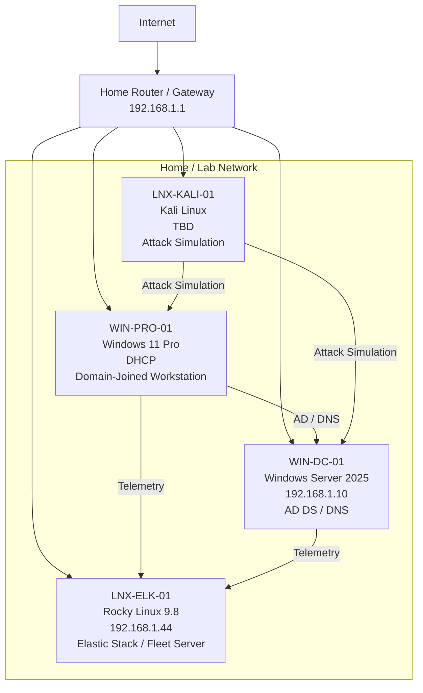

# Enterprise Security Lab Network Design

| Field						 | Value 						  		    				|
|-------------------|-------------------------------------------------------------------|
| Document Name 	| Enterprise Security Lab Network Design 							|
| Document Version 	| v0.1.0 															|
| Author			| Terry Humphrey 													|
| Status 		 	| Active 															|
| Last Updated 		| 2026-07-22 														|

---

## Table of Contents

- [1. Purpose](#1-purpose)
- [2. Scope](#2-scope)
- [3. Network Overview](#3-network-overview)
- [4. Network Topology](#4-network-topology)
- [5. IP Addressing](#5-ip-addressing)
- [6. DNS Architecture](#6-dns-architecture)
- [7. Network Communication](#7-network-communication)
- [8. Required Ports and Services](#8-required-ports-and-services)
- [9. Network Security Considerations](#9-network-security-considerations)
- [10. Future Network Enhancements](#10-future-network-enhancements)
- [11. Related Documentation](#11-related-documentation)

---

# 1. Purpose

## Overview

The Enterprise Security Lab Network Design defines the network architecture and communication design for the Enterprise Security Lab.

The network is designed to support centralized security monitoring, Active Directory services, Elastic Stack SIEM operations, endpoint monitoring and log collection, and security testing within a controlled home lab environment.

This document describes network addressing, DNS, communication flows, required services, and security considerations.

---

# 2. Scope

This document covers:

- Network addressing
- Host IP assignments
- DNS architecture
- Network communication flows
- Required network services
- Required ports
- Network security considerations
- Planned network improvements

This document does not define detailed host configurations or Elastic Stack deployment procedures. Those details are documented separately in the related documentation.

---

# 3. Network Overview

The Enterprise Security Lab operates on the existing home network infrastructure.

Due to SSH connectivity requirements and existing network addressing within the home environment, the lab currently shares the same subnet as the production home network.

Re-addressing or physically isolating the lab network was determined to be outside the current scope of the project because doing so would require changes to existing DHCP reservations and client configurations.

The current design prioritizes functionality and accessibility while recognizing that a shared network introduces additional security considerations.

## Network Addressing

| Network       | Address Space     |
|---------------|-------------------|
| Home Network  | 192.168.1.0/24    |

The lab currently does not use a dedicated VLAN or isolated subnet.

---

# 4. Network Topology

---

# 5. IP Addressing

## Host IP Assignments

| Hostname      | IP Address    | Purpose                       | Assignment    |
|---------------|---------------|-------------------------------|---------------|
| WIN-DC-01     | 192.168.1.10  | Domain Controller / DNS       | Static        |
| LNX-ELK-01    | 192.168.1.44  | Elastic Stack / Fleet Server  | Static        |
| WIN-PRO-01    | DHCP          | Windows Workstation           | DHCP          |
| LNX-KALI-01   | TBD           | Attack Simulation             | TBD           |

## Network Configuration

| Setting           | Value             |
|-------------------|-------------------|
| Network           | 192.168.1.0/24    |
| Default Gateway   | 192.168.1.1       |
| DNS Server        | 192.168.1.10      |
| DNS Domain        | serenity.lab      |

---

# 6. DNS Architecture

Active Directory Integrated DNS provides name resolution for the lab environment.

The Windows Domain Controller hosts the primary DNS service used by domain-joined Windows systems.

| Setting       | Value                             |
|---------------|-----------------------------------|
| DNS Provider  | Active Directory Integrated DNS   |
| DNS Server    | WIN-DC-01                         |
| DNS IP        | 192.168.1.10                      |
| Domain        | serenity.lab                      |

## DNS Requirements

Domain-joined systems use the Active Directory DNS server for internal name resolution and Active Directory service discovery.

The following hosts are expected to resolve through the lab DNS infrastructure:

- WIN-DC-01.serenity.lab
- LNX-ELK-01.serenity.lab
- WIN-PRO-01.serenity.lab

---

# 7. Network Communication

The following communication flows are required for normal lab operations.

## Active Directory

Windows workstations communicate with the Domain Controller for:

- DNS resolution
- Domain authentication
- Kerberos authentication
- Group Policy processing
- Active Directory services
- Public Key Infrastructure

## Elastic Stack

Elastic Agents communicate with the Elastic Stack environment to provide endpoint monitoring and log collection.

The Fleet Server provides centralized Elastic Agent management.

Endpoint log collection is ultimately stored and analyzed by Elasticsearch and Kibana.

## Security Testing

Kali Linux is used to simulate adversary activity against designated lab systems.

Attack simulations are intended to generate realistic security telemetry that can be collected by Elastic Agents and analyzed through Elastic Security.

---

# 8. Required Ports and Services

| Port  | Protocol  | Service               | Source                    | Destination   | Purpose                   |
|-------|-----------|-----------------------|---------------------------|---------------|---------------------------|
| 53    | TCP/UDP   | DNS                   | Lab Systems               | WIN-DC-01     | DNS resolution            |
| 88    | TCP/UDP   | Kerberos              | Windows Clients           | WIN-DC-01     | Authentication            |
| 389   | TCP/UDP   | LDAP                  | Windows Clients           | WIN-DC-01     | Directory services        |
| 445   | TCP       | SMB                   | Windows Clients           | WIN-DC-01     | Windows/AD services       |
| 464   | TCP/UDP   | Kerberos Password     | Windows Clients           | WIN-DC-01     | Password operations       |
| 636   | TCP       | LDAPS                 | TBD                       | WIN-DC-01     | Secure LDAP               |
| 3268  | TCP       | Global Catalog        | Windows Clients           | WIN-DC-01     | Directory queries         |
| 3269  | TCP       | Global Catalog SSL    | TBD                       | WIN-DC-01     | Secure directory queries  |
| 5601  | TCP       | Kibana                | Administrator / Analyst   | LNX-ELK-01    | Kibana access             |
| 8220  | TCP       | Fleet Server          | Elastic Agents            | LNX-ELK-01    | Agent management          |
| 9200  | TCP       | Elasticsearch         | Elastic Components        | LNX-ELK-01    | Elasticsearch API         |
| 22    | TCP       | SSH                   | Administrator             | LNX-ELK-01    | Linux administration      |

> Port requirements may expand as additional services and systems are deployed.

---

# 9. Network Security Considerations

## Shared Network

The lab currently shares the same subnet as the production home network.

This design provides network connectivity between lab systems and simplifies administration but reduces network isolation.

The lab should therefore be treated as a controlled environment rather than a fully isolated enterprise security network.

## Security Implications

Because the lab shares the production network:

- Attack simulations must be restricted to designated lab systems.
- Vulnerability scanning must not target unauthorized systems.
- Kali Linux activity must remain within the defined lab scope.
- Firewall rules should be used where practical to restrict unnecessary access.
- Administrative services should not be exposed to the public Internet.
- Lab systems should be monitored for unexpected communication with production systems.

## Future Segmentation

Future network improvements may include:

- Dedicated lab VLAN
- Dedicated lab subnet
- Firewall-based segmentation
- Separate DHCP scope
- Restricted inter-VLAN routing
- Isolated attack simulation network

These changes are outside the current scope but may be implemented as the lab expands.

---

# 10. Future Network Enhancements

Planned network improvements include:

- Implement dedicated lab network segmentation
- Evaluate VLAN-based isolation
- Restrict administrative services to trusted systems
- Implement additional firewall rules
- Expand network monitoring
- Add additional Windows and Linux systems
- Add dedicated attack simulation infrastructure

---

# 11. Related Documentation

| Document                          | Purpose                                                                                                                                                           |
|-----------------------------------|-------------------------------------------------------------------------------------------------------------------------------------------------------------------|
| README.md                         | High-level overview of the Enterprise Security Lab, objectives, architecture, technologies, hardware inventory, capabilities, and documentation index.            |
| 01-Architecture.md                | Overall lab architecture, physical hardware, virtualization layout, server roles, infrastructure components, and system relationships.                            |
| 03-Asset-Inventory.md             | Inventory of physical devices, VMs, operating systems, hostnames, IP addresses, and system roles/ownership.                                                       |
| 04-Active-Directory.md            | Active Directory architecture, OUs, users, groups, naming conventions, GPOs, authentication, and identity management.                                             |
| 05-Certificate-Authority-PKI.md   | Enterprise CA, certificate templates, trust relationships, certificate lifecycle, and PKI implementation.                                                         |
| 06-Server-Build-Standards.md      | Baseline configuration standards for Windows and Linux servers, including naming, security settings, and required services.                                       |
| 07-Elastic-Deployment.md          | Elasticsearch and Kibana installation, configuration, cluster architecture, and core Elastic Stack infrastructure.                                                |
| 08-Elastic-Fleet-Deployment.md    | Fleet Server, agent policies, integrations, enrollment, and centralized agent management.                                                                         |
| 09-Windows-Agent.md               | Elastic Agent deployment, configuration, integrations, validation, and troubleshooting for Windows endpoints.                                                     |
| 10-Linux-Agent.md                 | Elastic Agent deployment, configuration, integrations, validation, and troubleshooting for Linux systems.                                                         |
| 11-Sysmon.md                      | Sysmon installation, configuration, event collection, telemetry, and Elastic integration.                                                                         |
| 12-Elastic-Security.md            | Elastic Security configuration, detection alerting, dashboards, cases, investigations, and analyst workflows.                                                     |
| 13-Detection-Rules.md             | The 30 custom detection rules, KQL, index patterns, severity, risk scores, MITRE ATT&CK mappings, validation status, tuning, and false-positive considerations.   |
| 14-Vulnerability-Management.md    | Vulnerability scanning, risk prioritization, remediation workflows, and verification.                                                                             |
| 15-Patch-Management.md            | WSUS deployment, update approvals, client targeting, maintenance windows, and patch compliance.                                                                   |
| 16-Incident-Response.md           | Incident response lifecycle, alert triage, investigation, containment, eradication, recovery, and lessons learned.                                                |
| 17-Investigation-Runbooks.md      | New. Step-by-step analyst procedures for investigating high-value alerts and detection scenarios.                                                                 |
| 18-Backup-Recovery.md             | Backup strategy, VM recovery, file restoration, disaster recovery, and recovery validation.                                                                       |
| 19-Security-Hardening.md          | Windows/Linux hardening, security baselines, auditing, logging, and defensive controls.                                                                           |
| 20-NIST-CSF-Mapping.md            | Maps lab capabilities to the NIST Cybersecurity Framework and demonstrates alignment with enterprise security practices.                                          |
| 99-Lab-Journal.md                 | Chronological implementation record, troubleshooting, design decisions, testing, snapshots, and future improvements.                                              |

---
