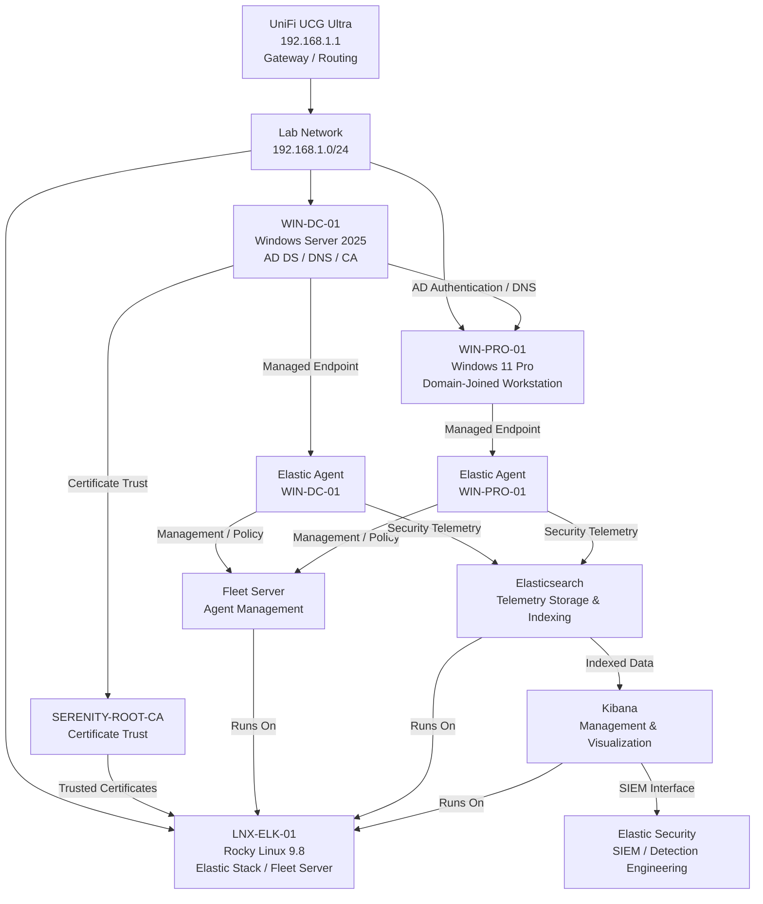

# Enterprise Security Lab Asset Inventory

| Field             | Value                        |
|-------------------|------------------------------|
| Document Name     | Asset Inventory              |
| Document Version  | v0.1.0                       |
| Author            | Terry Humphrey               |
| Status            | Active                       |
| Last Updated      | 2026-07-24                   |

---

## Table of Contents

- [1. Purpose](#1-purpose)
- [2. Scope](#2-scope)
- [3. Asset Inventory Overview](#3-asset-inventory-overview)
- [4. Physical Hardware](#4-physical-hardware)
- [5. Virtual Machines](#5-virtual-machines)
- [6. Windows Systems](#6-windows-systems)
- [7. Linux Systems](#7-linux-systems)
- [8. Network Infrastructure](#8-network-infrastructure)
- [9. Security Infrastructure](#9-security-infrastructure)
- [10. Asset Relationships](#10-asset-relationships)
- [11. Asset Status](#11-asset-status)
- [12. Planned Enhancements](#12-planned-enhancements)
- [13. Related Documentation](#13-related-documentation)

---

# 1. Purpose

## Overview

This document provides an inventory of the physical and virtual assets that make up the Enterprise Security Lab.

The asset inventory establishes a centralized reference for hardware, virtual machines, operating systems, network infrastructure, security infrastructure, and system roles.

The inventory supports:

- Infrastructure management
- Security monitoring
- Asset identification
- System documentation
- Vulnerability management
- Patch management
- Incident response
- Detection engineering
- Lab architecture planning

---

# 2. Scope

This document covers:

- Physical hardware
- Virtual machines
- Windows systems
- Linux systems
- Network infrastructure
- Security infrastructure
- Asset relationships
- Asset status

This document does not provide detailed installation or configuration procedures for individual systems.

Detailed configuration information is documented separately.

---

# 3. Asset Inventory Overview

The Enterprise Security Lab uses a combination of physical Apple hardware, virtual machines, network infrastructure, and security platforms to simulate a small enterprise environment.

The lab currently includes:

- Physical Mac systems
- Windows virtual machines
- Linux virtual machines
- Active Directory
- Internal Certificate Authority
- Elastic Stack
- Elastic Fleet
- Elastic Agents
- Windows security telemetry
- Sysmon telemetry
- Kali Linux attack simulation capabilities

---

# 4. Physical Hardware

## Physical Asset Inventory

| Asset ID  | Device                    | Operating System | RAM    | Storage   | Primary Role                                      | Status |
|-----------|---------------------------|------------------|--------|-----------|---------------------------------------------------|--------|
| HW-001    | MacBook Air M4            | macOS 26         | 32 GB  | 1 TB      | Primary virtualization and administration system  | Active |
| HW-002    | Mac Mini Late 2014        | macOS 12.7.6     | 16 GB  | 1.2 TB    | Virtualization host / infrastructure services     | Active |
| HW-003    | MacBook Pro Early 2015    | macOS 12.7.6     | 8 GB   | 1 TB      | Virtualization host / server workloads            | Active |
| HW-004    | Mac Mini Late 2014        | Windows 10       | 8 GB   | 1 TB      | Windows infrastructure workload host              | Active |

## Primary Lab System

The MacBook Air M4 serves as the primary administrative and virtualization system for the lab.

Primary workloads include:

- Windows virtual machines
- Kali Linux virtual machine
- Ubuntu Linux virtual machine
- Security administration
- Lab documentation
- Infrastructure management

---

# 5. Virtual Machines

## Virtual Machine Inventory

| Asset ID  | Hostname      | Operating System      | IP Address    | Role                                              | Status    |
|-----------|---------------|-----------------------|---------------|---------------------------------------------------|-----------|
| VM-001    | WIN-DC-01     | Windows Server 2025   | 192.168.1.10  | Active Directory / DNS / Certificate Authority    | Active    |
| VM-002    | WIN-PRO-01    | Windows 11 Pro        | 192.168.1.51  | Domain-joined workstation                         | Active    |
| VM-003    | LNX-ELK-01    | Rocky Linux 9.8       | 192.168.1.44  | Elasticsearch / Kibana / Fleet Server             | Active    |
| VM-004    | LNX-KALI-01   | Kali Linux            | TBD           | Security testing and attack simulation            | Planned   |
| VM-005    | LNX-UBU-01    | Ubuntu Linux          | TBD           | Linux server workload / testing                   | Planned   |
| VM-006    | WIN-WSUS-01   | Windows Server 2025   | TBD           | Linux server workload                             | Planned   |
| VM-007    | LNX-DB-01     | Linux                 | TBD           | Database server workload                          | Planned   |
| VM-008    | LNX-WEB-01    | Linux                 | TBD           | Web server workload                               | Planned   |

## Rocky Linux Elastic Server

| Setting               | Value                         |
|-----------------------|-------------------------------|
| Hostname              | LNX-ELK-01                    |
| Operating System      | Rocky Linux 9.8               |
| IP Address            | 192.168.1.44                  |
| RAM                   | 8 GB                          |
| CPU                   | 2 vCPU                        |
| Storage               | 100 GB                        |
| Deployment            | Virtual Machine               |
| Container Platform    | Docker                        |
| Primary Role          | Elastic Stack / Fleet Server  |
| Status                | Active                        |

The Rocky Linux server hosts:

- Elasticsearch
- Kibana
- Fleet Server
- Elastic Agent infrastructure

---

# 6. Windows Systems

## Windows Asset Inventory

| Hostname      | Operating System      | IP Address   | Role                           | Domain Status     | Security Telemetry | Status |
|---------------|-----------------------|--------------|--------------------------------|-------------------|--------------------|--------|
| WIN-DC-01     | Windows Server 2025   | 192.168.1.10 | Domain Controller / DNS / CA   | Domain Controller | Elastic Agent      | Active |
| WIN-PRO-01    | Windows 11 Pro        | 192.168.1.51 | Domain-Joined Workstation      | Domain Joined     | Elastic Agent      | Active |

## WIN-DC-01

The primary Windows Server in the lab provides centralized identity and infrastructure services.

Responsibilities include:

- Active Directory Domain Services
- DNS
- Certificate Authority
- Domain authentication
- Group Policy
- Certificate trust services

Security telemetry is collected using Elastic Agent and forwarded to the Elastic Stack.

## WIN-PRO-01

The Windows 11 Pro workstation represents a domain-joined enterprise endpoint.

Responsibilities include:

- User workstation simulation
- Domain authentication
- Group Policy processing
- Endpoint security telemetry
- Security testing target

---

# 7. Linux Systems

## Linux Asset Inventory

| Hostname      | Operating System  | IP Address    | Role                              | Security Telemetry | Status    |
|---------------|-------------------|---------------|-----------------------------------|--------------------|-----------|
| LNX-ELK-01    | Rocky Linux 9.8   | 192.168.1.44  | Elastic Stack / Fleet Server      | Elastic Agent      | Active    |
| LNX-UBU-01    | Ubuntu Linux      | TBD           | Linux server workload / testing   | Planned            | Planned   |
| LNX-DB-01     | Linux             | TBD           | Database server                   | Planned            | Planned   |
| LNX-WEB-01    | Linux             | TBD           | Web server                        | Planned            | Planned   |

The Linux environment provides infrastructure workloads and additional logging and monitoring sources for the Elastic SIEM.

---

# 8. Network Infrastructure

## Network Asset Inventory

| Asset ID  | Device          | IP Address  | Role                                 | Status |
|-----------|-----------------|-------------|--------------------------------------|--------|
| NET-001   | UniFi UCG Ultra | 192.168.1.1 | Network gateway / firewall / routing | Active |

## Network Configuration

The Enterprise Security Lab operates on the local home network and uses the UniFi UCG Ultra as the primary network gateway and security appliance.

The lab currently uses the `192.168.1.0/24` network.

Key infrastructure addresses include:

| Hostname      | IP Address   | Role                           |
|---------------|--------------|--------------------------------|
| WIN-DC-01     | 192.168.1.10 | Active Directory / DNS / CA    |
| LNX-ELK-01    | 192.168.1.44 | Elastic Stack / Fleet Server   |

---

# 9. Security Infrastructure

## Security Asset Inventory

| Asset                 | Host                      | Role                                    | Status |
|-----------------------|---------------------------|-----------------------------------------|--------|
| Active Directory      | WIN-DC-01                 | Centralized identity and authentication | Active |
| DNS                   | WIN-DC-01                 | Internal name resolution                | Active |
| Certificate Authority | WIN-DC-01                 | Internal PKI and certificate trust      | Active |
| Elasticsearch         | LNX-ELK-01                | Security telemetry storage and indexing | Active |
| Kibana                | LNX-ELK-01                | SIEM management and visualization       | Active |
| Fleet Server          | LNX-ELK-01                | Elastic Agent management                | Active |
| Elastic Agents        | Windows / Linux endpoints | Endpoint telemetry collection           | Active |
| Elastic Security      | LNX-ELK-01                | SIEM and detection engineering          | Active |
| Sysmon                | Windows endpoints         | Advanced Windows telemetry              | Active |
| Kali Linux            | LNX-KALI-01               | Attack simulation and security testing  | Planned |

---

# 10. Asset Relationships

## Infrastructure Relationship Diagram

# Asset Dependency Summary

The primary dependencies within the lab are:

1. Windows endpoints depend on `WIN-DC-01` for Active Directory authentication and DNS.
2. Windows Elastic Agents depend on Fleet Server for centralized management.
3. Elastic Agents forward telemetry to Elasticsearch.
4. Kibana provides access to Elasticsearch data and Elastic Security.
5. The internal Certificate Authority provides certificate trust for secured services.
6. The UniFi gateway provides network connectivity and routing for lab systems.

---

# 11. Asset Status

The current environment contains a mixture of active and planned infrastructure.

## Active Assets

- `WIN-DC-01`
- `WIN-PRO-01`
- `LNX-ELK-01`
- Active Directory
- DNS
- Certificate Authority
- Elasticsearch
- Kibana
- Fleet Server
- Windows Elastic Agent
- Linux Elastic Agent infrastructure
- Elastic Security
- UniFi UCG Ultra
- Sysmon deployment

## Planned Assets and Capabilities

- `LNX-KALI-01`
- Additional Windows workstations
- Additional Linux servers
- Elastic Defend deployment
- Database server
- Web server
- WSUS infrastructure

Asset status should be updated as systems are deployed, retired, or repurposed.

---

# 12. Planned Enhancements

Planned improvements include:

- Assign unique asset IDs to all production and virtual assets
- Complete missing IP address assignments
- Document virtualization host assignments
- Document VM resource allocations
- Add MAC addresses where useful for infrastructure management
- Add hardware serial numbers where appropriate
- Expand endpoint inventory as systems are deployed
- Integrate asset inventory with vulnerability management
- Integrate asset inventory with patch management
- Maintain asset lifecycle status
- Add asset criticality classifications

---

# 13. Related Documentation

| Document                          | Purpose                                                                                                                                                           |
|-----------------------------------|-------------------------------------------------------------------------------------------------------------------------------------------------------------------|
| README.md                         | High-level overview of the Enterprise Security Lab, objectives, architecture, technologies, hardware inventory, capabilities, and documentation index.            |
| 01-Architecture.md                | Overall lab architecture, physical hardware, virtualization layout, server roles, infrastructure components, and system relationships.                            |
| 02-Network-Design.md              | Network architecture, IP addressing, DNS, communication flows, firewall requirements, segmentation, and network security considerations.                          |
| 04-Active-Directory.md            | Active Directory architecture, OUs, users, groups, naming conventions, GPOs, authentication, and identity management.                                             |
| 05-Certificate-Authority-PKI.md   | Enterprise CA, certificate templates, trust relationships, certificate lifecycle, and PKI implementation.                                                         |
| 06-Server-Build-Standards.md      | Baseline configuration standards for Windows and Linux servers, including naming, security settings, and required services.                                       |
| 07-Elastic-Deployment.md          | Elasticsearch and Kibana installation, configuration, cluster architecture, and core Elastic Stack infrastructure.                                                |
| 08-Elastic-Fleet-Deployment.md    | Fleet Server, agent policies, integrations, enrollment, and centralized agent management.                                                                         |
| 09-Windows-Agent.md               | Elastic Agent deployment, configuration, integrations, validation, and troubleshooting for Windows endpoints.                                                     |
| 10-Linux-Agent.md                 | Elastic Agent deployment, configuration, integrations, validation, and troubleshooting for Linux systems.                                                         |
| 11-Sysmon.md                      | Sysmon installation, configuration, event collection, telemetry, and Elastic integration.                                                                         |
| 12-Elastic-Security.md            | Elastic Security configuration, detection alerting, dashboards, cases, investigations, and analyst workflows.                                                     |
| 13-Detection-Rules.md             | The 30 custom detection rules, KQL, index patterns, severity, risk scores, MITRE ATT&CK mappings, validation status, tuning, and false-positive considerations.   |
| 14-Vulnerability-Management.md    | Vulnerability scanning, risk prioritization, remediation workflows, and verification.                                                                             |
| 15-Patch-Management.md            | WSUS deployment, update approvals, client targeting, maintenance windows, and patch compliance.                                                                   |
| 16-Incident-Response.md           | Incident response lifecycle, alert triage, investigation, containment, eradication, recovery, and lessons learned.                                                |
| 17-Investigation-Runbooks.md      | New. Step-by-step analyst procedures for investigating high-value alerts and detection scenarios.                                                                 |
| 18-Backup-Recovery.md             | Backup strategy, VM recovery, file restoration, disaster recovery, and recovery validation.                                                                       |
| 19-Security-Hardening.md          | Windows/Linux hardening, security baselines, auditing, logging, and defensive controls.                                                                           |
| 20-NIST-CSF-Mapping.md            | Maps lab capabilities to the NIST Cybersecurity Framework and demonstrates alignment with enterprise security practices.                                          |
| 99-Lab-Journal.md                 | Chronological implementation record, troubleshooting, design decisions, testing, snapshots, and future improvements.                                              |

---

# Revision History

| Version   | Date	  		| Changes 									          	                                        |
|-----------|---------------|-----------------------------------------------------------------------------------------------|
| v0.1.0    | 2026-07-24    | Initial Asset Inventory documentation published                                               |