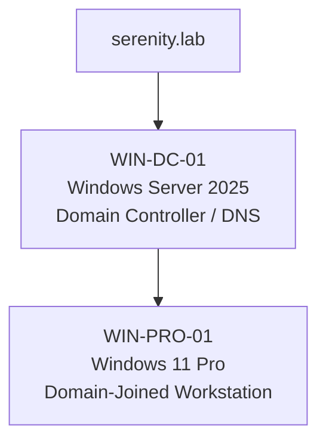
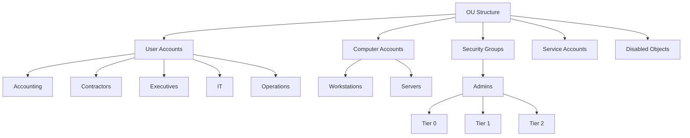
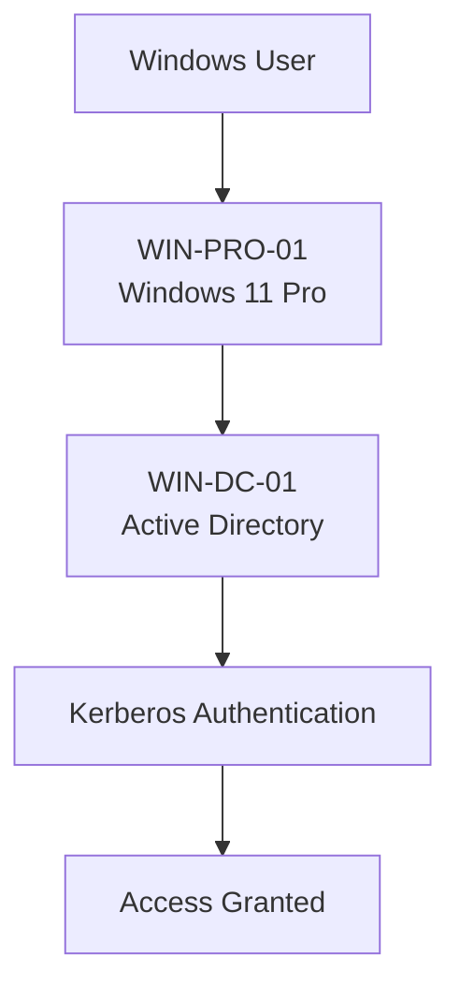
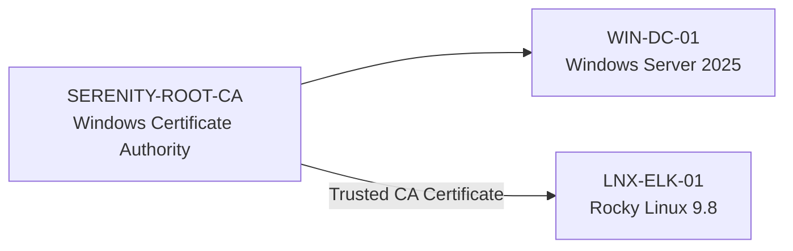

# Enterprise Security Lab Active Directory Architecture and Configuration

| Field				| Value 	    			|
|-------------------|---------------------------|
| Document Name     | Active Directory          |
| Document Version  | v0.2.0 					|
| Author            | Terry Humphrey 			|
| Status 		    | Active					|
| Last Updated 		| 2026-07-23 				|


---

## Table of Contents

- [1. Purpose](#1-purpose)
- [2. Scope](#2-scope)
- [3. Active Directory Overview](#3-active-directory-overview)
- [4. Domain Architecture](#4-domain-architecture)
- [5. Domain Controller](#5-domain-controller)
- [6. DNS Integration](#6-dns-integration)
- [7. Organizational Unit Structure](#7-organizational-unit-structure)
- [8. Security Groups](#8-security-groups)
- [9. User Design](#9-user-design)
- [10. Group Policy](#10-group-policy)
- [11. Domain-Joined Systems](#11-domain-joined-systems)
- [12. Authentication and Identity Flow](#12-authentication-and-identity-flow)
- [13. Certificate Authority Integration](#13-certificate-authority-integration)
- [14. Security Considerations](#14-security-considerations)
- [15. Validation and Testing](#15-validation-and-testing)
- [16. Planned Enhancements](#16-planned-enhancements)
- [17. Related Documentation](#17-related-documentation)

---

# 1. Purpose

## Overview

This document describes the Active Directory architecture and configuration used within the Enterprise Security Lab.

Active Directory Domain Services (AD DS) provides centralized identity management, authentication, authorization, DNS integration, and Group Policy management for the Windows systems within the lab environment.

The Active Directory environment is designed to simulate common enterprise identity and management practices while providing a foundation for security monitoring and detection engineering.

## Goals

The primary goals of the Active Directory environment are:

- Implement centralized identity management
- Provide centralized authentication and authorization
- Manage domain-joined Windows systems
- Provide Active Directory integrated DNS
- Implement Group Policy management
- Generate security-relevant authentication and administrative events
- Provide identity-related telemetry to the Elastic SIEM
- Support security monitoring and detection engineering

---

# 2. Scope

This document covers:

- Active Directory domain architecture
- Domain Controller configuration
- Active Directory integrated DNS
- Organizational Units
- Users and groups
- Group Policy
- Domain-joined systems
- Authentication flows
- Certificate Authority integration
- Security considerations
- Validation and testing

This document does not cover detailed Elastic Agent deployment or Elastic Stack configuration. Those procedures are documented separately.

---

# 3. Active Directory Overview

The Enterprise Security Lab uses Microsoft Active Directory Domain Services as the centralized identity provider for the Windows environment.

The Active Directory domain provides:

- Centralized authentication
- Authorization
- User and group management
- Computer account management
- Group Policy management
- DNS integration
- Kerberos authentication
- LDAP directory services
- Security event generation

The Active Directory environment is also used as a source of security log collection for the Elastic Stack SIEM.

---

# 4. Domain Architecture

## Domain Information

| Setting                   | Value                 |
|---------------------------|-----------------------|
| Domain Name               | serenity.lab          |
| NetBIOS Name              | SERENITY              |
| Forest Name               | serenity.lab          |
| Domain Functional Level   | Windows Server 2025   |
| Forest Functional Level   | Windows Server 2025   |
| Domain Controller         | WIN-DC-01             |
| Domain Controller IP      | 192.168.1.10          |
| DNS Server                | 192.168.1.10          |

## Domain Architecture Diagram



---

# 5. Domain Controller

## Server Information

| Setting           | Value                             |
|-------------------|-----------------------------------|
| Hostname          | WIN-DC-01                         |
| Operating System  | Windows Server 2025               |
| Server Role       | Active Directory Domain Services  |
| IP Address        | 192.168.1.10                      |
| DNS Role          | Active Directory Integrated DNS   |
| Domain            | serenity.lab                      |
| Status            | Active                            |

## Installed Roles and Services

- Active Directory Domain Services
- DNS Server
- Active Directory Integrated DNS

## Domain Controller Responsibilities

The Domain Controller provides:

- User authentication
- Computer authentication
- Kerberos authentication
- LDAP directory services
- Active Directory management
- Group Policy processing
- DNS services
- Domain membership services

---

# 6. DNS Integration

Active Directory Integrated DNS provides name resolution for the lab environment.

Domain-joined Windows systems use the Domain Controller as their primary DNS server.

| Setting           | Value                         |
|-------------------|-------------------------------|
| DNS Server        | WIN-DC-01                     |
| DNS IP Address    | 192.168.1.10                  |
| DNS Domain        | serenity.lab                  |
| DNS Type          | Active Directory Integrated   |

## DNS Records

The following systems are expected to resolve through the Active Directory DNS infrastructure:

- WIN-DC-01.serenity.lab
- LNX-ELK-01.serenity.lab
- WIN-PRO-01.serenity.lab

## DNS Validation

DNS resolution was validated using:

- `nslookup`
- `ping`
- Hostname resolution tests
- Forward DNS resolution

---

# 7. Organizational Unit Structure

## Purpose

Organizational Units (OUs) allow logical organization and Group Policy assignment.

## Implemented OUs

From Powershell, run the script 'Create-OUs.ps1'

This script automatically generates the OU's required for the Serenity Lab. 

PowerShell Script:

```powershell
.\Create-OUs.ps1
```





| OU / Sub-OU       | Parent                | Purpose                                                               |
|-------------------|-----------------------|-----------------------------------------------------------------------|
| User Accounts     | OU Structure (root)   | Container for all department-based user OUs                           |
| Accounting        | User Accounts         | Accounting department user accounts                                   |
| Contractors       | User Accounts         | External/contractor user accounts                                     |
| Executives        | User Accounts         | Executive user accounts                                               |
| IT                | User Accounts         | IT department user accounts                                           |
| Operations        | User Accounts         | Operations department user accounts                                   |
| Computer Accounts | OU Structure (root)   | Container for all device-based OUs                                    |
| Workstations      | Computer Accounts     | End-user workstation computer objects                                 |
| Servers           | Computer Accounts     | Server computer objects                                               |
| Security Groups   | OU Structure (root)   | Container for security group objects                                  |
| Admins            | Security Groups       | Tiered administrative accounts                                        |
| Tier 0            | Admins                | Domain/forest-level admin accounts (DCs, AD itself)                   |
| Tier 1            | Admins                | Server administration accounts                                        |
| Tier 2            | Admins                | Workstation/helpdesk-level administration accounts                    |
| Service Accounts  | OU Structure (root)   | Service accounts used by applications/scheduled tasks                 |
| Disabled Objects  | OU Structure (root)   | Holding location for disabled user/computer objects prior to deletion |


**Note:** The built-in `CN=Users` and `CN=Computers` containers are **containers, not true OUs**, and cannot have Group Policy linked to them directly. During initial AD automation this was identified early, so custom-named OUs (Servers, Workstations, Service Accounts) were created instead of reusing default container names — avoiding namespace conflicts with the built-in containers.


## Quick OU Map

This is a very useful command to get a fast overview of current AD OU structure:

```powershell
Get-ADOrganizationalUnit -Filter * | Sort-Object DistinguishedName | Format-Table Name, DistinguishedName
```


---

# 8. Security Groups

## Group Creation

From Powershell, run the script 'Create-Groups.ps1'

This script automatically generates the groups required for the Serenity Lab. 

PowerShell Script:

```powershell
.\Create-Groups.ps1
```

| Security Group              | Purpose                                   |
|----------------------------|--------------------------------------------|
| Accounting                 | Finance and accounting staff               |
| Compliance                 | Compliance and audit personnel             |
| Contractors                | Temporary contract personnel               |
| Developers                 | Software development access                |
| Executive                  | Executive leadership accounts              |
| Help Desk                  | End-user support staff                     |
| Human Resources            | Human resources personnel                  |
| IT Administrators          | Administrative IT management               |
| Operations                 | General operations staff                   |
| Remote Users               | Users authorized for remote access         |
| Sales                      | Sales department personnel                 |
| Server Administrators      | Server administration privileges           |
| Service Accounts           | Non-interactive application accounts       |
| Vendors                    | External vendor accounts                   |
| Workstation Administrators | Workstation administration privileges      |

---

# 9. User Design


## Administrative Accounts

Recommended accounts:

| Account           | Purpose                   |
|-------------------|---------------------------|
| Administrator     | Built-in domain admin     |
| admin.serenity    | Security administration   |
| zoe.washburne     | Security testing          |

## User Creation

From Powershell, run the script 'Create-Users.ps1'

This script automatically generates the users required for the Serenity Lab and assigns them to the appropriate groups. 

PowerShell Script:

```powershell
.\Create-Users.ps1
```


Users were created via a custom PowerShell script that creates all lab user accounts and assigns them to their proper security groups.


| Username           | Display Name             | Department        | AD Groups                                  |
|--------------------|--------------------------|-------------------|--------------------------------------------|
| admin.serenity     | Serenity Administrator   | IT                | IT Administrators                          |
| badger             | Adelei Niska "Badger"    | Vendors           | Vendors                                    |
| derrial.book       | Derrial Book             | Compliance        | Compliance                                 |
| hoban.washburne    | Hoban Washburne          | IT Operations     | Workstation Administrators                 |
| inara.serra        | Inara Serra              | Human Resources   | Human Resources                            |
| jayne.cobb         | Jayne Cobb               | Operations        | Operations                                 |
| kaylee.frye        | Kaylee Frye              | Engineering       | Developers                                 |
| malcolm.reynolds   | Malcolm Reynolds         | Executive         | Executive, Remote Users                    |
| monty              | Monty                    | Help Desk         | Help Desk                                  |
| river.tam          | River Tam                | Security          | IT Security                                |
| saffron            | Bridget Haymer           | Sales             | Sales                                      |
| simon.tam          | Simon Tam                | Research          | Developers                                 |
| svc.backup         | Backup Service           | Service Accounts  | Service Accounts                           |
| svc.elastic        | Elastic Service Account  | Service Accounts  | Service Accounts                           |
| svc.monitoring     | Monitoring Service       | Service Accounts  | Service Accounts                           |
| tracey.smith       | Tracey Smith             | Finance           | Accounting                                 |
| yo.saf.bridge      | YoSaffBridge             | Contractors       | Contractors                                |
| zoe.washburne      | Zoe Washburne            | IT Operations     | IT Administrators, Server Administrators   |

---


# 10. Group Policy

Group Policy is used to centrally manage security and configuration settings for domain-joined Windows systems.

## Planned Group Policy Areas

- Windows security configuration
- Windows auditing
- PowerShell logging
- Advanced audit policies
- Windows Defender configuration
- Windows Firewall configuration
- Security event logging
- System hardening
- Endpoint configuration

## Current Group Policy Configuration

Document implemented policies below as they are deployed.

| Policy                    | Purpose                       | Status          |
|---------------------------|-------------------------------|-----------------|
| Default Domain Policy     | Default domain configuration  | Active          |
| Security Auditing Policy  | Security event collection     | Active          |
| PowerShell Logging Policy | PowerShell visibility         | Active          |
| Windows Defender Policy   | Endpoint security             | Not Validated   |
| Windows Firewall Policy   | Host firewall configuration   | Not Validated   |

---

# 11. Domain-Joined Systems

## Windows Systems

| Hostname      | Operating System      | Role              | Domain Status |
|---------------|-----------------------|-------------------|---------------|
| WIN-DC-01     | Windows Server 2025   | Domain Controller | Active        |
| WIN-PRO-01    | Windows 11 Pro        | Workstation       | Domain Joined |

## Domain Join Process

Windows workstations are joined to the `serenity.lab` domain using the Active Directory Domain Controller.

The domain join process requires:

1. DNS configured to use the Domain Controller
2. Network connectivity to the Domain Controller
3. Valid domain credentials
4. Successful domain membership validation
5. Successful user authentication

---

# 12. Authentication and Identity Flow

The Active Directory environment uses Kerberos as the primary authentication protocol for domain authentication.



## Authentication Services

The Active Directory environment provides:

- Kerberos authentication
- LDAP directory services
- DNS-based service discovery
- Group Policy processing
- Domain authentication
- Computer account authentication

---

# 13. Certificate Authority Integration

The Domain Controller environment includes a Microsoft Certificate Authority used to provide internal PKI services for the lab.

## Certificate Authority Information

| Setting   | Value                 |
|-----------|-----------------------|
| CA Name   | SERENITY-ROOT-CA      |
| CA Type   | Enterprise Root CA    |
| Host      | WIN-DC-01             |
| Domain    | serenity.lab          |
| Status    | Active                |
| CA Role   | Root Issuing CA       | 

## PKI Integration

The internal Certificate Authority provides trusted certificates for lab services and systems.

The CA certificate has been exported and installed as a trusted Certificate Authority on the Rocky Linux Elastic Stack server.

This allows Linux-based lab systems to trust certificates issued by the internal PKI.

## Certificate Trust Flow



Detailed PKI configuration is documented in:

`05-Certificate-Authority-PKI.md`

---

# 14. Security Considerations

## Identity Security

The Active Directory environment is treated as a critical security component of the lab.

Security considerations include:

- Strong administrative credentials
- Separation of administrative and standard accounts
- Least-privilege access
- Controlled administrative access
- Security event auditing
- Centralized log collection
- Monitoring of authentication activity

## Monitoring

Active Directory security events are collected and analyzed through the Elastic Stack.

Monitored activity may include:

- Successful authentication
- Failed authentication
- Account lockouts
- Privilege changes
- Group membership changes
- User account changes
- Administrative activity
- PowerShell activity

## Security Testing

The lab may use Kali Linux to simulate attacks against designated Active Directory systems.

Testing is restricted to the controlled lab environment.

---

# 15. Validation and Testing

The Active Directory environment is validated through the following tests.

## Domain Controller

- Active Directory Domain Services installed
- Domain Controller operational
- DNS operational
- Domain authentication successful
- Kerberos authentication validated

## DNS

- Forward DNS resolution validated
- Domain Controller resolves by hostname
- Elastic Stack server resolves by hostname
- Windows workstation resolves by hostname

## Domain Membership

- Windows workstation joined to domain
- Domain user authentication successful
- Group Policy processing validated

## Elastic Integration

- Domain Controller logs collected
- Windows authentication events visible in Kibana
- Active Directory security events searchable
- Detection rules validated against relevant events

---

# 16. Planned Enhancements

Planned improvements include:

- Implement additional Group Policy controls
- Add additional Windows workstations
- Expand Active Directory auditing
- Expand Active Directory detection coverage
- Implement additional attack simulation scenarios

---

# 17. Related Documentation

| Document                          | Purpose                                                                                                                                                           |
|-----------------------------------|-------------------------------------------------------------------------------------------------------------------------------------------------------------------|
| README.md                         | High-level overview of the Enterprise Security Lab, objectives, architecture, technologies, hardware inventory, capabilities, and documentation index.            |
| 01-Architecture.md                | Overall lab architecture, physical hardware, virtualization layout, server roles, infrastructure components, and system relationships.                            |
| 02-Network-Design.md              | Network architecture, IP addressing, DNS, communication flows, firewall requirements, segmentation, and network security considerations.                          |
| 03-Asset-Inventory.md             | Inventory of physical devices, VMs, operating systems, hostnames, IP addresses, and system roles/ownership.                                                       |
| 04-Active-Directory.md            | Active Directory architecture, OUs, users, groups, naming conventions, GPOs, authentication, and identity management.                                             |
| 05-Certificate-Authority-PKI.md   | Enterprise CA, certificate templates, trust relationships, certificate lifecycle, and PKI implementation.                                                         |
| 06-Server-Build-Standards.md      | Baseline configuration standards for Windows and Linux servers, including naming, security settings, and required services.                                       |
| 07-Elastic-Deployment.md          | Elasticsearch and Kibana installation, configuration, cluster architecture, and core Elastic Stack infrastructure.                                                |
| 08-Elastic-Fleet-Deployment.md    | Fleet Server, agent policies, integrations, enrollment, and centralized agent management.                                                                         |
| 09-Windows-Agent.md               | Elastic Agent deployment, configuration, integrations, validation, and troubleshooting for Windows endpoints.                                                     |
| 10-Linux-Agent.md                 | Elastic Agent deployment, configuration, integrations, validation, and troubleshooting for Linux systems.                                                         |
| 11-Sysmon.md                      | Sysmon installation, configuration, event collection, telemetry, and Elastic integration.                                                                         |
| 12-Elastic-Security.md            | Elastic Security configuration, detection alerting, dashboards, cases, investigations, and analyst workflows.                                                     |
| 13-Detection-Rules.md             | The 30 custom detection rules, KQL, index patterns, severity, risk scores, MITRE ATT&CK mappings, validation status, tuning, and false-positive considerations.   |
| 14-Vulnerability-Management.md    | Vulnerability scanning, risk prioritization, remediation workflows, and verification.                                                                             |
| 15-Patch-Management.md            | WSUS deployment, update approvals, client targeting, maintenance windows, and patch compliance.                                                                   |
| 16-Incident-Response.md           | Incident response lifecycle, alert triage, investigation, containment, eradication, recovery, and lessons learned.                                                |
| 17-Investigation-Runbooks.md      | New. Step-by-step analyst procedures for investigating high-value alerts and detection scenarios.                                                                 |
| 18-Backup-Recovery.md             | Backup strategy, VM recovery, file restoration, disaster recovery, and recovery validation.                                                                       |
| 19-Security-Hardening.md          | Windows/Linux hardening, security baselines, auditing, logging, and defensive controls.                                                                           |
| 20-NIST-CSF-Mapping.md            | Maps lab capabilities to the NIST Cybersecurity Framework and demonstrates alignment with enterprise security practices.                                          |
| 99-Lab-Journal.md                 | Chronological implementation record, troubleshooting, design decisions, testing, snapshots, and future improvements.                                              |

---

# Revision History

| Version 	| Date 		 | Changes 									    	                                            |
|-----------|------------|----------------------------------------------------------------------------------------------|
| v0.1.0    | 2026-07-14 | Initial Windows AD document created                                                          |
| v0.2.0    | 2026-07-23 | Revised for new architecture. Split documentation to align with new documentation structure. |

---	