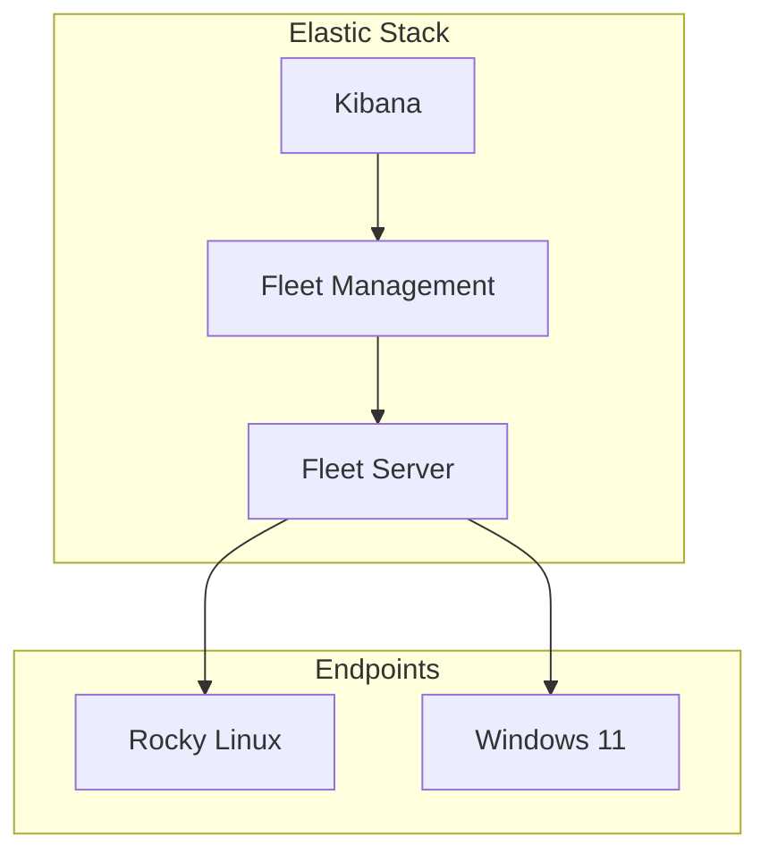
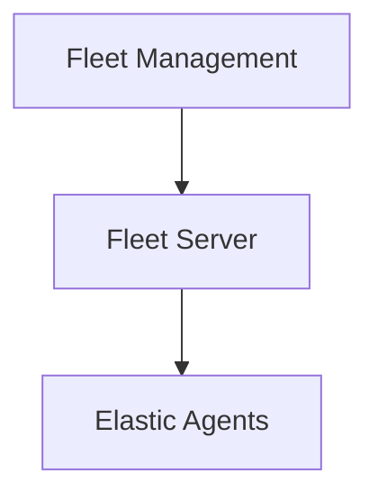

# Elastic Fleet Deployment

| Field				| Value 	    			|
|-------------------|---------------------------|
| Document Name     | Elastic Fleet Deployment  |
| Document Version  | v0.1.0 					|
| Author            | Terry Humphrey 			|
| Status 		    | Active					|
| Last Updated 		| 2026-07-10 				|

---

# Executive Summary

This document describes the deployment and configuration of Elastic Fleet within the Serenity Lab environment. It covers initial Kibana access, Fleet Server deployment, Elastic Agent installation, policy creation, system integrations, endpoint enrollment, and validation procedures. Upon completion, Fleet provides centralized management of Elastic Agents and serves as the communication layer between Elasticsearch, Kibana, and monitored endpoints.

---

## Table of Contents
- [1. Purpose](#1-purpose)
- [2. Environment Overview](#2-environment-overview)
- [3. Architecture Overview](#3-architecture-overview)
- [4. Initial Kibana Access](#4-initial-kibana-access)
- [5. Fleet Overview](#5-fleet-overview)
- [6. Fleet Server Design](#6-fleet-server-design)
- [7. Fleet Server Policy](#7-fleet-server-policy)
- [8. Fleet Server Configuration](#8-fleet-server-configuration)
- [9. Fleet Server Installation](#9-fleet-server-installation)
- [10. Fleet Server Verification](#10-fleet-server-verification)
- [11. Agent Policies](#11-agent-policies)
- [12. Adding System Integration](#12-adding-system-integration)
- [13. Endpoint Enrollment](#13-endpoint-enrollment)
- [14. Fleet Agent Status](#14-fleet-agent-status)
- [15. Troubleshooting](#15-troubleshooting)
- [16. Validation Checklist](#16-validation-checklist)
- [17. Lessons Learned](#17-lessons-learned)
- [18. Related Documentation](#18-related-documentation)
- [Screenshots](#screenshots)

---

# 1. Purpose

## Overview

This document describes the configuration of Kibana Fleet and deployment of Fleet Server for centralized Elastic Agent management.

Fleet provides centralized management of Elastic Agents throughout the Serenity Lab environment.

---

# 2. Environment Overview

| Component 			| Value 			|
|-----------------------|-------------------|
| Kibana Version 	    | 8.13.4 			|
| Elasticsearch Version | 8.13.4 			|
| Fleet Server Host     | elastic-node-01 	|
| Operating System 		| Rocky Linux 9.8   |
| Agent Version 		| 8.13.4 			|

---

# 3. Architecture Overview



---

# 4. Initial Kibana Access

Kibana provides the graphical management interface for the Elastic Stack, including the configuration of Fleet.

## URL

Kibana is accessed through:

```
http://192.168.1.220:5601
```

---

## Login Account

Initial administrative access:

```
Username:
elastic

Password:
Configured during Elasticsearch deployment
```

---

# 5. Fleet Overview

## Purpose

Fleet provides:

- Centralized agent management
- Policy-based configuration
- Integration deployment
- Agent health monitoring

---

# 6. Fleet Server Design

## Fleet Server Role

Fleet Server provides communication between Kibana and Elastic Agents.

Responsibilities:

- Agent enrollment
- Policy distribution
- Agent communication
- Integration management

---

# 7. Fleet Server Policy

## Policy Name

```
Fleet Server Policy
```

---

## Policy Purpose

The Fleet Server policy manages:

- Fleet Server integration
- Agent communication settings
- Fleet monitoring

---

# 8. Fleet Server Configuration

## Host Configuration

During setup:

| Setting 	| Value               |
|-----------|---------------------|
| Hostname 	| elastic-node-01     |
| Port 		| 8220				  |
| Protocol 	| HTTPS               |
| Policy 	| Fleet Server Policy |

Port 8220 is the default Fleet Server communication port used by Elastic Agents after enrollment.

---

# 9. Fleet Server Installation

## Download Elastic Agent

Download version 8.13.4:

```bash
curl -L -O \
https://artifacts.elastic.co/downloads/beats/elastic-agent/elastic-agent-8.13.4-linux-x86_64.tar.gz
```

*Reason:* 

- curl tells the server to download the file, 
- -L tells curl to follow HTTP redirects, 
- -O says save the download using the file name from the URL.

---

## Extract Archive

```bash
tar xzvf elastic-agent-8.13.4-linux-x86_64.tar.gz
```

*Reason:* 

- tar is the Linux archive utility used to extract .tar archive files
- x tells the command to extract the contents of the archive
- z tells the command to decompress the archive using gzip, this is needed because the file ends in .gz
- v tells the command to use Verbose mode, which displays each file as it is extracted.
- f tells the command that the next arguement is the archive file name.


---

## Enter Directory

```bash
cd elastic-agent-8.13.4-linux-x86_64
```

---

## Install Fleet Server

Example:

```bash
sudo ./elastic-agent install \
--fleet-server-es=http://localhost:9200 \
--fleet-server-service-token=<TOKEN> \
--fleet-server-policy=fleet-server-policy \
--fleet-server-port=8220
```
*Reason:*

- ./elastic-agent executes the elastic-agent binary located in the current directory (./)
- install Installs the Elastic Agent as a persistent system service rather than running it interactively
- --fleet-server-es=http://localhost:9200 This tells the fleet server where Elasticsearch is located
- --fleet-server-service-token=<TOKEN> This provides the Fleet Server Service Token. It is generated by Kibana and authorizes the Fleet server to register itself with Elasticsearch and Fleet. Without this token, the Fleet Server is not permitted to join the deployment.
- --fleet-server-policy=fleet-server-policy This specifies which Fleet policy your fleet server should use. In my environment, I have a policy named 'fleet-server-policy'
- --fleet-server-port=8220 This configures Fleet Server to listen for Elastic Agent enrollment requests on TCP port 8220.

---

# 10. Fleet Server Verification

## Kibana Verification

Navigate:



Expected:

```
Fleet Server
Healthy
```

---

## Linux Verification

Check service:

```bash
sudo systemctl status elastic-agent
```
*Reason:* This tells you if the elastic-agent is running or not.

---

Check agent status:

```bash
sudo elastic-agent status
```
*Reason:* This command checks the operational status of the Elastic Agent

Expected:

```
HEALTHY
```

---

Check Fleet Server Listening Status:

```bash
sudo ss -tulpn | grep 8220
```
*Reason:* This command confirms the Fleet Server is actively listening on TCP port.

- ss This is socket statistics and it displays network socket information.
- -t Tells the command to show TCP sockets.
- -u Tells the command to show UDP sockets.
- -l Tells the command to show listening sockets or services waiting for a connection.
- -p Tells the command to show the process using a socket
- -n Tells the command to show the numeric addresses and ports rather than resolving names.
- | Pipes the output into another command
- grep 8220 Filters the output and only displays lines containing port 8220.

Expected:

You should see an output similar to the following. If Fleet Server is not listening, this command will return no output.

```
tcp   LISTEN 0      4096        0.0.0.0:8220       0.0.0.0:*    users:(("elastic-agent",pid=12345,fd=123))
```

---

# 11. Agent Policies

## Fleet Server Policy

Purpose:

Manages Fleet Server.

---

## Linux Monitoring Policy

Purpose:

Collects metrics for Linux endpoints including:

- CPU
- Memory
- Network
- Filesystem
- Processes
- Logs

---

## Windows Monitoring Policy

Purpose:

Collects:

- Security Events
- PowerShell
- Sysmon
- Defender

---

# 12. Adding System Integration

## Integration

Added:

```
System
```

---

## Purpose

Collects operating system telemetry.

---

## Integration Name

Recommended:

```
Linux System Monitoring
```

---

## Description

Example:

```
Collects Linux operating system metrics and logs from Serenity Lab Linux hosts.
```

---

# 13. Endpoint Enrollment

## Enrollment Process

1. Create or select Agent Policy
2. Generate enrollment command
3. Install Elastic Agent
4. Verify agent appears in Fleet

---

# 14. Fleet Agent Status

## Health States

| Status    | Meaning                       |
|-----------|-------------------------------|
| Healthy   | Agent communicating normally  |
| Unhealthy | Agent has problems            |
| Offline   | Agent not communicating       |

---

# 15. Troubleshooting

---

## Issue: Fleet Server Setup Hanging

### Symptoms

Confirm Connect step does not complete.

### Investigation

Verify:

```bash
sudo docker ps
```

*Reason:* Lists running Docker containers, used to confirm Elasticsearch and Kibana started successfully.

Verify:

```bash
curl http://localhost:9200
```

*Reason:*

- This tells you if Elasticsearch is running and responding to requests

---

## Issue: Fleet Requires HTTPS

### Cause

Elastic 8.x Fleet Server expects secure communication.

### Resolution

Use generated Fleet Server certificates.

---

## Issue: Agent Directory Missing

### Cause

Elastic Agent archive was extracted in a different location.

### Resolution

Locate:

```bash
ls -la
```

Confirm directory:

```
elastic-agent-8.13.4-linux-x86_64
```

---

# 16. Validation Checklist

| Test                      | Result    |
|---------------------------|-----------|
| Kibana Accessible         | Validated |
| Elasticsearch Healthy     | Validated |
| Fleet Enabled             | Validated |
| Fleet Server Connected    | Validated |
| Elastic Agent Installed   | Validated |
| System Integration Added  | Validated |

---

# 17. Lessons Learned

Important findings.


- Fleet Server is a separate Elastic component that provides centralized management communication between Elastic Agents and the Elastic Stack
- Fleet setup is GUI-driven initially
- Agent policies control data collection, integrations, and Elastic Agent configuration
- HTTPS is required for Fleet communication

---

# 18. Related Documentation

| Document                          | Purpose 			                                                                                                                                			|
|-----------------------------------|---------------------------------------------------------------------------------------------------------------------------------------------------------------|
| README.md						    | Provides a high-level overview of the ELK Stack SIEM Home Lab, including objectives, architecture, technologies, and documentation index.	                    |
| 01-Architecture.md 			    | Defines the lab architecture, infrastructure, networking, identity services, Elastic components, and system relationships.									|
| 02-Initial-Design.md			    | Documents the original objectives, requirements, constraints, technology selections, and architectural decisions.												|
| 03-Elastic-Deployment.md 		    | Documents the installation and deployment of Elasticsearch, Kibana, Docker, and the initial Elastic Stack environment. 					                    |
| 04-Elastic-Fleet-Deployment.md    | Documents Elastic Fleet deployment, Fleet Server configuration, Elastic Agent enrollment, agent policies, integrations, and centralized endpoint management.  |
| 05-Windows-AD.md 				    | Documents Active Directory, DNS, organizational structure, and identity management configuration.																|
| 06-Windows-Agent.md 			    | Documents the deployment, enrollment, and configuration of Elastic Agents on Windows endpoints.																|
| 07-Sysmon.md 						| Documents Sysmon installation, configuration, and Windows endpoint visibility improvements.																	|
| 08-Elastic-Security.md 			| Documents Elastic Security configuration, including detections, alerts, cases, and analyst workflows.															|
| 09-Detection-Rules.md 			| Documents custom detection rules, testing procedures, and MITRE ATT&CK mappings.																				|
| 10-Incident-Response.md 		    | Documents incident response workflows, investigations, evidence collection, and lessons learned.																|
| 99-Lab-Journal.md					| Documents lab progress, implementation activities, troubleshooting, decisions, and lessons learned.															|

---

# Screenshots

Screenshots will be added during future validation steps.

Planned screenshots:

- Kibana Fleet Management overview
- Fleet Server status
- Fleet Server agent policy
- Elastic Agent enrollment
- Healthy agent status
- Fleet Server port validation

---

# Revision History

| Version 	| Date 		 | Changes 									    	    |
|-----------|------------|------------------------------------------------------|
| v0.1.0    | 2026-07-10 | Initial Elastic Fleet Deployment document created    |

---	