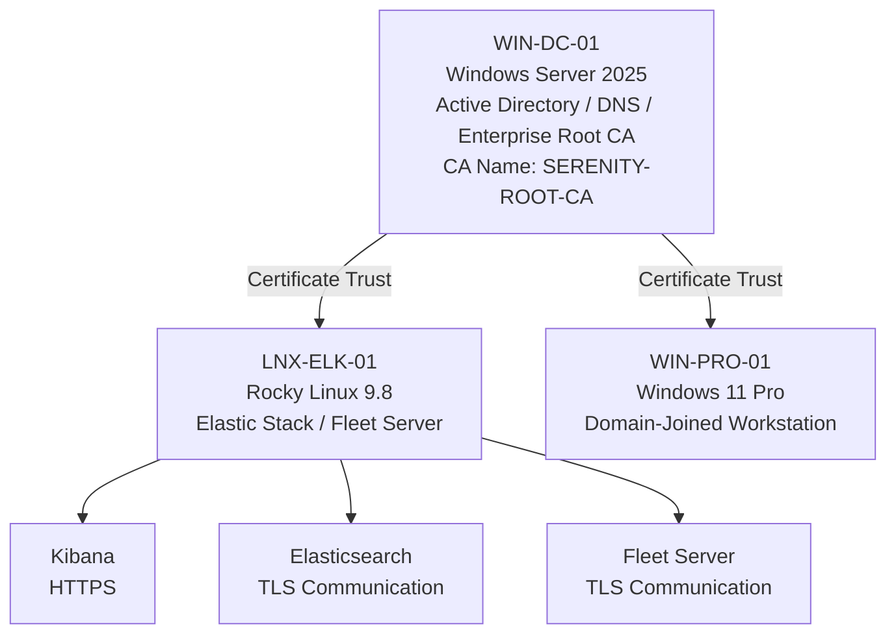

# Enterprise Security Lab Certificate Authority & PKI

| Field             | Value                              |
|-------------------|------------------------------------|
| Document Name     | Certificate Authority & PKI        |
| Document Version  | v0.1.0                             |
| Author            | Terry Humphrey                     |
| Status            | Active                             |
| Last Updated      | 2026-07-24                         |

---

## Table of Contents

- [1. Purpose](#1-purpose)
- [2. Scope](#2-scope)
- [3. PKI Overview](#3-pki-overview)
- [4. Certificate Authority Architecture](#4-certificate-authority-architecture)
- [5. Certificate Authority Configuration](#5-certificate-authority-configuration)
- [6. Certificate Trust](#6-certificate-trust)
- [7. Certificate Usage](#7-certificate-usage)
- [8. Certificate Enrollment](#8-certificate-enrollment)
- [9. Security Configuration](#9-security-configuration)
- [10. Validation and Testing](#10-validation-and-testing)
- [11. Certificate Lifecycle Management](#11-certificate-lifecycle-management)
- [12. Planned Enhancements](#12-planned-enhancements)
- [13. Related Documentation](#13-related-documentation)

---

# 1. Purpose

## Overview

This document describes the internal Public Key Infrastructure (PKI) and Certificate Authority (CA) used by the Enterprise Security Lab.

The Certificate Authority provides a centralized trust anchor for certificates used to secure internal lab services and encrypted communications.

The PKI supports:

- Certificate trust
- TLS encryption
- HTTPS services
- Secure Elastic Stack communications
- Internal service authentication
- Certificate lifecycle management

---

# 2. Scope

This document covers:

- PKI architecture
- Certificate Authority configuration
- Certificate trust
- Certificate usage
- Certificate enrollment
- Security configuration
- Certificate validation
- Certificate lifecycle management

This document does not cover detailed procedures for configuring individual applications to use certificates.

Application-specific certificate configuration is documented within the applicable system or service documentation.

---

# 3. PKI Overview

The Enterprise Security Lab uses an internal Microsoft Certificate Authority hosted on the primary Windows Server.

The Certificate Authority provides certificates and establishes a trusted certificate chain for internal lab services.

The internal PKI is used to support secure communications between systems and services within the lab.

## PKI Components

| Component              | Host                     | Purpose                                       | Status |
|------------------------|--------------------------|-----------------------------------------------|--------|
| Certificate Authority  | WIN-DC-01                | Issues and manages internal certificates      | Active |
| Root CA Certificate    | SERENITY-ROOT-CA         | Establishes internal certificate trust        | Active |
| Elastic Stack          | LNX-ELK-01               | Uses trusted certificates for secure services | Active |
| Windows Endpoints      | WIN-DC-01 / WIN-PRO-01   | Certificate trust and secure communications   | Active |

---

# 4. Certificate Authority Architecture

## Architecture Diagram

# 5. Certificate Authority Configuration

## Certificate Authority Information

| Setting              | Value                    |
|----------------------|--------------------------|
| Hostname             | WIN-DC-01                |
| Operating System     | Windows Server 2025      |
| CA Name              | SERENITY-ROOT-CA         |
| CA Type              | Enterprise Root CA       |
| Domain               | serenity.lab             |
| Status               | Active                   |

The Certificate Authority is hosted on `WIN-DC-01` and provides the internal trust anchor for the Enterprise Security Lab.

The CA is integrated with the lab's Active Directory environment.

## Certificate Authority Responsibilities

The Certificate Authority provides:

- Internal certificate issuance
- Certificate trust establishment
- TLS certificate support
- HTTPS certificate support
- Certificate lifecycle management
- Internal PKI services

---

# 6. Certificate Trust

Systems that communicate with services using certificates issued by the internal CA must trust the `SERENITY-ROOT-CA` root certificate.

## Linux Trust Configuration

The `SERENITY-ROOT-CA` certificate was imported into the Rocky Linux certificate trust store used by `LNX-ELK-01`.

The certificate was placed in the system CA trust anchors directory and the system trust store was updated.

The resulting trust configuration was validated using the system certificate trust tools.

## Trust Validation

The internal CA was confirmed as trusted by the Elastic server.

The CA trust configuration enables Linux-based services to validate certificates issued by the internal Certificate Authority.

## Windows Trust

Domain-joined Windows systems receive certificate trust through the Active Directory environment and associated certificate trust mechanisms.

The Windows certificate trust configuration supports internal services using certificates issued by `SERENITY-ROOT-CA`.

---

# 7. Certificate Usage

The internal PKI supports certificate-based security for services within the Enterprise Security Lab.

## Certificate Usage

| Service / System       | Certificate Usage                    | Status |
|------------------------|--------------------------------------|--------|
| Kibana                 | HTTPS / TLS                          | Active |
| Elasticsearch          | Secure service communications        | Active |
| Fleet Server           | TLS-protected agent communications   | Active |
| Linux Elastic Server   | Internal CA trust                    | Active |
| Windows Endpoints      | Internal certificate trust           | Active |

Certificates may be used to provide:

- HTTPS encryption
- TLS encryption
- Service identity validation
- Certificate-based trust
- Secure Elastic Stack communications

---

# 8. Certificate Enrollment

Certificates issued by the internal Certificate Authority are used by systems and services that require trusted TLS communications.

Certificate enrollment may be performed through:

- Active Directory-integrated certificate services
- Certificate templates
- Manual certificate requests
- Service-specific certificate enrollment procedures

Certificate enrollment procedures should ensure that:

- The requesting system is authorized to obtain the certificate.
- The certificate subject and Subject Alternative Name (SAN) values are correct.
- The certificate is issued by the trusted internal CA.
- The private key is protected.
- The certificate is installed in the appropriate system or application trust store.

Detailed certificate enrollment procedures should be documented with the applicable service configuration.

---

# 9. Security Configuration

The internal PKI is protected through:

- Restricted administrative access
- Certificate Authority role-based permissions
- Protected private keys
- Certificate trust validation
- TLS-protected communications
- Controlled certificate issuance

## Private Key Protection

Private keys associated with issued certificates must be protected from unauthorized access.

Private keys should not be:

- Committed to source control
- Included in public documentation
- Shared publicly
- Stored in unsecured locations
- Embedded directly in configuration files when more secure storage is available

## Certificate Security

Certificates should be monitored for:

- Expiration
- Revocation
- Incorrect subject names
- Incorrect SAN values
- Unauthorized issuance
- Trust chain errors

---

# 10. Validation and Testing

The PKI deployment was validated by confirming:

## Certificate Authority

- Certificate Authority operational on `WIN-DC-01`
- CA identified as `SERENITY-ROOT-CA`
- Certificate issuance available

## Certificate Trust

- Root CA certificate exported successfully
- Root CA certificate imported into the Linux trust store
- Linux system trust store updated
- `SERENITY-ROOT-CA` recognized as trusted

## Elastic Stack

- Elastic server trusts the internal CA
- TLS certificates can be validated against the internal CA
- Secure Elastic Stack communications can use the internal trust chain

---

# 11. Certificate Lifecycle Management

Certificates should be managed throughout their lifecycle.

The lifecycle includes:

1. Certificate request
2. Certificate approval
3. Certificate issuance
4. Certificate installation
5. Certificate validation
6. Certificate monitoring
7. Certificate renewal
8. Certificate revocation
9. Certificate replacement

Certificate lifecycle management should account for:

- Certificate expiration dates
- Renewal requirements
- Certificate revocation
- Private key protection
- Certificate inventory
- Service dependencies

Certificate records should be maintained for critical infrastructure services.

---

# 12. Planned Enhancements

Planned improvements include:

- Document certificate templates
- Document certificate enrollment procedures
- Document certificate renewal procedures
- Document certificate revocation procedures
- Inventory certificates issued to lab systems
- Document certificate expiration monitoring
- Expand certificate usage across internal services
- Automate certificate deployment where appropriate
- Integrate certificate lifecycle tracking with the asset inventory

---

# 13. Related Documentation

| Document                          | Purpose                                                                                                                                                           |
|-----------------------------------|-------------------------------------------------------------------------------------------------------------------------------------------------------------------|
| README.md                         | High-level overview of the Enterprise Security Lab, objectives, architecture, technologies, hardware inventory, capabilities, and documentation index.            |
| 01-Architecture.md                | Overall lab architecture, physical hardware, virtualization layout, server roles, infrastructure components, and system relationships.                            |
| 02-Network-Design.md              | Network architecture, IP addressing, DNS, communication flows, firewall requirements, segmentation, and network security considerations.                          |
| 03-Asset-Inventory.md             | Inventory of physical devices, VMs, operating systems, hostnames, IP addresses, and system roles/ownership.                                                       |
| 04-Active-Directory.md            | Active Directory architecture, OUs, users, groups, naming conventions, GPOs, authentication, and identity management.                                             |
| 06-Server-Build-Standards.md      | Baseline configuration standards for Windows and Linux servers, including naming, security settings, and required services.                                       |
| 07-Elastic-Deployment.md          | Elasticsearch and Kibana installation, configuration, cluster architecture, and core Elastic Stack infrastructure.                                                |
| 08-Elastic-Fleet-Deployment.md    | Fleet Server, agent policies, integrations, enrollment, and centralized agent management.                                                                         |
| 09-Windows-Agent.md               | Elastic Agent deployment, configuration, integrations, validation, and troubleshooting for Windows endpoints.                                                     |
| 10-Linux-Agent.md                 | Elastic Agent deployment, configuration, integrations, validation, and troubleshooting for Linux systems.                                                         |
| 11-Sysmon.md                      | Sysmon installation, configuration, event collection, telemetry, and Elastic integration.                                                                         |
| 12-Elastic-Security.md            | Elastic Security configuration, detection alerting, dashboards, cases, investigations, and analyst workflows.                                                     |
| 13-Detection-Rules.md             | The 30 custom detection rules, KQL, index patterns, severity, risk scores, MITRE ATT&CK mappings, validation status, tuning, and false-positive considerations.   |
| 14-Vulnerability-Management.md    | Vulnerability scanning, risk prioritization, remediation workflows, and verification.                                                                             |
| 15-Patch-Management.md            | WSUS deployment, update approvals, client targeting, maintenance windows, and patch compliance.                                                                   |
| 16-Incident-Response.md           | Incident response lifecycle, alert triage, investigation, containment, eradication, recovery, and lessons learned.                                                |
| 17-Investigation-Runbooks.md      | New. Step-by-step analyst procedures for investigating high-value alerts and detection scenarios.                                                                 |
| 18-Backup-Recovery.md             | Backup strategy, VM recovery, file restoration, disaster recovery, and recovery validation.                                                                       |
| 19-Security-Hardening.md          | Windows/Linux hardening, security baselines, auditing, logging, and defensive controls.                                                                           |
| 20-NIST-CSF-Mapping.md            | Maps lab capabilities to the NIST Cybersecurity Framework and demonstrates alignment with enterprise security practices.                                          |
| 99-Lab-Journal.md                 | Chronological implementation record, troubleshooting, design decisions, testing, snapshots, and future improvements.                                              |

---

# Revision History

| Version   | Date	  		| Changes 									          	                                        |
|-----------|---------------|-----------------------------------------------------------------------------------------------|
| v0.1.0    | 2026-07-24    | Initial Certificate Authority documentation published                                         |