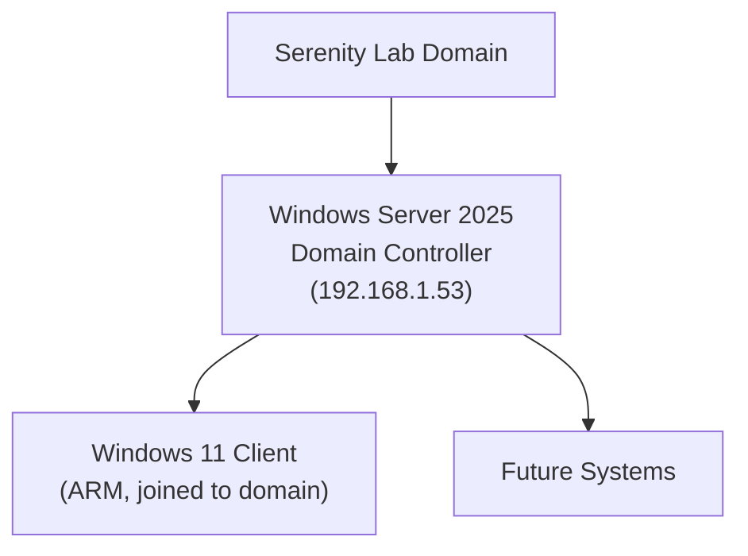
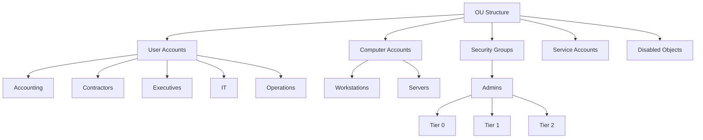
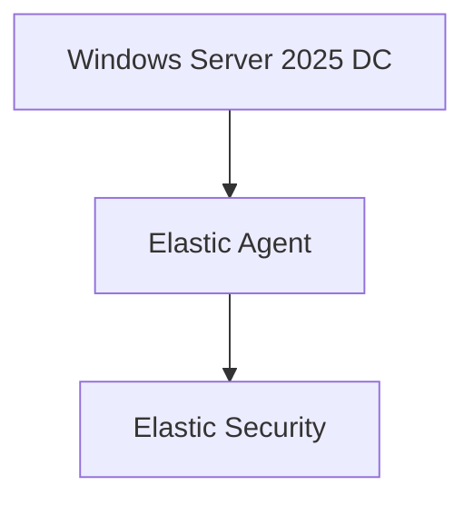

# Windows AD

| Field				| Value 	    			|
|-------------------|---------------------------|
| Document Name     | Windows AD                |
| Document Version  | v0.1.0 					|
| Author            | Terry Humphrey 			|
| Status 		    | Active					|
| Last Updated 		| 2026-07-14 				|

---

# Executive Summary

This document describes the deployment and configuration of Microsoft Active Directory Domain Services (AD DS) within the Serenity Lab environment. It covers the installation of Windows Server 2025, promotion to a Domain Controller, DNS configuration, organizational unit design, security groups, user provisioning, Windows 11 domain integration, and preparation for centralized security monitoring with the Elastic Stack.

---

## Table of Contents
- [1. Purpose](#1-purpose)
- [2. Environment Overview](#2-environment-overview)
- [3. Architecture Overview](#3-architecture-overview)
- [4. Virtual Machine Configuration](#4-virtual-machine-configuration)
- [5. Active Directory Installation](#5-active-directory-installation)
- [6. Domain Configuration](#6-domain-configuration)
- [7. Domain Controller Configuration](#7-domain-controller-configuration)
- [8. DNS Configuration](#8-dns-configuration)
- [9. Organizational Unit Design](#9-organizational-unit-design)
- [10. Security Groups](#10-security-groups) 
- [11. User Design](#11-user-design)
- [12. Windows 11 Domain Join](#12-windows-11-domain-join)
- [13. Active Directory Security Logging](#13-active-directory-security-logging)
- [14. Elastic Integration Planning](#14-elastic-integration-planning)
- [15. Validation Checklist](#15-validation-checklist)
- [16. Troubleshooting](#16-troubleshooting)
- [17. Lessons Learned](#17-lessons-learned)
- [18. Related Documentation](#18-related-documentation)
- [Screenshots](#screenshots)

---

# 1. Purpose

## Overview

This document describes the deployment and configuration of Active Directory Domain Services (AD DS) within the Serenity Lab environment.

Active Directory provides:

- Centralized identity management
- Authentication services
- Authorization control
- Group policy management
- Windows security event generation

---

# 2. Environment Overview

| Component         | Value                                                         |
|-------------------|---------------------------------------------------------------|
| Operating System  | Windows Server 2025 Standard Evaluation (Desktop Experience)  |
| Server Role       | Domain Controller                                             |
| Domain Name       | serenity.lab                                                  |
| DNS Domain        | serenity.lab                                                  |
| Static IP         | 192.168.1.53                                                  |
| Purpose           | Identity and authentication services                          |

**Note:** Desktop Experience was chosen (rather than Server Core) specifically because the host is a Mac Mini and remote management tools (RSAT/MMC snap-ins) would not be readily accessible without a local desktop session.

---

# 3. Architecture Overview



---

# 4. Virtual Machine Configuration

## Domain Controller VM

| Resource              | Value                                                         |
|-----------------------|---------------------------------------------------------------|
| Host Platform         | VirtualBox (on Mac Mini)                                      |
| Installation Source   | Windows Server 2025 Evaluation ISO (Microsoft, free download) |
| Operating System      | Windows Server 2025 Standard Evaluation (Desktop Experience)  |
| Role                  | Domain Controller                                             |
| CPU                   | 1 vCPU                                                        |
| RAM                   | 4 GB                                                          |
| HDD                   | 80 GB                                                         |
| Network               | Bridged                                                       |

**Note:** These are minimum viable specs, chosen due to host resource constraints on the Mac Mini. Performance is expected to be slow. Revisit sizing if the lab expands.

## Windows 11 Client VM

| Resource          | Value                         |
|-------------------|-------------------------------|
| Host Platform     | Mac (Apple Silicon)           |
| Operating System  | Windows 11 Pro (ARM)          |
| Role              | Domain-joined workstation     |
| Preferred DNS     | Domain Controller IP          |
| CPU               | 2 vCPU                        |
| RAM               | 4 GB                          |
| HDD               | 80 GB                         |
| Network           | Bridged                       |

**Note:** Point the preferred DNS to the Domain controller, not the Home Router

---

# 5. Active Directory Installation


## Installed Role

Active Directory Domain Services:

```
AD DS
```

---

## Installation Process

### Step 1: Build the Domain Controller VM

1. Open VirtualBox → New Virtual Machine
2. Select the Windows Server 2025 ISO
3. **Uncheck** "Proceed with Unattended Installation"
4. Configure hardware:
   - 1 CPU
   - 4 GB RAM
   - 80 GB HDD
   - Network: Bridged
5. Choose "Install Windows Server" and check the box to agree to delete everything on the disk (acceptable — this is a VM)
6. Select **Windows Server 2025 Standard Evaluation (Desktop Experience)**
   - Normally Server Core (no Desktop Experience) would be selected for a production DC, but Desktop Experience was chosen here for local management access on a Mac host without RSAT set up remotely
7. Complete the installation of Windows.
7. **Take a snapshot** before proceeding further

### Step 2: Base Configuration

1. Set a static IP address on the server — required for AD (`192.168.1.53`)
2. Set the server's hostname

### Step 3: Install AD DS Role

1. Open PowerShell and install the AD DS role:

```powershell
Install-WindowsFeature AD-Domain-Services -IncludeManagementTools
```

12. Reboot the server once the role finishes installing (required before promotion will succeed)

### Step 4: Promote to Domain Controller

1. Open PowerShell again and promote the server to a new Domain Controller, creating a new forest:

```powershell
Install-ADDSForest -DomainName "serenity.lab" `
  -CreateDnsDelegation:$false `
  -DatabasePath "C:\Windows\NTDS" `
  -LogPath "C:\Windows\NTDS" `
  -SysvolPath "C:\Windows\SYSVOL" `
  -Force:$true
```

2. Reboot the server once complete <-----------THIS TROUBLESHOOTING STEP NEEDS TO BE MOVED

3. **Take a snapshot** once the domain is confirmed working

---

# 6. Domain Configuration

## Domain Information

| Setting                   | Value                 |
|---------------------------|-----------------------|
| Forest Name               | serenity.lab          |
| Domain Name               | serenity.lab          |
| DNS Installed             | Yes                   |

---

# 7. Domain Controller Configuration

## Server Identity

Example:

```
WIN2025-01
```

---

## Required Services

The Domain Controller provides:

| Service                           | Purpose                   |
|-----------------------------------|---------------------------|
| Active Directory Domain Services  | Identity database         |
| DNS                               | Name resolution           |
| Kerberos                          | Authentication            |
| LDAP                              | Directory queries         |
| Group Policy                      | Configuration management  |

---

# 8. DNS Configuration

## Purpose

DNS is required for:

- Domain discovery
- Kerberos authentication
- Client domain joining
- Service location

---

## DNS Validation

Verify the domain resolves:

```powershell
nslookup serenity.lab
```

Expected: resolves to the Domain Controller's IP (192.168.1.53).

Verify future/planned hosts resolve as records are added, e.g.:

```powershell
nslookup elastic-node-01.serenity.lab
```

If the record is missing, create a DNS host (A) record manually for that host in AD DNS Manager.

---

# 9. Organizational Unit Design

## Purpose

Organizational Units (OUs) allow logical organization and Group Policy assignment.

## Implemented OUs

From Powershell, run the script 'Create-OUs.ps1'

This script automatically generates the OU's required for the Serenity Lab. 

PowerShell Script:

```powershell
.\Create-OUs.ps1
```





| OU / Sub-OU       | Parent                | Purpose                                                               |
|-------------------|-----------------------|-----------------------------------------------------------------------|
| User Accounts     | OU Structure (root)   | Container for all department-based user OUs                           |
| Accounting        | User Accounts         | Accounting department user accounts                                   |
| Contractors       | User Accounts         | External/contractor user accounts                                     |
| Executives        | User Accounts         | Executive user accounts                                               |
| IT                | User Accounts         | IT department user accounts                                           |
| Operations        | User Accounts         | Operations department user accounts                                   |
| Computer Accounts | OU Structure (root)   | Container for all device-based OUs                                    |
| Workstations      | Computer Accounts     | End-user workstation computer objects                                 |
| Servers           | Computer Accounts     | Server computer objects                                               |
| Security Groups   | OU Structure (root)   | Container for security group objects                                  |
| Admins            | Security Groups       | Tiered administrative accounts                                        |
| Tier 0            | Admins                | Domain/forest-level admin accounts (DCs, AD itself)                   |
| Tier 1            | Admins                | Server administration accounts                                        |
| Tier 2            | Admins                | Workstation/helpdesk-level administration accounts                    |
| Service Accounts  | OU Structure (root)   | Service accounts used by applications/scheduled tasks                 |
| Disabled Objects  | OU Structure (root)   | Holding location for disabled user/computer objects prior to deletion |


**Note:** The built-in `CN=Users` and `CN=Computers` containers are **containers, not true OUs**, and cannot have Group Policy linked to them directly. During initial AD automation this was identified early, so custom-named OUs (Servers, Workstations, Service Accounts) were created instead of reusing default container names — avoiding namespace conflicts with the built-in containers.


## Quick OU Map

This is a very useful command to get a fast overview of current AD OU structure:

```powershell
Get-ADOrganizationalUnit -Filter * | Sort-Object DistinguishedName | Format-Table Name, DistinguishedName
```

---

# 10. Security Groups

## Group Creation

From Powershell, run the script 'Create-Groups.ps1'

This script automatically generates the groups required for the Serenity Lab. 

PowerShell Script:

```powershell
.\Create-Groups.ps1
```

| Security Group              | Purpose                                   |
|----------------------------|--------------------------------------------|
| Accounting                 | Finance and accounting staff               |
| Compliance                 | Compliance and audit personnel             |
| Contractors                | Temporary contract personnel               |
| Developers                 | Software development access                |
| Executive                  | Executive leadership accounts              |
| Help Desk                  | End-user support staff                     |
| Human Resources            | Human resources personnel                  |
| IT Administrators          | Administrative IT management               |
| Operations                 | General operations staff                   |
| Remote Users               | Users authorized for remote access         |
| Sales                      | Sales department personnel                 |
| Server Administrators      | Server administration privileges           |
| Service Accounts           | Non-interactive application accounts       |
| Vendors                    | External vendor accounts                   |
| Workstation Administrators | Workstation administration privileges      |

---


# 11. User Design

## Administrative Accounts

Recommended accounts:

| Account           | Purpose                   |
|-------------------|---------------------------|
| Administrator     | Built-in domain admin     |
| admin.serenity    | Security administration   |
| zoe.washburne     | Security testing          |

## User Creation

From Powershell, run the script 'Create-Users.ps1'

This script automatically generates the users required for the Serenity Lab and assigns them to the appropriate groups. 

PowerShell Script:

```powershell
.\Create-Users.ps1
```


Users were created via a custom PowerShell script that creates all lab user accounts and assigns them to their proper security groups.


| Username           | Display Name             | Department        | AD Groups                                  |
|--------------------|--------------------------|-------------------|--------------------------------------------|
| admin.serenity     | Serenity Administrator   | IT                | IT Administrators                          |
| badger             | Adelei Niska "Badger"    | Vendors           | Vendors                                    |
| derrial.book       | Derrial Book             | Compliance        | Compliance                                 |
| hoban.washburne    | Hoban Washburne          | IT Operations     | Workstation Administrators                 |
| inara.serra        | Inara Serra              | Human Resources   | Human Resources                            |
| jayne.cobb         | Jayne Cobb               | Operations        | Operations                                 |
| kaylee.frye        | Kaylee Frye              | Engineering       | Developers                                 |
| malcolm.reynolds   | Malcolm Reynolds         | Executive         | Executive, Remote Users                    |
| monty              | Monty                    | Help Desk         | Help Desk                                  |
| river.tam          | River Tam                | Security          | IT Security                                |
| saffron            | Bridget Haymer           | Sales             | Sales                                      |
| simon.tam          | Simon Tam                | Research          | Developers                                 |
| svc.backup         | Backup Service           | Service Accounts  | Service Accounts                           |
| svc.elastic        | Elastic Service Account  | Service Accounts  | Service Accounts                           |
| svc.monitoring     | Monitoring Service       | Service Accounts  | Service Accounts                           |
| tracey.smith       | Tracey Smith             | Finance           | Accounting                                 |
| yo.saf.bridge      | YoSaffBridge             | Contractors       | Contractors                                |
| zoe.washburne      | Zoe Washburne            | IT Operations     | IT Administrators, Server Administrators   |


---

# 12. Windows 11 Domain Join

## Client Configuration

Windows 11 systems are joined to:

```
serenity.lab
```

Client is a Windows 11 Pro (ARM) VM, hosted on a MacBook Air (Apple Silicon).

## Domain Join Process

1. Configure the client's preferred DNS server to point to the Domain Controller (192.168.1.53) — **not** the home router
2. Go to System > Rename this PC (advanced) > Advanced > Domain
3. Enter `serenity.lab` as the domain
4. Enter domain credentials when prompted
5. Restart the workstation

---

## Verification

Command:

```powershell
whoami
```

Expected:

```
serenity\<username>
```

---

Check domain:

```powershell
systeminfo | findstr /B /C:"Domain"
```

Expected:

```
Domain: serenity.lab
```

---

# 13. Active Directory Security Logging

## Important Event Sources

Active Directory generates:

- Authentication events
- Account creation events
- Password changes
- Group membership changes
- Privilege changes

---

## Important Security Event IDs

| Event ID  | Description                               |
|-----------|-------------------------------------------|
| 4624      | Successful login                          |
| 4625      | Failed login                              |
| 4720      | User created                              |
| 4728      | Member added to security-enabled group    |
| 4732      | Member added to local security group      |
| 4740      | Account locked out                        |
| 4768      | Kerberos authentication request           |

---

# 14. Elastic Integration Planning

## Future Data Collection

The following sources will be collected:



---

Planned Elastic integrations:

- Windows Integration
- Sysmon
- Defender events
- PowerShell logging

---

# 15. Validation Checklist

| Test                                                  | Status    |
|-------------------------------------------------------|-----------|
| Windows Server Installed                              | Complete  |
| AD DS Installed                                       | Complete  |
| serenity.lab Created                                  | Complete  |
| DNS Working                                           | Complete  |
| OUs Created (Servers, Workstations, Service Accounts) | Complete  |
| Security Groups Created                               | Complete  |
| Users Created and Assigned to Groups                  | Complete  |
| Windows 11 Joined                                     | Complete  |


---

# 16. Troubleshooting

## Issue: Client Cannot Join Domain

Check DNS:

```powershell
ipconfig /all
```

The DNS server should point to the Domain Controller.

---

## Issue: Authentication Failure

Verify:

- Correct username
- Domain membership
- Time synchronization
- DNS resolution

---

## Issue: Kerberos Errors

Check time:

```powershell
w32tm /query /status
```

Kerberos requires closely synchronized clocks.

---

## Issue: RDP Not Working on the Domain Controller

- Windows Defender Firewall may need to be disabled for the private network profile
- Remote Desktop must be manually enabled in System Settings — it is off by default

---

## Issue: PowerShell Script Won't Run (OU/Group/User Scripts)

- Check execution policy: `Get-ExecutionPolicy`
- Set to `RemoteSigned` if needed: `Set-ExecutionPolicy RemoteSigned`
- If already `RemoteSigned` but still blocked, unblock the specific file: `Unblock-File -Path C:\Scripts\<script>.ps1`

---

## Issue: Default AD Containers Mistaken for OUs

`CN=Users` and `CN=Computers` are containers, not OUs, and can't have GPOs linked directly. Custom OUs with distinct names (Servers, Workstations, Service Accounts) were created instead to avoid confusion and namespace conflicts.

---

## Issue: Screen Resolution locked to 800x600 on Windows 11 

- Guest additions need to be installed from the devices menu on VirtualBox for the Display Driver to be enabled.
- If you don't do this, you can't join the domain because the screen will not display all the required options.

---

# 17. Lessons Learned

- Active Directory depends heavily on DNS
- Time synchronization is required for authentication
- Domain Controllers become critical security log sources
- Active Directory identity events are a primary source of evidence during SOC investigations
- Desktop Experience is worth the extra overhead when managing a DC from a non-Windows host without RSAT configured
- Take snapshots at key milestones (post-install, post-promotion) — recovery is much faster than rebuilding
- Default AD containers (Users/Computers) are not true OUs — plan custom OU names up front
- PowerShell script automation (OUs, groups, users) is worth the setup time even for a small lab — it kept configuration consistent and repeatable

---


# 18. Related Documentation

| Document                          | Purpose 			                                                                                                                                			|
|-----------------------------------|---------------------------------------------------------------------------------------------------------------------------------------------------------------|
| README.md						    | Provides a high-level overview of the ELK Stack SIEM Home Lab, including objectives, architecture, technologies, and documentation index.	                    |
| 01-Architecture.md 			    | Defines the lab architecture, infrastructure, networking, identity services, Elastic components, and system relationships.									|
| 02-Initial-Design.md			    | Documents the original objectives, requirements, constraints, technology selections, and architectural decisions.												|
| 03-Elastic-Deployment.md 		    | Documents the installation and deployment of Elasticsearch, Kibana, Docker, and the initial Elastic Stack environment. 					                    |
| 04-Elastic-Fleet-Deployment.md    | Documents Elastic Fleet deployment, Fleet Server configuration, Elastic Agent enrollment, agent policies, integrations, and centralized endpoint management.  |
| 06-Windows-Agent.md 			    | Documents the deployment, enrollment, and configuration of Elastic Agents on Windows endpoints.																|
| 07-Sysmon.md 						| Documents Sysmon installation, configuration, and Windows endpoint visibility improvements.																	|
| 08-Elastic-Security.md 			| Documents Elastic Security configuration, including detections, alerts, cases, and analyst workflows.															|
| 09-Detection-Rules.md 			| Documents custom detection rules, testing procedures, and MITRE ATT&CK mappings.																				|
| 10-Incident-Response.md 		    | Documents incident response workflows, investigations, evidence collection, and lessons learned.																|
| 99-Lab-Journal.md					| Documents lab progress, implementation activities, troubleshooting, decisions, and lessons learned.															|

---

# Screenshots

Screenshots will be added during future validation steps.

Planned screenshots:

- Windows Server 2025 desktop after initial installation
- Server Manager showing Active Directory Domain Services installed
- Active Directory Users and Computers console
- Serenity.lab domain overview
- Organizational Unit (OU) structure
- User Accounts OU with departmental sub-OUs
- Computer Accounts OU with Domain Controllers, Servers, and Workstations
- Security Groups OU
- Example security group properties (e.g., IT Administrators)
- Administrative OU structure (Tier 0, Tier 1, Tier 2)
- Sample user account properties (e.g., Malcolm Reynolds)
- User membership in multiple security groups
- PowerShell showing successful OU creation script execution
- PowerShell showing successful security group creation script execution
- PowerShell showing successful user creation script execution
- Windows 11 successfully joined to serenity.lab

---

# Revision History

| Version 	| Date 		 | Changes 									    	    |
|-----------|------------|------------------------------------------------------|
| v0.1.0    | 2026-07-14 | Initial Windows AD document created                  |

---	