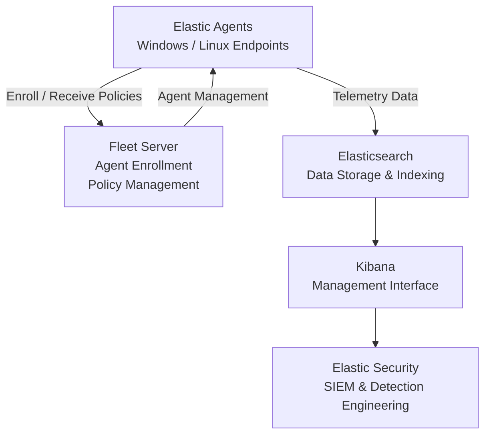

# Enterprise Security Lab Elastic Stack Deployment

| Field             | Value                     |
|-------------------|---------------------------|
| Document Name     | Elastic Stack Deployment  |
| Document Version  | v0.2.0                    |
| Author            | Terry Humphrey            |
| Status            | Active                    |
| Last Updated      | 2026-07-23                |

---

## Table of Contents

- [1. Purpose](#1-purpose)
- [2. Scope](#2-scope)
- [3. Elastic Stack Overview](#3-elastic-stack-overview)
- [4. Deployment Architecture](#4-deployment-architecture)
- [5. Elastic Server Configuration](#5-elastic-server-configuration)
- [6. Docker Deployment](#6-docker-deployment)
- [7. Elasticsearch Configuration](#7-elasticsearch-configuration)
- [8. Kibana Configuration](#8-kibana-configuration)
- [9. Data Storage](#9-data-storage)
- [10. Security Configuration](#10-security-configuration)
- [11. Service Validation](#11-service-validation)
- [12. Planned Enhancements](#12-planned-enhancements)
- [13. Related Documentation](#13-related-documentation)

---

# 1. Purpose

## Overview

This document describes the deployment and configuration of the Elastic Stack used by the Enterprise Security Lab.

The Elastic Stack provides centralized log ingestion, indexing, search, visualization, and security monitoring for Windows and Linux systems throughout the lab.

## Goals

The Elastic Stack deployment provides:

- Centralized log collection
- Security event storage
- Searchable event data
- Security dashboards
- Detection engineering platform
- SIEM functionality
- Security investigations
- Threat hunting

---

# 2. Scope

This document covers:

- Elastic Stack architecture
- Docker deployment
- Elasticsearch configuration
- Kibana configuration
- Service validation
- Security configuration

This document does not cover Elastic Agent deployment or Fleet configuration. Those topics are documented separately.

---

# 3. Elastic Stack Overview

The Enterprise Security Lab uses the Elastic Stack as its Security Information and Event Management (SIEM) platform.

Core components include:

- Elasticsearch
- Kibana
- Elastic Security
- Fleet Server
- Elastic Agents

---

# 4. Deployment Architecture

## Elastic Components

| Component        | Purpose                            |
|------------------|------------------------------------|
| Elasticsearch    | Data storage and indexing          |
| Kibana           | Web interface and visualization    |
| Elastic Security | SIEM capabilities                  |
| Fleet Server     | Centralized agent management       |

## Architecture Diagram

---

# 5. Elastic Server Configuration

## Server Information

| Setting           | Value             |
|-------------------|-------------------|
| Hostname          | LNX-ELK-01        |
| Operating System  | Rocky Linux 9.8   |
| IP Address        | 192.168.1.44      |
| Deployment Method | Docker            |
| Status            | Active            |

## Server Responsibilities

- Hosts Elasticsearch
- Hosts Kibana
- Hosts Fleet Server
- Stores security telemetry
- Provides SIEM interface

---

# 6. Docker Deployment

The Elastic Stack is deployed using Docker containers managed through Docker Compose.

## Docker Components

- Docker Engine
- Docker Compose

## Container Overview

| Container     | Purpose       |
|---------------|---------------|
| Elasticsearch | Search engine |
| Kibana        | Web interface |

---

# 7. Elasticsearch Configuration

## Elasticsearch

| Setting   | Value         |
|-----------|---------------|
| Version   | 8.13.4        |
| Cluster   | serenity-lab  |
| Node Role | Single Node   |
| Status    | Active        |

## Responsibilities

- Event indexing
- Search
- Data storage
- Query processing

---

# 8. Kibana Configuration

## Kibana

| Setting | Value                   |
|---------|-------------------------|
| Version | 8.13.4                  |
| URL     | https://LNX-ELK-01:5601 |
| Status  | Active                  |

## Responsibilities

- Dashboards
- Discover
- Elastic Security
- Fleet Management
- Visualizations

---

# 9. Data Storage

## Indexed Data

The Elastic Stack stores:

- Windows Security Logs
- Sysmon Events
- PowerShell Logs
- Linux Logs
- Authentication Events
- Detection Alerts

## Primary Data Sources

- Domain Controller
- Windows Workstations
- Linux Servers
- Elastic Agents

---

# 10. Security Configuration

The Elastic Stack is secured using:

- HTTPS
- Internal Certificate Authority
- Role-based authentication
- TLS communication

Certificates are issued by the internal Enterprise Certificate Authority.

---

# 11. Service Validation

The deployment was validated by confirming:

- Elasticsearch cluster health reported Green
- Kibana successfully connected to Elasticsearch
- Docker containers were running after deployment
- HTTPS access to Kibana was operational
- Elastic data streams were created
- Security events were searchable within Kibana

---

# 12. Planned Enhancements

Planned improvements include:

- Additional Elasticsearch nodes
- Snapshot repository
- Automated backups
- Additional dashboards
- Additional visualizations
- Performance tuning

---

# 13. Related Documentation

| Document                          | Purpose                                                                                                                                                           |
|-----------------------------------|-------------------------------------------------------------------------------------------------------------------------------------------------------------------|
| README.md                         | High-level overview of the Enterprise Security Lab, objectives, architecture, technologies, hardware inventory, capabilities, and documentation index.            |
| 01-Architecture.md                | Overall lab architecture, physical hardware, virtualization layout, server roles, infrastructure components, and system relationships.                            |
| 02-Network-Design.md              | Network architecture, IP addressing, DNS, communication flows, firewall requirements, segmentation, and network security considerations.                          |
| 03-Asset-Inventory.md             | Inventory of physical devices, VMs, operating systems, hostnames, IP addresses, and system roles/ownership.                                                       |
| 04-Active-Directory.md            | Active Directory architecture, OUs, users, groups, naming conventions, GPOs, authentication, and identity management.                                             |
| 05-Certificate-Authority-PKI.md   | Enterprise CA, certificate templates, trust relationships, certificate lifecycle, and PKI implementation.                                                         |
| 06-Server-Build-Standards.md      | Baseline configuration standards for Windows and Linux servers, including naming, security settings, and required services.                                       |
| 08-Elastic-Fleet-Deployment.md    | Fleet Server, agent policies, integrations, enrollment, and centralized agent management.                                                                         |
| 09-Windows-Agent.md               | Elastic Agent deployment, configuration, integrations, validation, and troubleshooting for Windows endpoints.                                                     |
| 10-Linux-Agent.md                 | Elastic Agent deployment, configuration, integrations, validation, and troubleshooting for Linux systems.                                                         |
| 11-Sysmon.md                      | Sysmon installation, configuration, event collection, telemetry, and Elastic integration.                                                                         |
| 12-Elastic-Security.md            | Elastic Security configuration, detection alerting, dashboards, cases, investigations, and analyst workflows.                                                     |
| 13-Detection-Rules.md             | The 30 custom detection rules, KQL, index patterns, severity, risk scores, MITRE ATT&CK mappings, validation status, tuning, and false-positive considerations.   |
| 14-Vulnerability-Management.md    | Vulnerability scanning, risk prioritization, remediation workflows, and verification.                                                                             |
| 15-Patch-Management.md            | WSUS deployment, update approvals, client targeting, maintenance windows, and patch compliance.                                                                   |
| 16-Incident-Response.md           | Incident response lifecycle, alert triage, investigation, containment, eradication, recovery, and lessons learned.                                                |
| 17-Investigation-Runbooks.md      | New. Step-by-step analyst procedures for investigating high-value alerts and detection scenarios.                                                                 |
| 18-Backup-Recovery.md             | Backup strategy, VM recovery, file restoration, disaster recovery, and recovery validation.                                                                       |
| 19-Security-Hardening.md          | Windows/Linux hardening, security baselines, auditing, logging, and defensive controls.                                                                           |
| 20-NIST-CSF-Mapping.md            | Maps lab capabilities to the NIST Cybersecurity Framework and demonstrates alignment with enterprise security practices.                                          |
| 99-Lab-Journal.md                 | Chronological implementation record, troubleshooting, design decisions, testing, snapshots, and future improvements.                                              |

---

---

# Revision History

| Version   | Date	  		| Changes 									          	                                        |
|-----------|---------------|-----------------------------------------------------------------------------------------------|
| v0.1.0    | 2026-07-09    | Initial Elastic Deployment documentation published                                            |
| v0.1.1    | 2026-07-10	| Updated Related documentation section.	                                                    |
| v0.2.0    | 2026-07-23    | Revised for new architecture. Split documentation to align with new documentation structure.  |  