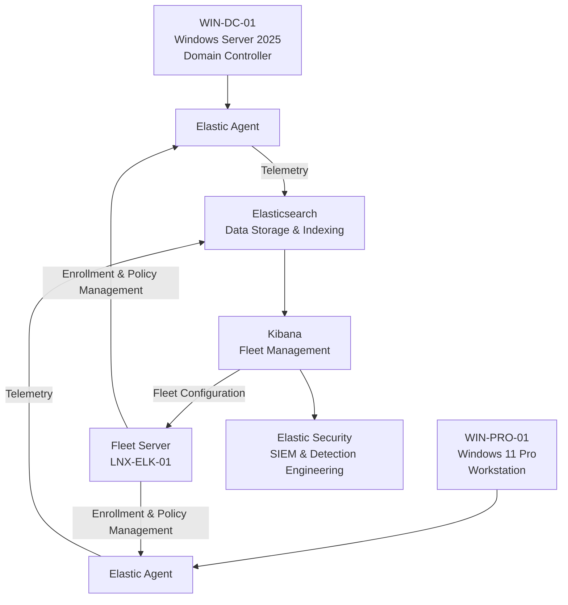

# Enterprise Security Lab Elastic Fleet Deployment

| Field             | Value                        |
|-------------------|------------------------------|
| Document Name     | Elastic Fleet Deployment     |
| Document Version  | v0.2.0                       |
| Author            | Terry Humphrey               |
| Status            | Active                       |
| Last Updated      | 2026-07-24                   |

---

## Table of Contents

- [1. Purpose](#1-purpose)
- [2. Scope](#2-scope)
- [3. Elastic Fleet Overview](#3-elastic-fleet-overview)
- [4. Fleet Architecture](#4-fleet-architecture)
- [5. Fleet Server Configuration](#5-fleet-server-configuration)
- [6. Elastic Agent Policies](#6-elastic-agent-policies)
- [7. Endpoint Enrollment](#7-endpoint-enrollment)
- [8. Elastic Integrations](#8-elastic-integrations)
- [9. Security Configuration](#9-security-configuration)
- [10. Validation and Testing](#10-validation-and-testing)
- [11. Planned Enhancements](#11-planned-enhancements)
- [12. Related Documentation](#12-related-documentation)

---

# 1. Purpose

## Overview

This document describes the deployment and configuration of Elastic Fleet within the Enterprise Security Lab.

Elastic Fleet provides centralized management of Elastic Agents deployed throughout the lab environment.

Fleet enables centralized:

- Agent enrollment
- Agent policy management
- Integration deployment
- Endpoint visibility
- Telemetry collection management

## Goals

The Elastic Fleet deployment provides:

- Centralized Elastic Agent management
- Standardized endpoint configurations
- Security telemetry collection
- Integration lifecycle management
- Endpoint health monitoring
- Foundation for Elastic Security monitoring

---

# 2. Scope

This document covers:

- Elastic Fleet architecture
- Fleet Server deployment
- Elastic Agent policies
- Endpoint enrollment
- Elastic integrations
- Validation testing

This document does not cover:

- Elasticsearch deployment
- Kibana deployment
- Elastic Agent installation procedures
- Detection rule creation
- Incident response workflows

Those topics are documented separately.

---

# 3. Elastic Fleet Overview

Elastic Fleet is the centralized management layer for Elastic Agents.

Within the Enterprise Security Lab, Fleet manages endpoint telemetry collection from Windows and Linux systems.

Fleet provides:

- Centralized agent management
- Configuration enforcement
- Integration deployment
- Agent status monitoring
- Data collection visibility

---

# 4. Fleet Architecture

## Components

| Component         | Purpose                                       |
|-------------------|-----------------------------------------------|
| Fleet Server      | Manages Elastic Agent enrollment and policies |
| Elastic Agents    | Collect security telemetry from endpoints     |
| Elasticsearch     | Stores collected telemetry                    |
| Kibana            | Provides Fleet management interface           |
| Elastic Security  | Provides SIEM capabilities                    |

---

## Architecture Diagram


---

# 5. Fleet Server Configuration

## Server Information

| Setting           | Value             |
|-------------------|-------------------|
| Hostname          | LNX-ELK-01        |
| Operating System  | Rocky Linux 9.8   |
| IP Address        | 192.168.1.44      |
| Role              | Fleet Server      |
| Deployment Method | Elastic Agent     |
| Status            | Active            |

---

## Fleet Server Responsibilities

Fleet Server provides:

- Elastic Agent enrollment
- Agent policy distribution
- Integration management
- Endpoint health reporting

---

# 6. Elastic Agent Policies

Elastic Agent policies define the configuration applied to managed endpoints.

## Implemented Policies

| Policy                    | Purpose                               | Status    |
|---------------------------|---------------------------------------|-----------|
| Windows Security Policy   | Windows security telemetry collection | Active    |
| Linux Server Policy       | Linux system telemetry collection     | Active    |
| Sysmon Policy             | Sysmon event collection               | Planned   |

---

## Policy Management

Policies are managed through Kibana:


Policies define:

- Assigned integrations
- Data collection sources
- Endpoint configuration
- Agent behavior

---

# 7. Endpoint Enrollment

## Supported Endpoints

| Hostname      | Operating System      | Role              | Status |
|---------------|-----------------------|-------------------|--------|
| WIN-DC-01     | Windows Server 2025   | Domain Controller | Active |
| WIN-PRO-01    | Windows 11 Pro        | Workstation       | Active |
| LNX-ELK-01    | Rocky Linux 9.8       | Elastic Server    | Active |

---

## Enrollment Process

Endpoints are enrolled into Fleet by:

1. Creating an enrollment token
2. Installing Elastic Agent
3. Assigning the appropriate agent policy
4. Validating communication with Fleet Server

---

## Enrollment Validation

Successful enrollment is confirmed through:

- Fleet Agent status
- Agent health reporting
- Data stream creation
- Event visibility in Kibana

---

# 8. Elastic Integrations

The following integrations support security monitoring:

| Integration       | Purpose                                           |
|-------------------|---------------------------------------------------|
| Windows           | Windows event collection                          |
| System            | Linux and operating system logging and monitoring |
| Sysmon            | Advanced Windows endpoint visibility              |
| Elastic Defend    | Endpoint security monitoring                      |

---

# 9. Security Configuration

Elastic Fleet communication is secured using:

- TLS encryption
- Trusted Certificate Authority
- Agent authentication
- Enrollment tokens
- Role-based access control

The Enterprise Security Lab uses the internal Certificate Authority:

```
SERENITY-ROOT-CA
```

for certificate trust management.

---

# 10. Validation and Testing

The Fleet deployment was validated by confirming:

## Fleet Server

- Fleet Server operational
- Kibana connection successful
- Agent enrollment available

## Elastic Agents

- Agents visible in Fleet
- Agent status healthy
- Policies assigned correctly

## Data Collection

- Windows events searchable
- Linux telemetry searchable
- Security data streams created
- Events visible in Kibana Discover

---

# 11. Planned Enhancements

Future improvements include:

- Additional endpoint policies
- Elastic Defend deployment
- Additional Windows workstations
- Expanded Sysmon coverage
- Agent upgrade procedures
- Automated deployment workflows

---

# 12. Related Documentation

| Document                          | Purpose                                                                                                                                                           |
|-----------------------------------|-------------------------------------------------------------------------------------------------------------------------------------------------------------------|
| README.md                         | High-level overview of the Enterprise Security Lab, objectives, architecture, technologies, hardware inventory, capabilities, and documentation index.            |
| 01-Architecture.md                | Overall lab architecture, physical hardware, virtualization layout, server roles, infrastructure components, and system relationships.                            |
| 02-Network-Design.md              | Network architecture, IP addressing, DNS, communication flows, firewall requirements, segmentation, and network security considerations.                          |
| 03-Asset-Inventory.md             | Inventory of physical devices, VMs, operating systems, hostnames, IP addresses, and system roles/ownership.                                                       |
| 04-Active-Directory.md            | Active Directory architecture, OUs, users, groups, naming conventions, GPOs, authentication, and identity management.                                             |
| 05-Certificate-Authority-PKI.md   | Enterprise CA, certificate templates, trust relationships, certificate lifecycle, and PKI implementation.                                                         |
| 06-Server-Build-Standards.md      | Baseline configuration standards for Windows and Linux servers, including naming, security settings, and required services.                                       |
| 07-Elastic-Deployment.md          | Elasticsearch and Kibana installation, configuration, cluster architecture, and core Elastic Stack infrastructure.                                                |
| 08-Elastic-Fleet-Deployment.md    | Fleet Server, agent policies, integrations, enrollment, and centralized agent management.                                                                         |
| 09-Windows-Agent.md               | Elastic Agent deployment, configuration, integrations, validation, and troubleshooting for Windows endpoints.                                                     |
| 10-Linux-Agent.md                 | Elastic Agent deployment, configuration, integrations, validation, and troubleshooting for Linux systems.                                                         |
| 11-Sysmon.md                      | Sysmon installation, configuration, event collection, telemetry, and Elastic integration.                                                                         |
| 12-Elastic-Security.md            | Elastic Security configuration, detection alerting, dashboards, cases, investigations, and analyst workflows.                                                     |
| 13-Detection-Rules.md             | The 30 custom detection rules, KQL, index patterns, severity, risk scores, MITRE ATT&CK mappings, validation status, tuning, and false-positive considerations.   |
| 14-Vulnerability-Management.md    | Vulnerability scanning, risk prioritization, remediation workflows, and verification.                                                                             |
| 15-Patch-Management.md            | WSUS deployment, update approvals, client targeting, maintenance windows, and patch compliance.                                                                   |
| 16-Incident-Response.md           | Incident response lifecycle, alert triage, investigation, containment, eradication, recovery, and lessons learned.                                                |
| 17-Investigation-Runbooks.md      | New. Step-by-step analyst procedures for investigating high-value alerts and detection scenarios.                                                                 |
| 18-Backup-Recovery.md             | Backup strategy, VM recovery, file restoration, disaster recovery, and recovery validation.                                                                       |
| 19-Security-Hardening.md          | Windows/Linux hardening, security baselines, auditing, logging, and defensive controls.                                                                           |
| 20-NIST-CSF-Mapping.md            | Maps lab capabilities to the NIST Cybersecurity Framework and demonstrates alignment with enterprise security practices.                                          |
| 99-Lab-Journal.md                 | Chronological implementation record, troubleshooting, design decisions, testing, snapshots, and future improvements.                                              |

---


# Revision History

| Version 	| Date 		    | Changes 									    	                                            |
|-----------|---------------|-----------------------------------------------------------------------------------------------|
| v0.1.0    | 2026-07-10    | Initial Elastic Fleet Deployment document created                                             |
| v0.2.0    | 2026-07-23    | Revised for new architecture. Split documentation to align with new documentation structure.  |  
---	