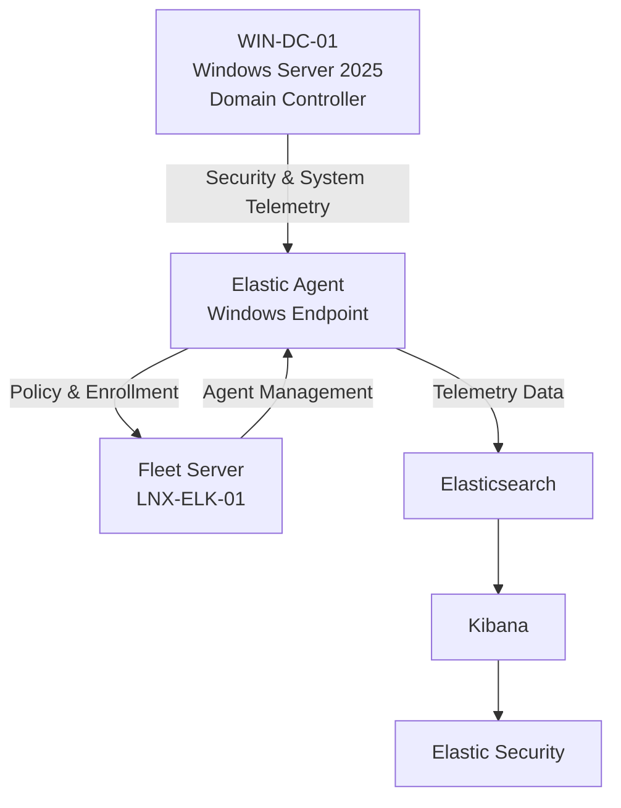
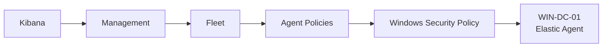
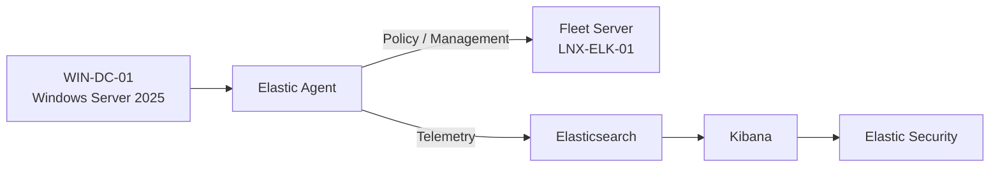
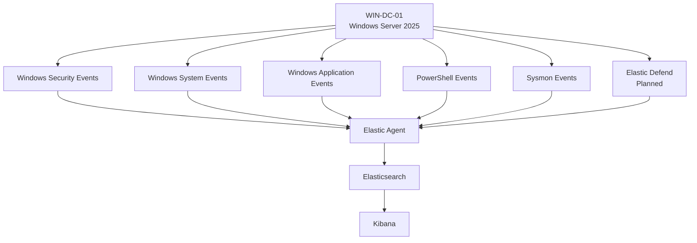
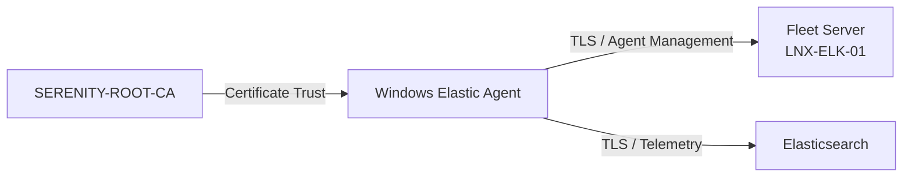
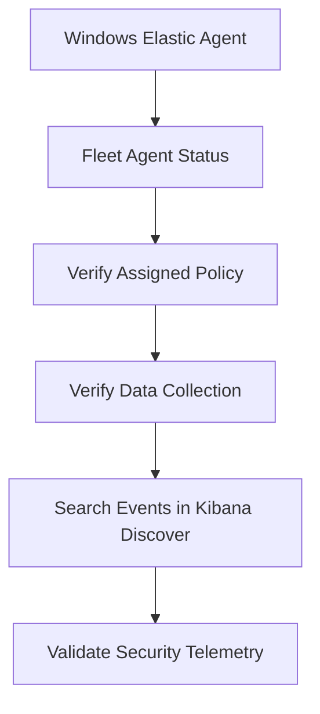

# Enterprise Security Lab Windows Elastic Agent Deployment

| Field             | Value                        |
|-------------------|------------------------------|
| Document Name     | Windows Elastic Agent        |
| Document Version  | v0.1.0                       |
| Author            | Terry Humphrey               |
| Status            | Active                       |
| Last Updated      | 2026-07-24                   |

---

## Table of Contents

- [1. Purpose](#1-purpose)
- [2. Scope](#2-scope)
- [3. Windows Elastic Agent Overview](#3-windows-elastic-agent-overview)
- [4. Agent Architecture](#4-agent-architecture)
- [5. Windows Agent Configuration](#5-windows-agent-configuration)
- [6. Agent Installation](#6-agent-installation)
- [7. Windows Agent Policy](#7-windows-agent-policy)
- [8. Windows Integrations](#8-windows-integrations)
- [9. Agent Security Configuration](#9-agent-security-configuration)
- [10. Agent Validation and Testing](#10-agent-validation-and-testing)
- [11. Troubleshooting](#11-troubleshooting)
- [12. Planned Enhancements](#12-planned-enhancements)
- [13. Related Documentation](#13-related-documentation)

---

# 1. Purpose

## Overview

This document describes the deployment and configuration of the Elastic Agent on Windows systems within the Enterprise Security Lab.

The Windows Elastic Agent provides centralized endpoint telemetry collection and forwards security-relevant data to the Elastic Stack through Elastic Fleet.

## Goals

The Windows Elastic Agent deployment provides:

- Centralized endpoint telemetry collection
- Windows event collection
- Security event visibility
- PowerShell telemetry
- Sysmon telemetry when deployed
- Centralized agent management through Fleet
- Endpoint health monitoring
- Security monitoring data for Elastic Security
- Telemetry supporting detection engineering and threat hunting

---

# 2. Scope

This document covers:

- Windows Elastic Agent architecture
- Windows Agent configuration
- Agent installation and enrollment
- Fleet Agent Policy assignment
- Windows integrations
- Agent security configuration
- Validation and testing
- Basic troubleshooting

This document does not cover:

- Elasticsearch deployment
- Kibana deployment
- Fleet Server deployment
- Linux Elastic Agent deployment
- Sysmon installation and configuration
- Detection rule creation
- Incident response workflows

Those topics are documented separately.

---

# 3. Windows Elastic Agent Overview

The Elastic Agent is the endpoint data collection and management component deployed to Windows systems within the Enterprise Security Lab.

The agent is centrally managed through Elastic Fleet and receives its configuration from an assigned Fleet Agent Policy.

The Windows Elastic Agent provides:

- Centralized agent management
- Configuration enforcement
- Windows event collection
- Security telemetry collection
- System telemetry collection
- PowerShell event collection
- Sysmon telemetry collection when configured
- Agent health monitoring

---

# 4. Agent Architecture

## Components

| Component          | Purpose                                      |
|--------------------|----------------------------------------------|
| Windows Endpoint   | Generates security and system telemetry       |
| Elastic Agent      | Collects and forwards endpoint telemetry      |
| Fleet Server       | Manages agent enrollment and policies         |
| Elasticsearch      | Stores and indexes collected telemetry        |
| Kibana             | Provides management and data visualization    |
| Elastic Security   | Provides SIEM and detection capabilities      |

## Architecture Diagram



# 5. Windows Agent Configuration

## Windows Agent Overview

The Elastic Agent installed on Windows endpoints provides centralized telemetry collection and endpoint monitoring for the Enterprise Security Lab.

The Elastic Agent is managed through Elastic Fleet and receives its configuration from the assigned Agent Policy.

## Windows Agent Configuration

| Setting              | Value                          |
|----------------------|--------------------------------|
| Endpoint             | WIN-DC-01                      |
| Operating System     | Windows Server 2025            |
| Agent Management     | Elastic Fleet                  |
| Fleet Server         | LNX-ELK-01                     |
| Agent Policy         | Windows Security Policy        |
| Status               | Active                         |

## Agent Responsibilities

The Windows Elastic Agent is responsible for collecting and forwarding security-relevant telemetry to Elasticsearch.

Primary responsibilities include:

- Windows event log collection
- Security event collection
- System event collection
- Application event collection
- Authentication telemetry
- Endpoint health reporting
- Integration-based telemetry collection

## Windows Event Sources

The Windows Agent collects telemetry from relevant Windows event channels configured through the assigned Fleet Agent Policy.

Primary event sources include:

- Windows Security Event Log
- Windows System Event Log
- Windows Application Event Log
- PowerShell event logs
- Additional security-relevant event channels configured through Elastic integrations

## Agent Policy Assignment

The Windows endpoint is assigned to the appropriate Fleet Agent Policy.

The policy defines:

- Windows event log integrations
- Data collection configuration
- Integration settings
- Agent behavior
- Output configuration

The policy is managed through:



## Agent Installation

The Elastic Agent is installed on the Windows endpoint and enrolled with Fleet using an enrollment token generated by the Fleet management interface.

The installation process consists of:

1. Generate an enrollment token in Fleet.
2. Download the Windows Elastic Agent package.
3. Install the Elastic Agent on the Windows endpoint.
4. Enroll the agent with Fleet Server.
5. Assign the appropriate Agent Policy.
6. Confirm the agent appears in Fleet.
7. Validate telemetry collection in Kibana.

Detailed installation procedures are documented separately in the Windows Agent installation documentation.

## Agent Communication

The Windows Elastic Agent communicates with Fleet Server for centralized management and policy updates.

Telemetry collected by the agent is forwarded to the configured Elastic output for indexing and analysis.



## Windows Agent Security

The Windows Agent deployment uses:

- Fleet-managed configuration
- Enrollment authentication
- TLS-protected communication
- Trusted internal Certificate Authority
- Role-based access control through Elastic

The internal Certificate Authority used by the lab is:

- SERENITY-ROOT-CA

## Configuration Validation

The Windows Agent configuration is validated by confirming:

- Elastic Agent service is running
- Agent appears in Fleet
- Agent status is healthy
- Correct Agent Policy is assigned
- Fleet Server communication is operational
- Windows event data is being collected
- Windows security events are searchable in Kibana
- Data streams are being created successfully

Windows Agent Telemetry

The Windows Agent provides the foundation for collecting telemetry used by the Enterprise Security Lab for:

- Authentication monitoring
- Account activity monitoring
- Privilege activity monitoring
- Administrative activity monitoring
- PowerShell monitoring
- Security event analysis
- Detection engineering
- Threat hunting
- Incident investigation

## Current Status

| Component            | Status     |
|----------------------|------------|
| Elastic Agent        | Active     |
| Fleet Enrollment     | Validated  |
| Agent Policy         | Assigned   |
| Fleet Communication  | Validated  |
| Windows Event Logs   | Validated  |
| Security Telemetry   | Validated  |
| Elasticsearch Output | Validated  |

# 6. Agent Installation and Enrollment

## Agent Installation

The Elastic Agent is installed on the Windows endpoint and enrolled with Fleet using an enrollment token generated by the Fleet management interface.

The installation process consists of:

1. Generate an enrollment token in Fleet.
2. Download the Windows Elastic Agent package.
3. Install the Elastic Agent on the Windows endpoint.
4. Enroll the agent with Fleet Server.
5. Assign the appropriate Agent Policy.
6. Confirm the agent appears in Fleet.
7. Validate telemetry collection in Kibana.

Detailed installation procedures are documented separately in the Windows Agent installation documentation.

## Agent Communication

The Windows Elastic Agent communicates with Fleet Server for centralized management and policy updates.

Telemetry collected by the agent is forwarded to the configured Elastic output for indexing and analysis.

## Enrollment Validation

| Component            | Status    |
|----------------------|-----------|
| Elastic Agent        | Active    |
| Fleet Enrollment     | Validated |
| Agent Policy         | Assigned  |
| Fleet Communication  | Validated |
| Windows Event Logs   | Validated |
| Security Telemetry   | Validated |
| Elasticsearch Output | Validated |

---

# 7. Windows Agent Policy

## Agent Policy Overview

The Windows Elastic Agent is managed through Elastic Fleet using an assigned Agent Policy.

The Agent Policy defines the integrations, data sources, and configuration settings applied to the Windows endpoint.

## Windows Agent Policy

| Setting       | Value                    |
|---------------|--------------------------|
| Policy Name   | Windows Security Policy  |
| Endpoint      | WIN-DC-01                |
| Operating System | Windows Server 2025   |
| Management    | Elastic Fleet            |
| Status        | Active                   |

## Policy Configuration

The Windows Security Policy is configured to collect security-relevant telemetry from the Windows endpoint.

The policy may include:

- Windows Security Event Logs
- Windows System Event Logs
- Windows Application Event Logs
- PowerShell logging
- Windows Defender telemetry
- Sysmon telemetry when configured
- Elastic Defend when deployed

## Policy Management

The Windows Agent Policy is managed through Kibana:


## Policy Assignment

The Windows endpoint is assigned to the Windows Security Policy during Fleet enrollment or through the Fleet management interface.

The assigned policy controls the configuration delivered to the Elastic Agent.

## Policy Validation

The Windows Agent Policy is validated by confirming:

- Policy exists in Fleet
- Policy is assigned to the correct endpoint
- Agent reports a healthy status
- Agent successfully receives policy configuration
- Configured integrations are active
- Expected Windows telemetry is visible in Kibana

## Current Status

| Component                | Status     |
|--------------------------|------------|
| Windows Security Policy  | Active     |
| Policy Assignment        | Validated  |
| Agent Configuration      | Validated  |
| Windows Telemetry        | Validated  |

---

# 8. Windows Integrations

The Windows Elastic Agent uses Elastic integrations to collect endpoint telemetry and forward security-relevant data to Elasticsearch.

## Windows Integration

The Windows integration provides collection of Windows event logs from configured Windows event channels.

Collected telemetry may include:

- Windows Security events
- Windows System events
- Windows Application events
- PowerShell events
- Other configured Windows event channels

## Sysmon Integration

Sysmon telemetry is collected through the Sysmon configuration and integration documented in:

`11-Sysmon.md`

The Sysmon integration provides enhanced endpoint telemetry for security monitoring and detection engineering.

## Elastic Defend

Elastic Defend provides endpoint security monitoring and additional endpoint telemetry.

Elastic Defend deployment is planned for a future phase of the Enterprise Security Lab.

## Integration Architecture



## Integration Configuration

Windows integrations are assigned through the Windows Security Policy in Elastic Fleet.

The policy determines which integrations are deployed to the Windows Elastic Agent and which telemetry is collected.

## Integration Validation

The Windows integrations are validated by confirming:

- Windows integration is assigned to the Windows Security Policy
- Elastic Agent is healthy
- Windows event data is searchable in Kibana
- Expected data streams are created
- Sysmon events are searchable when Sysmon is deployed
- Elastic Defend telemetry is available after deployment

## Current Integration Status

| Integration    | Purpose                       | Status  |
|----------------|-------------------------------|---------|
| Windows        | Windows event collection      | Active  |
| System         | Windows system telemetry     | Active  |
| PowerShell     | PowerShell event collection   | Active  |
| Sysmon         | Advanced Windows telemetry   | Planned |
| Elastic Defend | Endpoint security monitoring | Planned |

---

# 9. Agent Security Configuration

The Windows Elastic Agent communicates with the Elastic Fleet infrastructure using secured communications.

## Security Controls

The deployment uses:

- TLS-encrypted communication
- Trusted Certificate Authority
- Fleet enrollment tokens
- Centralized policy management
- Role-based access control

## Certificate Authority Trust

The Windows endpoint trusts the internal Certificate Authority:

```text
SERENITY-ROOT-CA
```

Certificate Authority configuration is documented in:

`05-Certificate-Authority-PKI.md`

## Enrollment Security

Enrollment tokens are used to authenticate the initial Elastic Agent enrollment with Fleet Server.

Enrollment tokens should be treated as sensitive credentials and should not be:

- Committed to source control
- Included in public documentation
- Shared publicly
- Stored in unsecured locations

## Agent Communication Security

The Elastic Agent uses TLS-protected communication for connections to the Elastic Stack infrastructure.

The communication flow is:



## Security Validation

The Windows Elastic Agent security configuration is validated by confirming:

- Certificate Authority trust is established
- Agent enrollment completed successfully
- Fleet Server communication is operational
- TLS communication is functional
- Agent authentication is successful
- Enrollment tokens are not exposed in source control
- Agent policy configuration is centrally managed

# 10. Agent Validation and Testing

The Windows Elastic Agent deployment is validated through Elastic Fleet and Kibana.

## Fleet Validation

Confirm the following:

- Windows endpoint appears in Fleet
- Agent status is Healthy
- Correct Agent Policy is assigned
- Last activity timestamp is current
- Fleet Server communication is operational

## Data Collection Validation

Confirm that Windows telemetry is visible in Kibana.

Validation includes:

- Windows Security events searchable
- Windows System events searchable
- Windows Application events searchable
- PowerShell events searchable
- Sysmon events searchable when Sysmon is deployed

## Validation Workflow



## Example Validation Queries

Use Kibana Discover to confirm that Windows events are being indexed.

Example KQL searches may include:

- `host.name : "WIN-DC-01"`
- `event.code : 4624`
- `event.code : 4625`
- `event.code : 4688`
- `data_stream.dataset : "windows.security"`

These searches should return events when the corresponding telemetry is being collected and indexed.

## Validation Status

| Validation Item            | Status    |
|----------------------------|-----------|
| Elastic Agent in Fleet     | Validated |
| Agent Health               | Validated |
| Agent Policy Assignment    | Validated |
| Fleet Server Communication | Validated |
| Windows Security Events    | Validated |
| Windows System Events      | Validated |
| Windows Application Events | Validated |
| PowerShell Events          | Validated |
| Elasticsearch Data Output  | Validated |
| Kibana Event Visibility    | Validated |

---

# 11. Troubleshooting

## Agent Not Visible in Fleet

Check:

- Elastic Agent service is running
- Network connectivity to Fleet Server
- DNS resolution of Fleet Server
- TLS certificate trust
- Enrollment token validity
- Agent Policy assignment

## Agent Status Unhealthy

Check:

- Elastic Agent logs
- Fleet Server connectivity
- Elasticsearch connectivity
- Certificate validation
- Agent Policy configuration
- Network connectivity

## No Windows Events

Check:

- Windows integration is assigned to the Agent Policy
- Windows event channels are configured
- Elastic Agent service is running
- Events exist in Windows Event Viewer
- Expected data streams are being created
- Kibana Discover query filters are correct

## No PowerShell Events

Check:

- PowerShell logging is enabled
- PowerShell event channels are configured
- Windows integration is assigned to the Agent Policy
- Elastic Agent service is running
- PowerShell events exist in Event Viewer
- PowerShell data is searchable in Kibana

## No Sysmon Events

Check:

- Sysmon is installed
- Sysmon service is running
- Sysmon configuration is loaded
- Sysmon events exist in Event Viewer
- Sysmon integration is assigned to the Agent Policy
- Elastic Agent is healthy
- Sysmon data is searchable in Kibana

## Certificate or TLS Errors

Check:

- `SERENITY-ROOT-CA` is trusted by the Windows endpoint
- Certificate hostname matches the destination hostname
- Certificate is valid and not expired
- Fleet Server certificate is trusted
- Elasticsearch certificate is trusted
- System date and time are correct
- DNS resolves the Fleet Server and Elasticsearch hostnames correctly

## Agent Communication Issues

Check:

- Windows endpoint can resolve `LNX-ELK-01`
- Windows endpoint can reach Fleet Server
- Required firewall ports are accessible
- Fleet Server is operational
- Elasticsearch is operational
- Elastic Agent service is running

## Troubleshooting Validation

After resolving an issue, confirm:

- Elastic Agent reports Healthy in Fleet
- Correct Agent Policy is assigned
- Fleet Server communication is operational
- Expected integrations are active
- Windows telemetry is being indexed
- Events are searchable in Kibana Discover

# 12. Planned Enhancements

Planned improvements to the Windows Elastic Agent deployment include:

- Deploy Elastic Agent to additional Windows workstations
- Expand Windows event collection
- Expand PowerShell telemetry
- Deploy and validate Sysmon
- Deploy Elastic Defend
- Develop automated Elastic Agent deployment procedures
- Develop Elastic Agent upgrade procedures
- Implement endpoint monitoring dashboards
- Expand Windows endpoint detection coverage

Related Documentation

| Document                          | Purpose                                                                                                                                                           |
|-----------------------------------|-------------------------------------------------------------------------------------------------------------------------------------------------------------------|
| README.md                         | High-level overview of the Enterprise Security Lab, objectives, architecture, technologies, hardware inventory, capabilities, and documentation index.            |
| 01-Architecture.md                | Overall lab architecture, physical hardware, virtualization layout, server roles, infrastructure components, and system relationships.                            |
| 02-Network-Design.md              | Network architecture, IP addressing, DNS, communication flows, firewall requirements, segmentation, and network security considerations.                          |
| 03-Asset-Inventory.md             | Inventory of physical devices, VMs, operating systems, hostnames, IP addresses, and system roles/ownership.                                                       |
| 04-Active-Directory.md            | Active Directory architecture, OUs, users, groups, naming conventions, GPOs, authentication, and identity management.                                             |
| 05-Certificate-Authority-PKI.md   | Enterprise CA, certificate templates, trust relationships, certificate lifecycle, and PKI implementation.                                                         |
| 06-Server-Build-Standards.md      | Baseline configuration standards for Windows and Linux servers, including naming, security settings, and required services.                                       |
| 07-Elastic-Deployment.md          | Elasticsearch and Kibana installation, configuration, cluster architecture, and core Elastic Stack infrastructure.                                                |
| 08-Elastic-Fleet-Deployment.md    | Fleet Server, agent policies, integrations, enrollment, and centralized agent management.                                                                         |
| 10-Linux-Agent.md                 | Elastic Agent deployment, configuration, integrations, validation, and troubleshooting for Linux systems.                                                         |
| 11-Sysmon.md                      | Sysmon installation, configuration, event collection, telemetry, and Elastic integration.                                                                         |
| 12-Elastic-Security.md            | Elastic Security configuration, detection alerting, dashboards, cases, investigations, and analyst workflows.                                                     |
| 13-Detection-Rules.md             | The 30 custom detection rules, KQL, index patterns, severity, risk scores, MITRE ATT&CK mappings, validation status, tuning, and false-positive considerations.   |
| 14-Vulnerability-Management.md    | Vulnerability scanning, risk prioritization, remediation workflows, and verification.                                                                             |
| 15-Patch-Management.md            | WSUS deployment, update approvals, client targeting, maintenance windows, and patch compliance.                                                                   |
| 16-Incident-Response.md           | Incident response lifecycle, alert triage, investigation, containment, eradication, recovery, and lessons learned.                                                |
| 17-Investigation-Runbooks.md      | New. Step-by-step analyst procedures for investigating high-value alerts and detection scenarios.                                                                 |
| 18-Backup-Recovery.md             | Backup strategy, VM recovery, file restoration, disaster recovery, and recovery validation.                                                                       |
| 19-Security-Hardening.md          | Windows/Linux hardening, security baselines, auditing, logging, and defensive controls.                                                                           |
| 20-NIST-CSF-Mapping.md            | Maps lab capabilities to the NIST Cybersecurity Framework and demonstrates alignment with enterprise security practices.                                          |
| 99-Lab-Journal.md                 | Chronological implementation record, troubleshooting, design decisions, testing, snapshots, and future improvements.                                              |

---

# Revision History

| Version   | Date	  		| Changes 									          	                                        |
|-----------|---------------|-----------------------------------------------------------------------------------------------|
| v0.1.0    | 2026-07-24    | Initial Windows Agent documentation published                                                 |
