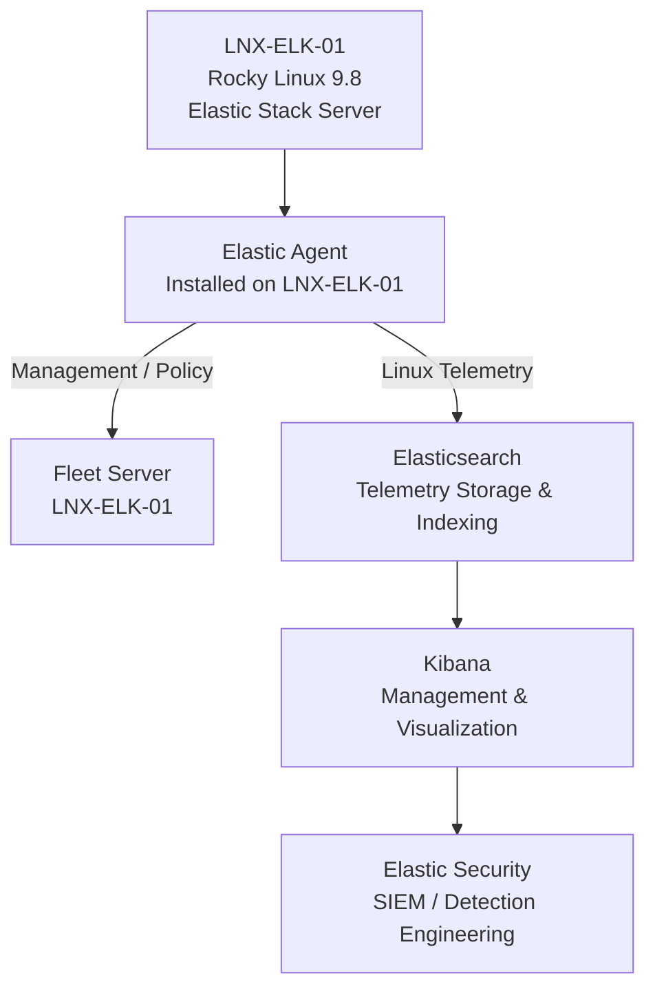
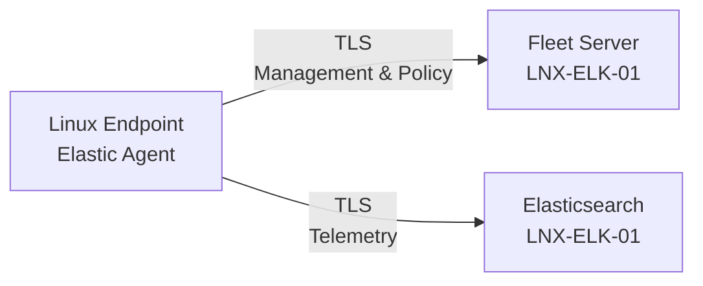

# Enterprise Security Lab Linux Agent Deployment

| Field             | Value                    |
|-------------------|--------------------------|
| Document Name     | Linux Agent Deployment   |
| Document Version  | v0.1.0                   |
| Author            | Terry Humphrey           |
| Status            | Active                   |
| Last Updated      | 2026-07-24               |

---

## Table of Contents

- [1. Purpose](#1-purpose)
- [2. Scope](#2-scope)
- [3. Linux Elastic Agent Overview](#3-linux-elastic-agent-overview)
- [4. Linux Agent Architecture](#4-linux-agent-architecture)
- [5. Linux Agent Configuration](#5-linux-agent-configuration)
- [6. Agent Installation](#6-agent-installation)
- [7. Linux Agent Policy](#7-linux-agent-policy)
- [8. Elastic Integrations](#8-elastic-integrations)
- [9. Security Configuration](#9-security-configuration)
- [10. Validation and Testing](#10-validation-and-testing)
- [11. Troubleshooting](#11-troubleshooting)
- [12. Planned Enhancements](#12-planned-enhancements)
- [13. Related Documentation](#13-related-documentation)

---

# 1. Purpose

## Overview

This document describes the deployment and configuration of Elastic Agent on Linux systems within the Enterprise Security Lab.

Elastic Agent provides centralized telemetry collection from Linux systems and forwards collected data to the Elastic Stack for storage, analysis, visualization, and security monitoring.

The Linux Elastic Agent deployment supports:

- Centralized Linux telemetry collection
- Fleet-managed agent configuration
- System log collection
- Authentication event collection
- Security monitoring
- Linux endpoint visibility
- Elastic Security investigations
- Detection engineering

---

# 2. Scope

This document covers:

- Linux Elastic Agent architecture
- Linux Agent configuration
- Elastic Agent installation
- Fleet enrollment
- Elastic integrations
- Security configuration
- Validation and testing
- Troubleshooting

This document does not cover:

- Elasticsearch deployment
- Kibana deployment
- Fleet Server deployment
- Windows Elastic Agent deployment
- Sysmon configuration
- Detection rule creation
- Incident response procedures

Those topics are documented separately.

---

# 3. Linux Elastic Agent Overview

Elastic Agent provides a unified method for collecting telemetry from Linux systems and managing endpoint configurations through Elastic Fleet.

Within the Enterprise Security Lab, Linux Elastic Agents are managed through Fleet Server and forward telemetry to Elasticsearch.

Fleet provides centralized management of:

- Agent enrollment
- Agent policies
- Integration configuration
- Agent health
- Data collection

---

# 4. Linux Agent Architecture

## Components

| Component         | Purpose                                      |
|-------------------|----------------------------------------------|
| Linux Endpoint    | Generates system and security telemetry      |
| Elastic Agent     | Collects and forwards Linux telemetry        |
| Fleet Server      | Provides centralized agent management        |
| Elasticsearch     | Stores and indexes collected telemetry       |
| Kibana            | Provides Fleet and data visualization        |
| Elastic Security  | Provides SIEM and security monitoring        |

## Architecture Diagram



---

# 5. Linux Agent Configuration

## Linux Agent Overview

The Linux Elastic Agent provides centralized telemetry collection and endpoint management for Linux systems within the Enterprise Security Lab.

The Linux Agent is managed through Elastic Fleet and is responsible for collecting system and security telemetry from enrolled Linux endpoints.

## Linux Agent Responsibilities

The Linux Elastic Agent provides:

- Centralized agent management
- System telemetry collection
- Authentication and security event collection
- Log forwarding to Elasticsearch
- Agent health reporting
- Fleet policy enforcement

## Linux Agent Configuration

| Setting           | Value             |
|-------------------|-------------------|
| Agent Management  | Elastic Fleet     |
| Management Server | LNX-ELK-01        |
| Fleet Server      | LNX-ELK-01        |
| Operating System  | Rocky Linux 9.8   |
| Agent Policy      | POL-LINUX-SERVERS |
| Output            | Elasticsearch     |
| Status            | Active            |

---

# 6. Linux Agent Installation

## Agent Installation

The Elastic Agent is installed on the Linux endpoint and enrolled with Fleet using an enrollment token generated through the Fleet management interface.

The installation process consists of:

1. Generate an enrollment token in Fleet.
2. Download the appropriate Linux Elastic Agent package.
3. Install the Elastic Agent on the Linux endpoint.
4. Enroll the agent with Fleet Server.
5. Assign the appropriate Agent Policy.
6. Confirm the agent appears in Fleet.
7. Validate telemetry collection in Kibana.

Detailed installation procedures are documented separately in the Linux Agent installation documentation.

## Agent Communication

The Linux Elastic Agent communicates with Fleet Server for centralized management and policy updates.

Telemetry collected by the agent is forwarded to the configured Elastic output for indexing and analysis.

---

# 7. Linux Agent Policy

## Linux Agent Policy

The Linux Agent is managed through an Elastic Fleet policy that defines the configuration and integrations applied to the endpoint.

| Component             | Status    |
|-----------------------|-----------|
| Linux Agent           | Active    |
| Fleet Enrollment      | Validated |
| Agent Policy          | Assigned  |
| Fleet Communication   | Validated |
| Linux System Logs     | Validated |
| Security Telemetry    | Validated |
| Elasticsearch Output  | Validated |

## Policy Configuration

The Linux Agent Policy defines:

- Assigned integrations
- Data collection sources
- Agent configuration
- Output configuration
- Agent behavior

Policy changes are managed centrally through Kibana under the Fleet management interface.

---

# 8. Linux Integrations

The Linux Agent uses Elastic integrations to collect system and security telemetry.

| Integration       | Purpose                               | Status  |
|-------------------|---------------------------------------|---------|
| System            | Linux system monitoring and logging   | Active  |
| Auditd            | Linux audit event collection          | Planned |
| Elastic Defend    | Endpoint security monitoring          | Planned |


## Integration Management

Linux integrations are assigned through the applicable Elastic Agent Policy in Fleet.

Integration configuration is centrally managed through Kibana and distributed to enrolled Linux Elastic Agents by Fleet Server.

---

# 9. Security Configuration

Linux Elastic Agent communication is protected using:

- TLS encryption
- Trusted Certificate Authority
- Agent authentication
- Enrollment tokens
- Role-based access control

The Enterprise Security Lab uses the internal Certificate Authority:

```text
SERENITY-ROOT-CA
```

for certificate trust management.

Certificate Authority configuration is documented in:

`05-Certificate-Authority-PKI.md`

Enrollment Security

Enrollment tokens are used to authenticate the initial Elastic Agent enrollment with Fleet Server.

Enrollment tokens should be treated as sensitive credentials and should not be:

- Committed to source control
- Included in public documentation
- Shared publicly
- Stored in unsecured locations

Agent Communication Security

The Linux Elastic Agent uses TLS-protected communication for connections to the Elastic Stack infrastructure.

The general communication flow is:



---

# 10. Validation and Testing

The Linux Elastic Agent deployment is validated by confirming:

| Validation Item | Status |
|-------------------------------|---|
| Elastic Agent in Fleet        | Validated |
| Agent Health                  | Validated |
| Agent Policy Assignment       | Validated |
| Fleet Server Communication    | Validated |
| Linux System Logs             | Validated |
| Linux Authentication Events   | Validated |
| Linux Security Events         | Validated |
| Elasticsearch Data Output     | Validated |
| Kibana Event Visibility       | Validated |

---

# 11. Planned Enhancements

Planned improvements include:

- Additional Linux endpoints
- Additional Linux-specific integrations
- Auditd integration
- Elastic Defend deployment
- Expanded Linux security telemetry
- Agent upgrade procedures
- Automated Linux Agent deployment workflows
- Additional Linux detection rules

---

# 12. Related Documentation


| Document                          | Purpose                                                                                                                                                           |
|-----------------------------------|-------------------------------------------------------------------------------------------------------------------------------------------------------------------|
| README.md                         | High-level overview of the Enterprise Security Lab, objectives, architecture, technologies, hardware inventory, capabilities, and documentation index.            |
| 01-Architecture.md                | Overall lab architecture, physical hardware, virtualization layout, server roles, infrastructure components, and system relationships.                            |
| 02-Network-Design.md              | Network architecture, IP addressing, DNS, communication flows, firewall requirements, segmentation, and network security considerations.                          |
| 03-Asset-Inventory.md             | Inventory of physical devices, VMs, operating systems, hostnames, IP addresses, and system roles/ownership.                                                       |
| 04-Active-Directory.md            | Active Directory architecture, OUs, users, groups, naming conventions, GPOs, authentication, and identity management.                                             |
| 05-Certificate-Authority-PKI.md   | Enterprise CA, certificate templates, trust relationships, certificate lifecycle, and PKI implementation.                                                         |
| 06-Server-Build-Standards.md      | Baseline configuration standards for Windows and Linux servers, including naming, security settings, and required services.                                       |
| 07-Elastic-Deployment.md          | Elasticsearch and Kibana installation, configuration, cluster architecture, and core Elastic Stack infrastructure.                                                |
| 08-Elastic-Fleet-Deployment.md    | Fleet Server, agent policies, integrations, enrollment, and centralized agent management.                                                                         |
| 09-Windows-Agent.md               | Elastic Agent deployment, configuration, integrations, validation, and troubleshooting for Windows endpoints.                                                     |
| 11-Sysmon.md                      | Sysmon installation, configuration, event collection, telemetry, and Elastic integration.                                                                         |
| 12-Elastic-Security.md            | Elastic Security configuration, detection alerting, dashboards, cases, investigations, and analyst workflows.                                                     |
| 13-Detection-Rules.md             | The 30 custom detection rules, KQL, index patterns, severity, risk scores, MITRE ATT&CK mappings, validation status, tuning, and false-positive considerations.   |
| 14-Vulnerability-Management.md    | Vulnerability scanning, risk prioritization, remediation workflows, and verification.                                                                             |
| 15-Patch-Management.md            | WSUS deployment, update approvals, client targeting, maintenance windows, and patch compliance.                                                                   |
| 16-Incident-Response.md           | Incident response lifecycle, alert triage, investigation, containment, eradication, recovery, and lessons learned.                                                |
| 17-Investigation-Runbooks.md      | New. Step-by-step analyst procedures for investigating high-value alerts and detection scenarios.                                                                 |
| 18-Backup-Recovery.md             | Backup strategy, VM recovery, file restoration, disaster recovery, and recovery validation.                                                                       |
| 19-Security-Hardening.md          | Windows/Linux hardening, security baselines, auditing, logging, and defensive controls.                                                                           |
| 20-NIST-CSF-Mapping.md            | Maps lab capabilities to the NIST Cybersecurity Framework and demonstrates alignment with enterprise security practices.                                          |
| 99-Lab-Journal.md                 | Chronological implementation record, troubleshooting, design decisions, testing, snapshots, and future improvements.                                              |

---


# Revision History

| Version   | Date	  		| Changes 									          	                                        |
|-----------|---------------|-----------------------------------------------------------------------------------------------|
| v0.1.0    | 2026-07-24    | Initial Linux Agent documentation published                                         |