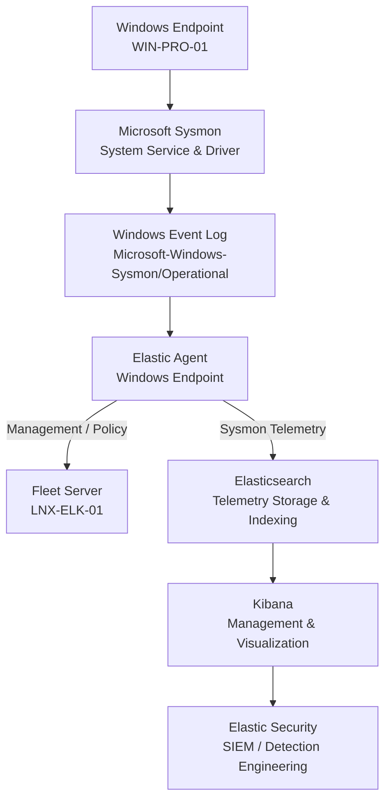
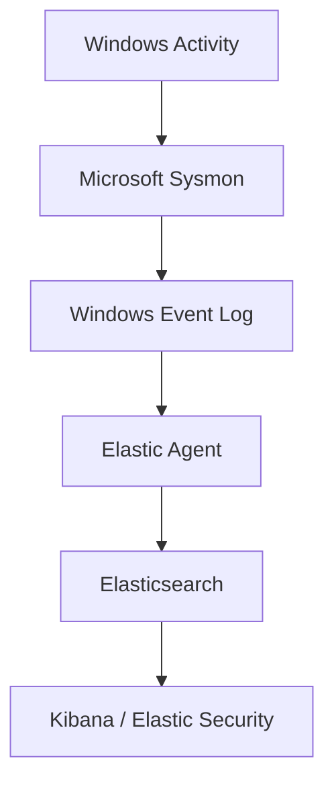
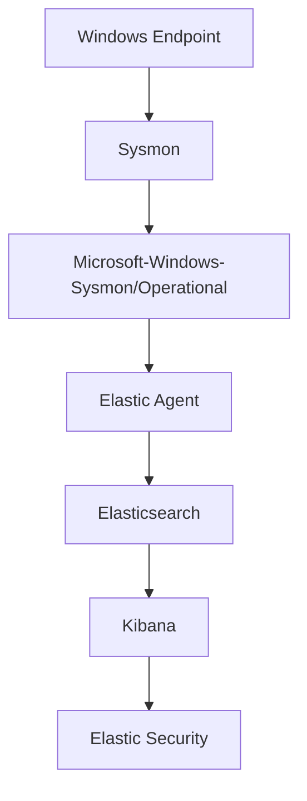
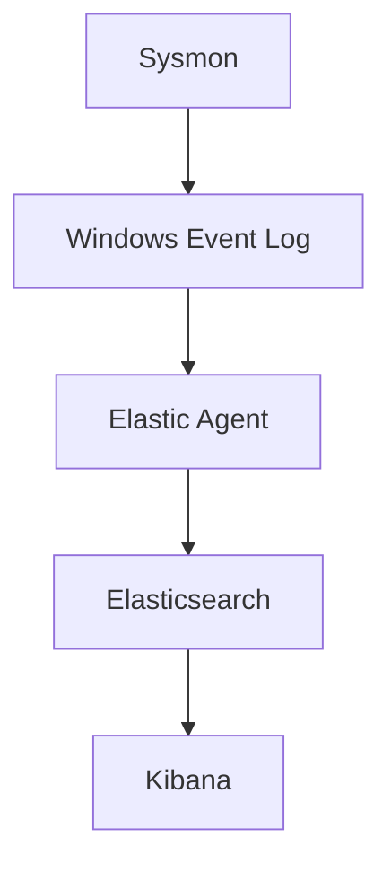

# Enterprise Security Lab Sysmon Deployment

| Field             | Value                    |
|-------------------|--------------------------|
| Document Name     | Sysmon Deployment        |
| Document Version  | v0.1.0                   |
| Author            | Terry Humphrey           |
| Status            | Active                   |
| Last Updated      | 2026-07-24               |

---

## Table of Contents

- [1. Purpose](#1-purpose)
- [2. Scope](#2-scope)
- [3. Sysmon Overview](#3-sysmon-overview)
- [4. Sysmon Architecture](#4-sysmon-architecture)
- [5. Sysmon Configuration](#5-sysmon-configuration)
- [6. Sysmon Installation](#6-sysmon-installation)
- [7. Sysmon Event Collection](#7-sysmon-event-collection)
- [8. Elastic Integration](#8-elastic-integration)
- [9. Security Configuration](#9-security-configuration)
- [10. Validation and Testing](#10-validation-and-testing)
- [11. Troubleshooting](#11-troubleshooting)
- [12. Planned Enhancements](#12-planned-enhancements)
- [13. Related Documentation](#13-related-documentation)

---

# 1. Purpose

## Overview

This document describes the deployment, configuration, and integration of Microsoft Sysmon within the Enterprise Security Lab.

Sysmon provides detailed Windows system activity telemetry that supplements the native Windows event logs collected by Elastic Agent.

The Sysmon deployment supports:

- Advanced Windows endpoint telemetry
- Process creation monitoring
- Network connection monitoring
- File creation monitoring
- Registry activity monitoring
- Process access monitoring
- Detection engineering
- MITRE ATT&CK-aligned threat detection
- Security investigations
- Incident response

---

# 2. Scope

This document covers:

- Sysmon architecture
- Sysmon configuration
- Sysmon installation
- Sysmon event collection
- Elastic integration
- Security configuration
- Validation and testing
- Troubleshooting

This document does not cover:

- Windows Elastic Agent deployment
- Elasticsearch deployment
- Kibana deployment
- Fleet Server deployment
- Elastic Security configuration
- Detection rule creation
- Incident response procedures

Those topics are documented separately.

---

# 3. Sysmon Overview

Microsoft Sysmon is a Windows system service and device driver that provides detailed information about system activity.

Sysmon records events to the Windows Event Log and provides telemetry that is more detailed than many native Windows event sources.

Within the Enterprise Security Lab, Sysmon telemetry is collected from Windows endpoints by Elastic Agent and forwarded to Elasticsearch for analysis and detection.

## Sysmon Telemetry

The Sysmon deployment is intended to provide visibility into:

- Process creation
- Process termination
- Network connections
- File creation and modification
- Registry activity
- Process access
- Driver loading
- Image loading
- DNS queries
- Named pipe activity
- WMI activity
- File deletion

The exact events collected depend on the active Sysmon configuration.

---

# 4. Sysmon Architecture

## Components

| Component           | Purpose                                      |
|---------------------|----------------------------------------------|
| Windows Endpoint    | Generates system activity                    |
| Sysmon              | Collects detailed Windows telemetry          |
| Windows Event Log   | Stores Sysmon events                         |
| Elastic Agent       | Collects and forwards Sysmon telemetry       |
| Fleet Server        | Centrally manages Elastic Agent policies     |
| Elasticsearch       | Stores and indexes Sysmon telemetry          |
| Kibana              | Provides telemetry visualization             |
| Elastic Security    | Provides SIEM and detection capabilities     |

## Architecture Diagram



# 5. Sysmon Configuration

## Configuration Overview

Sysmon is configured using an XML configuration file that defines which events are collected and which activity is included or excluded.

The configuration is designed to provide high-value security telemetry while minimizing unnecessary event volume and false positives.

The Sysmon configuration supports the lab's detection engineering objectives and is aligned with relevant MITRE ATT&CK techniques where applicable.

## Configuration Management

The Sysmon configuration should be maintained as a version-controlled artifact.

Configuration changes should be:

- Documented
- Tested
- Reviewed
- Version controlled
- Validated after deployment

Configuration changes should be recorded in the lab journal.

## Configuration Status

| Component             | Status    |
|-----------------------|-----------|
| Sysmon Configuration  | Active    |
| Process Monitoring    | Planned   |
| Network Monitoring    | Planned   |
| File Monitoring       | Planned   |
| Registry Monitoring   | Planned   |
| Process Access        | Planned   |
| DNS Monitoring        | Planned   |
| Elastic Collection    | Validated |

The exact Sysmon event types and filtering rules are determined by the active configuration.

---

# 6. Sysmon Installation

## Installation Overview

Sysmon is installed on supported Windows endpoints to provide detailed system activity telemetry.

The installation process consists of:

1. Download the Sysmon package from Microsoft Sysinternals.
2. Obtain the approved Sysmon configuration.
3. Review the configuration before deployment.
4. Install the Sysmon service and driver.
5. Apply the approved configuration.
6. Confirm the Sysmon service is running.
7. Confirm Sysmon events are being generated.
8. Configure Elastic Agent to collect Sysmon events.
9. Validate Sysmon telemetry in Elasticsearch and Kibana.

## Installation Target

The initial Sysmon deployment targets:

- `WIN-PRO-01`

Additional Windows endpoints may be added as the lab expands.

## Sysmon Event Log

Sysmon writes operational events to:

```text
Microsoft-Windows-Sysmon/Operational
```
Elastic Agent collects events from this log and forwards them to the Elastic Stack.

# 7. Sysmon Event Collection

## Event Collection

Sysmon generates detailed telemetry for security-relevant system activity.

High-value Sysmon event categories include:

| Event Category              | Security Value                                   |
|-----------------------------|--------------------------------------------------|
| Process Creation            | Detects suspicious process execution             |
| Network Connection          | Identifies outbound and inbound network activity |
| File Creation               | Identifies suspicious file activity              |
| Registry Activity           | Detects persistence and configuration changes    |
| Process Access              | Identifies credential access attempts            |
| DNS Query                   | Provides domain resolution visibility            |
| Image Loading               | Identifies suspicious DLL and module activity    |
| Driver Loading              | Detects potentially suspicious driver activity   |
| Named Pipe Activity         | Supports lateral movement detection              |
| WMI Activity                | Supports remote execution detection              |

The exact events collected depend on the active Sysmon configuration and the version of Sysmon deployed. Event categories listed above represent intended or configured logging and monitoring sources and should not be interpreted as evidence that every category is currently enabled.

## Event Collection Flow



# 8. Elastic Integration

## Sysmon Integration

Sysmon telemetry is collected by Elastic Agent and forwarded to the Elastic Stack for centralized storage, analysis, and security monitoring.

The Sysmon integration is configured through the applicable Elastic Agent Policy in Fleet.

## Integration Configuration

| Component          | Purpose                                       | Status    |
|--------------------|-----------------------------------------------|-----------|
| Sysmon             | Generates detailed Windows security telemetry | Active    |
| Elastic Agent      | Collects Sysmon events                        | Validated |
| Fleet Server       | Manages Elastic Agent policy                  | Validated |
| Elasticsearch      | Stores and indexes Sysmon telemetry           | Validated |
| Kibana             | Provides event visibility and analysis        | Validated |
| Elastic Security   | Supports detection and investigation          | Validated |

## Data Flow



Sysmon events are used as a telemetry source for security monitoring, detection engineering, threat investigation, and incident response.

The collected logging and monitoring is intended to support detection rules mapped to relevant MITRE ATT&CK techniques.

# 9. Security Configuration

## Sysmon Security Considerations

Sysmon configuration should prioritize security-relevant telemetry while limiting excessive event generation.

The configuration should be reviewed periodically to ensure that:

- High-value events are collected
- Excessive event volume is minimized
- Known benign activity is appropriately filtered
- Detection requirements are supported
- New attack techniques can be monitored

## Configuration Security

The Sysmon configuration should not be modified directly on individual endpoints without documenting the change.

Configuration updates should be:

- Tested before deployment
- Version controlled
- Documented
- Applied consistently
- Validated after deployment

## Access Control

Administrative access to Sysmon configuration and deployment mechanisms should be restricted to authorized administrators.

Sysmon configuration files should not contain sensitive credentials or secrets.

---

# 10. Validation and Testing

The Sysmon deployment is validated by confirming:

| Validation Item                         | Status    |
|-----------------------------------------|-----------|
| Sysmon Installed                        | Validated |
| Sysmon Service Running                  | Validated |
| Sysmon Configuration Applied            | Validated |
| Sysmon Event Log Available              | Validated |
| Process Creation Events                 | Validated |
| Network Connection Events               | Planned   |
| File Creation Events                    | Validated |
| Registry Events                         | Planned   |
| Process Access Events                   | Planned   |
| Elastic Agent Collection                | Validated |
| Elasticsearch Data Output               | Validated |
| Kibana Event Visibility                 | Validated |

## Validation Activities

Validation should confirm that:

1. Sysmon is installed and operational.
2. The expected configuration is applied.
3. Sysmon events are written to the operational event log.
4. Elastic Agent is collecting Sysmon events.
5. Events are indexed in Elasticsearch.
6. Sysmon events are visible in Kibana.
7. Sysmon telemetry can be queried using KQL.
8. Detection rules can consume Sysmon telemetry.

# 11. Troubleshooting

## Sysmon Service Not Running

Check the Sysmon service status and review the Windows Event Log for errors.

Confirm that the Sysmon driver and service are installed correctly.

## No Sysmon Events

Verify that:

- Sysmon is running
- The configuration is applied
- The Sysmon operational event log is enabled
- The expected activity is being generated
- The active configuration is not excluding the event

## Elastic Agent Not Collecting Sysmon Events

Verify that:

- Elastic Agent is healthy
- The correct Windows Agent Policy is assigned
- The Sysmon integration is configured
- The Sysmon event log path is correct
- The agent can communicate with Fleet Server
- Events are being forwarded to Elasticsearch

## Sysmon Events Not Visible in Kibana

Verify the telemetry flow:




Check each stage independently to identify where telemetry collection is failing.

---

# 12. Planned Enhancements

Planned improvements include:

- Deploy Sysmon to additional Windows endpoints
- Expand Sysmon configuration coverage
- Map Sysmon events to MITRE ATT&CK techniques
- Tune Sysmon filters to reduce false positives
- Develop additional Sysmon-based detection rules
- Integrate Sysmon telemetry with investigation runbooks
- Automate Sysmon deployment through Group Policy or centralized management
- Automate Sysmon configuration updates
- Monitor Sysmon configuration drift
- Document Sysmon configuration version history
- Expand process access monitoring for credential theft detection
- Expand network telemetry for command-and-control detection


# 13. Related Documentation

| Document                          | Purpose                                                                                                                                                           |
|-----------------------------------|-------------------------------------------------------------------------------------------------------------------------------------------------------------------|
| README.md                         | High-level overview of the Enterprise Security Lab, objectives, architecture, technologies, hardware inventory, capabilities, and documentation index.            |
| 01-Architecture.md                | Overall lab architecture, physical hardware, virtualization layout, server roles, infrastructure components, and system relationships.                            |
| 02-Network-Design.md              | Network architecture, IP addressing, DNS, communication flows, firewall requirements, segmentation, and network security considerations.                          |
| 03-Asset-Inventory.md             | Inventory of physical devices, VMs, operating systems, hostnames, IP addresses, and system roles/ownership.                                                       |
| 04-Active-Directory.md            | Active Directory architecture, OUs, users, groups, naming conventions, GPOs, authentication, and identity management.                                             |
| 05-Certificate-Authority-PKI.md   | Enterprise CA, certificate templates, trust relationships, certificate lifecycle, and PKI implementation.                                                         |
| 06-Server-Build-Standards.md      | Baseline configuration standards for Windows and Linux servers, including naming, security settings, and required services.                                       |
| 07-Elastic-Deployment.md          | Elasticsearch and Kibana installation, configuration, cluster architecture, and core Elastic Stack infrastructure.                                                |
| 08-Elastic-Fleet-Deployment.md    | Fleet Server, agent policies, integrations, enrollment, and centralized agent management.                                                                         |
| 09-Windows-Agent.md               | Elastic Agent deployment, configuration, integrations, validation, and troubleshooting for Windows endpoints.                                                     |
| 10-Linux-Agent.md                 | Elastic Agent deployment, configuration, integrations, validation, and troubleshooting for Linux systems.                                                         |
| 12-Elastic-Security.md            | Elastic Security configuration, detection alerting, dashboards, cases, investigations, and analyst workflows.                                                     |
| 13-Detection-Rules.md             | The 30 custom detection rules, KQL, index patterns, severity, risk scores, MITRE ATT&CK mappings, validation status, tuning, and false-positive considerations.   |
| 14-Vulnerability-Management.md    | Vulnerability scanning, risk prioritization, remediation workflows, and verification.                                                                             |
| 15-Patch-Management.md            | WSUS deployment, update approvals, client targeting, maintenance windows, and patch compliance.                                                                   |
| 16-Incident-Response.md           | Incident response lifecycle, alert triage, investigation, containment, eradication, recovery, and lessons learned.                                                |
| 17-Investigation-Runbooks.md      | New. Step-by-step analyst procedures for investigating high-value alerts and detection scenarios.                                                                 |
| 18-Backup-Recovery.md             | Backup strategy, VM recovery, file restoration, disaster recovery, and recovery validation.                                                                       |
| 19-Security-Hardening.md          | Windows/Linux hardening, security baselines, auditing, logging, and defensive controls.                                                                           |
| 20-NIST-CSF-Mapping.md            | Maps lab capabilities to the NIST Cybersecurity Framework and demonstrates alignment with enterprise security practices.                                          |
| 99-Lab-Journal.md                 | Chronological implementation record, troubleshooting, design decisions, testing, snapshots, and future improvements.                                              |

---


# Revision History

| Version   | Date	  		| Changes 									          	                                        |
|-----------|---------------|-----------------------------------------------------------------------------------------------|
| v0.1.0    | 2026-07-24    | Initial Sysmon documentation published                                                        |