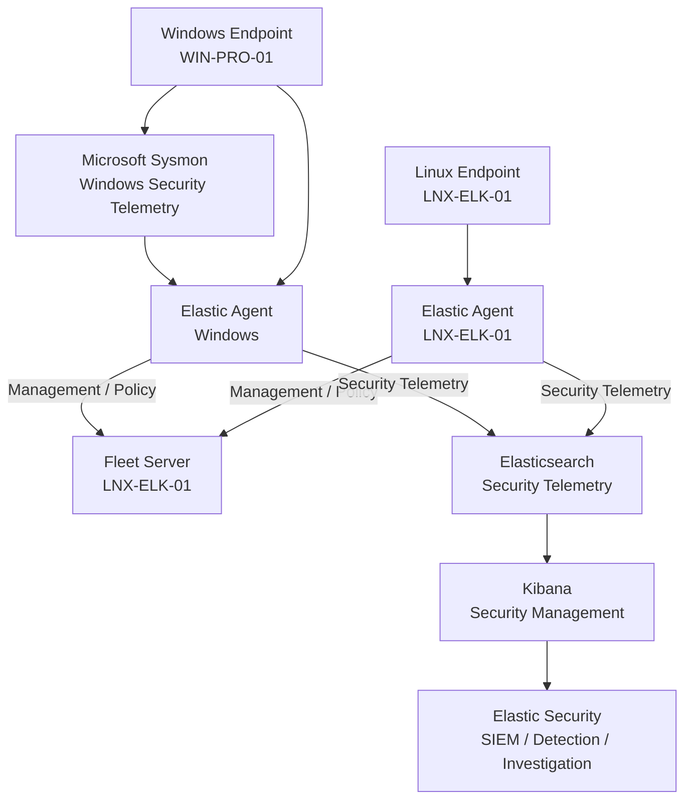
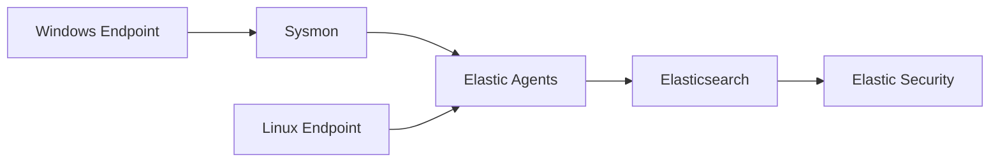
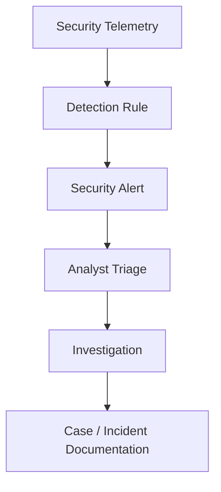
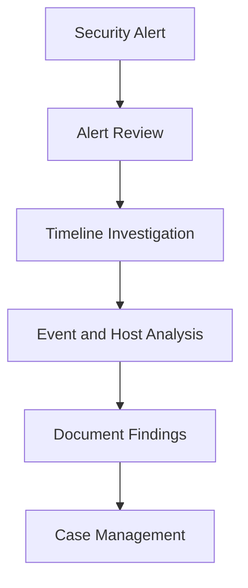
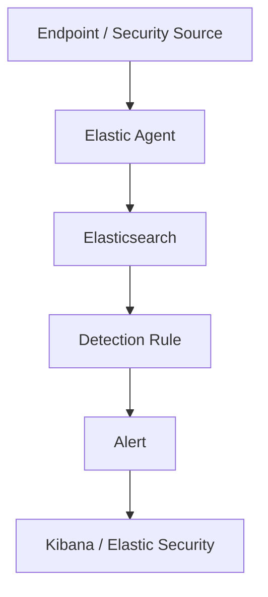

# Enterprise Security Lab Elastic Security Configuration

| Field             | Value                    |
|-------------------|--------------------------|
| Document Name     | Elastic Security         |
| Document Version  | v0.1.0                   |
| Author            | Terry Humphrey           |
| Status            | Active                   |
| Last Updated      | 2026-07-24               |

---

## Table of Contents

- [1. Purpose](#1-purpose)
- [2. Scope](#2-scope)
- [3. Elastic Security Overview](#3-elastic-security-overview)
- [4. Elastic Security Architecture](#4-elastic-security-architecture)
- [5. Security Data Sources](#5-security-data-sources)
- [6. Detection and Alerting](#6-detection-and-alerting)
- [7. Dashboards and Visualization](#7-dashboards-and-visualization)
- [8. Cases and Investigation](#8-cases-and-investigation)
- [9. Security Configuration](#9-security-configuration)
- [10. Validation and Testing](#10-validation-and-testing)
- [11. Troubleshooting](#11-troubleshooting)
- [12. Planned Enhancements](#12-planned-enhancements)
- [13. Related Documentation](#13-related-documentation)

---

# 1. Purpose

## Overview

This document describes the configuration and use of Elastic Security within the Enterprise Security Lab.

Elastic Security provides the Security Information and Event Management (SIEM) capabilities used to collect, analyze, detect, investigate, and respond to security events generated within the lab environment.

The Elastic Security deployment supports:

- Centralized security telemetry analysis
- Detection engineering
- Security alerting
- Threat investigation
- Incident investigation
- MITRE ATT&CK-aligned detection
- Security event visualization
- Case management
- Investigation workflows

---

# 2. Scope

This document covers:

- Elastic Security architecture
- Security data sources
- Detection and alerting
- Dashboards and visualization
- Cases and investigation
- Security configuration
- Validation and testing
- Troubleshooting

This document does not cover:

- Elasticsearch deployment
- Kibana deployment
- Fleet Server deployment
- Elastic Agent deployment
- Sysmon configuration
- Detection rule development procedures
- Incident response procedures

Those topics are documented separately.

---

# 3. Elastic Security Overview

Elastic Security provides the centralized security monitoring and analysis capabilities for the Enterprise Security Lab.

Security telemetry collected from Windows and Linux systems is stored in Elasticsearch and analyzed through Kibana and Elastic Security.

The platform provides capabilities for:

- Security event analysis
- Detection rule execution
- Alert generation
- Threat investigation
- Timeline-based investigation
- Case management
- Detection engineering
- MITRE ATT&CK mapping

Elastic Security serves as the primary analyst interface for investigating security events generated within the lab.

---

# 4. Elastic Security Architecture

## Components

| Component         | Purpose                                               |
|-------------------|-------------------------------------------------------|
| Windows Endpoints | Generate Windows security logging and monitoring      |
| Linux Endpoints   | Generate Linux security logging and monitoring        |
| Sysmon            | Provides detailed Windows logging and monitoring      |
| Elastic Agent     | Collects and forwards endpoint logging and monitoring |
| Fleet Server      | Centrally manages Elastic Agent policies              |
| Elasticsearch     | Stores and indexes security logging and monitoring    |
| Kibana            | Provides security management and visualization        |
| Elastic Security  | Provides SIEM and detection capabilities              |

## Architecture Diagram

---

# 5. Security Data Sources

Elastic Security uses telemetry collected from multiple sources within the Enterprise Security Lab.

## Data Sources

| Data Source          | Purpose                                                   | Status    |
|----------------------|-----------------------------------------------------------|-----------|
| Windows Event Logs   | Windows operating system and security events              | Validated |
| Sysmon               | Detailed Windows endpoint logging and monitoring          | Validated |
| Linux System Logs    | Linux operating system activity                           | Validated |
| Linux Authentication | Linux authentication activity                             | Validated |
| Auditd               | Linux audit events                                        | Planned   |
| Elastic Defend       | Endpoint security events and protection                   | Planned   |

The availability of specific event categories depends on the configuration of the applicable Elastic Agent integrations and endpoint security sources.

The current validated data sources provide the primary security information used by the Enterprise Security Lab for security monitoring, detection engineering, alert generation, and investigation. Additional sources, including Auditd and Elastic Defend, are planned enhancements to expand visibility and detection coverage.

## Security Data Flow

---

# 6. Detection and Alerting

## Detection Overview

Elastic Security provides detection capabilities through rules that evaluate collected security telemetry for suspicious or malicious activity.

The Enterprise Security Lab uses custom detection rules designed to identify security-relevant activity and map detections to applicable MITRE ATT&CK techniques.

Detection rules are documented separately in:

`13-Detection-Rules.md`

## Detection Rule Components

Detection rules may include:

- Rule name
- Rule description
- KQL query
- Data source
- Severity
- Risk score
- MITRE ATT&CK technique
- Investigation guidance
- False-positive considerations
- Validation status

## Detection Workflow

## Detection Status

| Capability                | Status     |
|---------------------------|------------|
| Detection Rules           | Active     |
| Custom Detection Rules    | Active     |
| KQL-Based Detection       | Active     |
| MITRE ATT&CK Mapping      | Active     |
| Alert Generation          | Validated  |
| Alert Investigation       | Planned    |
| Detection Tuning          | Planned    |

---

# 7. Dashboards and Visualization

Elastic Security and Kibana provide dashboards and visualization capabilities for security telemetry and detection activity.

Dashboards should be developed to monitor:

- Security alerts
- Endpoint activity
- Authentication activity
- Process activity
- Network activity
- Detection trends
- Security event volume

## Visualization Workflow

Dashboards should be developed to support security monitoring, detection validation, and investigation workflows.

---

# 8. Cases and Investigation

## Investigation Overview

Elastic Security provides investigation capabilities for analyzing security alerts and related telemetry.

Investigation activities may include:

- Reviewing alert details
- Examining process activity
- Reviewing authentication events
- Investigating network connections
- Analyzing related telemetry
- Reviewing host activity
- Documenting investigation findings

## Investigation Workflow

Detailed investigation procedures are documented in:

`17-Investigation-Runbooks.md`

Incident response procedures are documented in:

`16-Incident-Response.md`

---

# 9. Security Configuration

## Security Configuration

Elastic Security configuration should support centralized security monitoring and detection engineering.

Configuration areas include:

- Detection rules
- Alert severity
- Risk scoring
- MITRE ATT&CK mappings
- Data views
- Security dashboards
- Cases
- Investigation workflows
- User access controls

## Access Control

Access to Elastic Security and Kibana should be restricted based on user roles and administrative requirements.

Administrative permissions should be limited to authorized users.

Security analysts should receive only the permissions required to perform their assigned responsibilities.

## Detection Rule Management

Detection rules should be:

- Version controlled where practical
- Documented
- Tested
- Validated
- Reviewed periodically
- Tuned to reduce false positives

Changes to custom detection rules should be documented in the lab journal.

---

# 10. Validation and Testing

Elastic Security validation should confirm that security telemetry can be collected, indexed, analyzed, and used by detection rules.

## Validation Status

| Validation Item | Status |
|--------------------------------------------|-----------|
| Elasticsearch Security Data                | Validated |
| Kibana Security Logging and Monitoring     | Validated |
| Windows Security Logging and Monitoring    | Validated |
| Sysmon Logging and Monitoring              | Validated |
| Linux System Logging and Monitoring        | Validated |
| Detection Rules                            | Validated |
| Alert Generation                           | Validated |
| Alert Investigation                        | Planned   |
| Case Management                            | Validated |
| Security Dashboards                        | Planned   |

## Validation Activities

Validation should confirm that:

1. Security telemetry is indexed in Elasticsearch.
2. Security telemetry is visible in Kibana.
3. Detection rules can query the appropriate data sources.
4. Detection rules generate alerts when expected activity occurs.
5. Alerts contain sufficient information for analyst triage.
6. Security events can be investigated using available telemetry.
7. Detection rules are mapped to applicable MITRE ATT&CK techniques.

---

# 11. Troubleshooting

## No Security Data

Verify that:

- Elastic Agent is healthy.
- The appropriate Agent Policy is assigned.
- Required integrations are enabled.
- Endpoint telemetry is being generated.
- Events are being forwarded to Elasticsearch.
- Elasticsearch indices contain the expected data.

## Detection Rule Not Generating Alerts

Verify that:

- The detection rule is enabled.
- The KQL query matches the available event fields.
- The required telemetry source is active.
- The expected event was generated.
- The event was indexed in Elasticsearch.
- The rule execution interval has elapsed.

## Alerts Not Visible

Verify that:

- The alert was generated.
- The appropriate security indices are available.
- The user has sufficient permissions.
- The Kibana security interface is functioning correctly.

## Investigation Data Missing

Verify that:

- The underlying telemetry exists in Elasticsearch.
- Required event fields are populated.
- The relevant integrations are enabled.
- The investigation time range includes the event.
- The endpoint generated the expected telemetry.

## Telemetry Flow

---

# 12. Planned Enhancements

Planned improvements include:

- Expand security data sources
- Deploy Auditd integration
- Deploy Elastic Defend
- Expand custom detection coverage
- Improve detection rule validation
- Develop additional MITRE ATT&CK mappings
- Build security monitoring dashboards
- Expand case management workflows
- Improve detection tuning and false-positive reduction
- Automate detection rule deployment
- Implement detection rule version control
- Expand attack simulation and detection validation
- Integrate vulnerability and security telemetry where appropriate

---

# 13. Related Documentation

| Document                          | Purpose                                                                                                                                                           |
|-----------------------------------|-------------------------------------------------------------------------------------------------------------------------------------------------------------------|
| README.md                         | High-level overview of the Enterprise Security Lab, objectives, architecture, technologies, hardware inventory, capabilities, and documentation index.            |
| 01-Architecture.md                | Overall lab architecture, physical hardware, virtualization layout, server roles, infrastructure components, and system relationships.                            |
| 02-Network-Design.md              | Network architecture, IP addressing, DNS, communication flows, firewall requirements, segmentation, and network security considerations.                          |
| 03-Asset-Inventory.md             | Inventory of physical devices, VMs, operating systems, hostnames, IP addresses, and system roles/ownership.                                                       |
| 04-Active-Directory.md            | Active Directory architecture, OUs, users, groups, naming conventions, GPOs, authentication, and identity management.                                             |
| 05-Certificate-Authority-PKI.md   | Enterprise CA, certificate templates, trust relationships, certificate lifecycle, and PKI implementation.                                                         |
| 06-Server-Build-Standards.md      | Baseline configuration standards for Windows and Linux servers, including naming, security settings, and required services.                                       |
| 07-Elastic-Deployment.md          | Elasticsearch and Kibana installation, configuration, cluster architecture, and core Elastic Stack infrastructure.                                                |
| 08-Elastic-Fleet-Deployment.md    | Fleet Server, agent policies, integrations, enrollment, and centralized agent management.                                                                         |
| 09-Windows-Agent.md               | Elastic Agent deployment, configuration, integrations, validation, and troubleshooting for Windows endpoints.                                                     |
| 10-Linux-Agent.md                 | Elastic Agent deployment, configuration, integrations, validation, and troubleshooting for Linux systems.                                                         |
| 11-Sysmon.md                      | Sysmon installation, configuration, event collection, telemetry, and Elastic integration.                                                                         |
| 13-Detection-Rules.md             | The 30 custom detection rules, KQL, index patterns, severity, risk scores, MITRE ATT&CK mappings, validation status, tuning, and false-positive considerations.   |
| 14-Vulnerability-Management.md    | Vulnerability scanning, risk prioritization, remediation workflows, and verification.                                                                             |
| 15-Patch-Management.md            | WSUS deployment, update approvals, client targeting, maintenance windows, and patch compliance.                                                                   |
| 16-Incident-Response.md           | Incident response lifecycle, alert triage, investigation, containment, eradication, recovery, and lessons learned.                                                |
| 17-Investigation-Runbooks.md      | Step-by-step analyst procedures for investigating high-value alerts and detection scenarios.                                                                 |
| 18-Backup-Recovery.md             | Backup strategy, VM recovery, file restoration, disaster recovery, and recovery validation.                                                                       |
| 19-Security-Hardening.md          | Windows/Linux hardening, security baselines, auditing, logging, and defensive controls.                                                                           |
| 20-NIST-CSF-Mapping.md            | Maps lab capabilities to the NIST Cybersecurity Framework and demonstrates alignment with enterprise security practices.                                          |
| 99-Lab-Journal.md                 | Chronological implementation record, troubleshooting, design decisions, testing, snapshots, and future improvements.                                              |

---

# Revision History

| Version   | Date          | Changes                                          |
|-----------|---------------|--------------------------------------------------|
| v0.1.0    | 2026-07-24    | Initial Elastic Security documentation published |