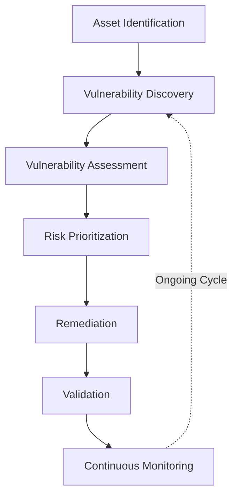
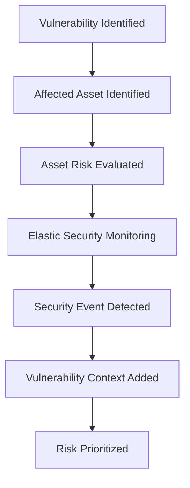

# Vulnerability Management

| Field						 | Value 						  		    				|
|-------------------|-------------------------------------------------------------------|
| Document Name 	| Vulnerability Management 										|
| Document Version 	| v0.1.0 															|
| Author			| Terry Humphrey 													|
| Status 		 	| Active 															|
| Last Updated 		| 2026-07-29 														|

---

## Table of Contents

- [1. Purpose](#1-purpose)
- [2. Scope](#2-scope)
- [3. Vulnerability Management Overview](#3-vulnerability-management-overview)
- [4. Vulnerability Management Process](#4-vulnerability-management-process)
- [5. Asset Assessment](#5-asset-assessment)
- [6. Vulnerability Identification](#6-vulnerability-identification)
- [7. Vulnerability Risk Prioritization](#7-vulnerability-risk-prioritization)
- [8. Vulnerability Tracking](#8-vulnerability-tracking)
- [9. Remediation](#9-remediation)
- [10. Remediation Validation](#10-remediation-validation)
- [11. SIEM Integration](#11-siem-integration)
- [12. Detection Engineering Correlation](#12-detection-engineering-correlation)
- [13. Vulnerability Management Metrics](#13-vulnerability-management-metrics)
- [14. Compliance Alignment](#14-compliance-alignment)
- [15. Future Vulnerability Management Enhancements](#15-future-vulnerability-management-enhancements)
- [16. Related Documentation](#16-related-documentation)

---

# 1. Purpose

## Overview

The Enterprise Security Lab Vulnerability Management process defines how vulnerabilities affecting systems within the lab environment are identified, assessed, prioritized, tracked, remediated, and validated.

The objective is to demonstrate a structured vulnerability management capability that supports security operations, risk management, patch management, detection engineering, and compliance activities.

Vulnerability management is integrated with the broader security monitoring architecture to provide additional context when evaluating the risk associated with systems, services, and security events.

---

# 2. Scope

This document covers:

- Vulnerability identification
- Vulnerability assessment
- Asset risk evaluation
- Vulnerability severity classification
- Risk prioritization
- Vulnerability tracking
- Remediation workflows
- Remediation validation
- SIEM correlation
- Detection engineering correlation
- Vulnerability management metrics
- Compliance considerations

This document does not define detailed WSUS patch deployment procedures. Those activities are documented separately in `15-Patch-Management.md`.

This document also does not define the detailed Elastic Security detection rules used to identify suspicious activity. Those rules are documented separately in `13-Detection-Rules.md`.

---

# 3. Vulnerability Management Overview

The Enterprise Security Lab uses vulnerability management as a continuous process for identifying weaknesses that could affect the confidentiality, integrity, or availability of systems and services.

The vulnerability management process is designed to support the following objectives:

- Identify vulnerabilities affecting lab systems
- Determine the severity and potential impact of vulnerabilities
- Prioritize vulnerabilities based on risk
- Track vulnerabilities through remediation
- Validate that remediation activities were successful
- Correlate vulnerability information with security monitoring
- Improve detection engineering priorities
- Support security and compliance documentation

The vulnerability management framework is fully documented in Phase 1. Operational vulnerability scanning, assessment data, and metrics will be implemented during Phase 2.

## Vulnerability Management Lifecycle

The vulnerability management lifecycle follows this general process:

---

# 4. Vulnerability Management Process

The vulnerability management process consists of the following activities:

| Phase                     | Description                                                                                       |
|---------------------------|---------------------------------------------------------------------------------------------------|
| Asset Identification      | Identify systems and services within the vulnerability management scope.                          |
| Vulnerability Discovery   | Identify known vulnerabilities, missing updates, insecure configurations, and exposed services.   |
| Assessment                | Evaluate vulnerability severity, exploitability, asset criticality, and exposure.                 |
| Prioritization            | Rank vulnerabilities based on overall risk.                                                       |
| Remediation               | Apply patches, configuration changes, software updates, or compensating controls.                 |
| Validation                | Confirm that remediation successfully addressed the vulnerability.                                |
| Tracking                  | Maintain records of open, remediated, accepted, and deferred vulnerabilities.                     |
| Reporting                 | Document vulnerability status and risk trends.                                                    |

Vulnerability management is intended to operate as an ongoing process rather than a one-time assessment.

---

# 5. Asset Assessment

Vulnerability management depends on maintaining an accurate inventory of systems within the lab.

The initial assessment scope includes:

| Hostname      | Operating System      | Role                          | Assessment Status     |
|---------------|-----------------------|-------------------------------|-----------------------|
| WIN-DC-01     | Windows Server 2025   | Domain Controller / DNS / CA  | Planned               |
| WIN-WSUS-01   | Windows Server 2025   | WSUS / File Server            | Planned               |
| LNX-ELK-01    | Rocky Linux 9.8       | Elastic Stack / SIEM          | Planned               |
| LNX-KALI-01   | Kali Linux            | Attack Simulation             | Excluded / Testing    |
| LNX-WEB-01    | Rocky Linux 9.8       | Apache / MariaDB              | Planned               | 

## Asset Information

Vulnerability management records should include:

- Hostname
- IP address
- Operating system
- Operating system version
- System role
- Installed software
- Network exposure
- System criticality
- Vulnerability assessment status
- Remediation status

## Asset Criticality

Assets should be evaluated based on their importance to the lab environment.

| Criticality   | Description                                                                   |
|---------------|-------------------------------------------------------------------------------|
| Critical      | Systems providing essential security, identity, or infrastructure services.   |
| High          | Systems supporting important security or operational capabilities.            |
| Medium        | Systems with limited operational impact if compromised.                       |
| Low           | Systems used primarily for testing or non-critical purposes.                  |

The Domain Controller and Elastic Stack infrastructure should generally receive higher priority during vulnerability assessment and remediation activities because they provide core services to the lab.

---

# 6. Vulnerability Identification

Vulnerabilities are identified through multiple sources.

Potential vulnerability identification methods include:

- Vulnerability scanning
- Authenticated vulnerability assessments
- Operating system patch assessments
- Software version analysis
- Vendor security advisories
- CVE research
- Security configuration reviews
- SIEM telemetry
- Threat intelligence
- Security testing
- Attack simulation

## Vulnerability Categories

Identified findings include:

- Known CVEs
- Missing security updates
- Unsupported operating systems
- End-of-life software
- Vulnerable software versions
- Insecure configurations
- Unnecessary exposed services
- Weak authentication configurations
- Missing security controls
- Misconfigured services

## Vulnerability Records

| Vulnerability | CVE   | Asset | Severity  | Discovery Source  | Status    |
|---------------|-------|-------|-----------|-------------------|-----------|
| TBD           | TBD   | TBD   | TBD       | TBD               | Open      |

---

# 7. Vulnerability Risk Prioritization

Vulnerabilities should be prioritized based on overall risk rather than severity alone.

Risk prioritization may consider:

- CVSS score
- Vulnerability severity
- Exploit availability
- Known exploitation in the wild
- Asset criticality
- Network exposure
- Privileged access
- Data sensitivity
- Potential business impact
- Availability of remediation
- Existing compensating controls

## Risk Prioritization

CVSS v3.1 Base Scores are used as an input to risk evaluation but are supplemented by asset criticality, exposure, and business context when determining remediation priority.

| Risk Level    | Description                                                           | Recommended Action                            |
|---------------|-----------------------------------------------------------------------|-----------------------------------------------|
| Critical      | Severe vulnerability affecting a highly important or exposed asset.   | Immediate remediation.                        |
| High          | Significant vulnerability with meaningful exploitation potential.     | Prioritize remediation.                       |
| Medium        | Vulnerability presenting moderate risk.                               | Remediate during normal maintenance cycle.    |
| Low           | Limited security impact or low likelihood of exploitation.            | Address as resources permit.                  |
| Informational | Finding providing security context without significant direct risk.   | Monitor or document as appropriate.           |

Where applicable, CVE identifiers and CVSS scores should be recorded.

---

# 8. Vulnerability Tracking

Identified vulnerabilities should be tracked throughout their lifecycle.

| Vulnerability | CVE | Asset | Severity | Risk | Remediation | Owner | Status | Date Identified | Date Remediated |
|---------------|-----|-------|----------|------|-------------|-------|--------|-----------------|-----------------|
| TBD           | TBD | TBD   | TBD      | TBD  | TBD         | TBD   | Open   | TBD             | TBD             |

## Vulnerability Status

The following statuses may be used:

- Open
- In Progress
- Remediated
- Validated
- Accepted Risk
- False Positive
- Deferred

## Risk Acceptance

Vulnerabilities that cannot be immediately remediated may be documented as accepted risk or deferred.

Risk acceptance documentation should include:

- Vulnerability
- Affected asset
- Business or operational justification
- Compensating controls
- Risk owner
- Approval date
- Review date
- Planned remediation date

---

# 9. Remediation

Remediation activities include:

- Installing security updates
- Applying operating system patches
- Updating vulnerable software
- Removing unsupported software
- Disabling unnecessary services
- Correcting insecure configurations
- Restricting network exposure
- Implementing compensating controls
- Replacing vulnerable components

Remediation activities should be coordinated with the applicable system owner and documented within the vulnerability tracking process.

## Remediation Priority

Critical and high-risk vulnerabilities should receive priority based on:

- Exploitability
- Asset criticality
- Exposure
- Availability of remediation
- Potential impact

Vulnerability remediation should be coordinated with patch management activities where applicable.

---

# 10. Remediation Validation

A vulnerability should not be considered fully remediated until remediation has been validated.

Validation may include:

- Rescanning the affected asset
- Verifying the installed software version
- Confirming a security update is installed
- Rechecking the affected configuration
- Confirming a vulnerable service is no longer exposed
- Reviewing SIEM telemetry for continued vulnerable activity

## Validation Results

| Vulnerability | Asset | Remediation Completed | Validation Method | Validation Result | Date |
|---------------|-------|-----------------------|-------------------|-------------------|------|
| TBD           | TBD   | TBD                   | TBD               | TBD               | TBD  |

---

# 11. SIEM Integration

Vulnerability management information may be correlated with Elastic Security telemetry to improve security monitoring and risk visibility.

During Phase 1, Elastic Security provides the centralized platform used to monitor Windows and Linux systems, validate custom detection rules, and correlate security events with asset context.

Potential correlation use cases include:

- Vulnerable host generating security alerts
- Vulnerable software associated with suspicious process execution
- Vulnerable systems targeted during attack simulation
- Exploitable services identified during network reconnaissance
- Vulnerability findings correlated with endpoint telemetry
- Security alerts originating from high-risk assets

## Vulnerability and SIEM Correlation

The following workflow is used:

Vulnerability information can provide additional context when investigating alerts and determining whether a security event may represent an attempted exploitation of a known weakness.

---

# 12. Detection Engineering Correlation

Vulnerability information is used to improve detection engineering priorities.

Potential applications include:

- Prioritizing detections for systems with known exploitable vulnerabilities
- Increasing monitoring of vulnerable services
- Developing detections for exploitation techniques associated with identified CVEs
- Correlating vulnerability exposure with attack simulation activity
- Identifying systems requiring additional security monitoring
- Improving alert prioritization based on asset risk

Vulnerability intelligence may also be used to identify gaps in existing detection coverage.

For example, if a vulnerable service is present within the environment and a corresponding exploitation technique is known, a detection rule may be developed to identify suspicious activity targeting that service.

---

# 13. Vulnerability Management Metrics

Vulnerability management metrics should be used to measure the effectiveness of the vulnerability management process.

| Metric                            | Value |
|-----------------------------------|-------|
| Total Assets Assessed             | TBD   |
| Total Vulnerabilities Identified  | TBD   |
| Critical Vulnerabilities          | TBD   |
| High Vulnerabilities              | TBD   |
| Medium Vulnerabilities            | TBD   |
| Low Vulnerabilities               | TBD   |
| Vulnerabilities Remediated        | TBD   |
| Vulnerabilities Outstanding       | TBD   |
| Average Remediation Time          | TBD   |
| Critical Vulnerabilities Past Due | TBD   |

## Remediation Tracking

| Metric                                | Target | Current | Status |
|---------------------------------------|--------|---------|--------|
| Critical Vulnerabilities Remediated   | TBD    | TBD     | TBD    |
| High Vulnerabilities Remediated       | TBD    | TBD     | TBD    |
| Vulnerability Validation Rate         | TBD    | TBD     | TBD    |
| Average Remediation Time              | TBD    | TBD     | TBD    |

---

# 14. Compliance Alignment

Vulnerability management supports multiple security and compliance objectives within the Enterprise Security Lab.

Relevant areas include:

- System and Information Integrity
- Configuration Management
- Risk Assessment
- Security Assessment
- Incident Response
- Maintenance
- Continuous Monitoring

Vulnerability management activities are used to demonstrate the ability to identify weaknesses, assess risk, implement remediation, and verify that security controls remain effective.

Where applicable, vulnerability management activities should be mapped to relevant NIST SP 800-171 requirements.

---

# 15. Future Vulnerability Management Enhancements

Planned or potential future improvements include:

- Implement dedicated vulnerability scanning
- Implement authenticated vulnerability assessments
- Automate vulnerability-to-asset correlation
- Develop vulnerability dashboards in Kibana
- Implement automated risk scoring
- Correlate CVEs with MITRE ATT&CK techniques
- Integrate vulnerability information with detection engineering
- Implement automated remediation workflows
- Expand continuous vulnerability monitoring
- Integrate external threat intelligence
- Establish vulnerability remediation SLAs
- Develop recurring vulnerability management reports

---

# 16. Related Documentation

| Document                          | Purpose                                                                                                                                                           |
|-----------------------------------|-------------------------------------------------------------------------------------------------------------------------------------------------------------------|
| README.md                         | High-level overview of the Enterprise Security Lab, objectives, architecture, technologies, hardware inventory, capabilities, and documentation index.            |
| 01-Architecture.md                | Overall lab architecture, physical hardware, virtualization layout, server roles, infrastructure components, and system relationships.                            |
| 02-Network-Design.md              | Network architecture, IP addressing, DNS, communication flows, firewall requirements, segmentation, and network security considerations.                          |
| 03-Asset-Inventory.md             | Inventory of physical devices, VMs, operating systems, hostnames, IP addresses, and system roles/ownership.                                                       |
| 04-Active-Directory.md            | Active Directory architecture, OUs, users, groups, naming conventions, GPOs, authentication, and identity management.                                             |
| 05-Certificate-Authority-PKI.md   | Enterprise CA, certificate templates, trust relationships, certificate lifecycle, and PKI implementation.                                                         |
| 06-Server-Build-Standards.md      | Baseline configuration standards for Windows and Linux servers, including naming, security settings, and required services.                                       |
| 07-Elastic-Deployment.md          | Elasticsearch and Kibana installation, configuration, cluster architecture, and core Elastic Stack infrastructure.                                                |
| 08-Elastic-Fleet-Deployment.md    | Fleet Server, agent policies, integrations, enrollment, and centralized agent management.                                                                         |
| 09-Windows-Agent.md               | Elastic Agent deployment, configuration, integrations, validation, and troubleshooting for Windows endpoints.                                                     |
| 10-Linux-Agent.md                 | Elastic Agent deployment, configuration, integrations, validation, and troubleshooting for Linux systems.                                                         |
| 11-Sysmon.md                      | Sysmon installation, configuration, event collection, telemetry, and Elastic integration.                                                                         |
| 12-Elastic-Security.md            | Elastic Security configuration, detection alerting, dashboards, cases, investigations, and analyst workflows.                                                     |
| 13-Detection-Rules.md             | The 30 custom detection rules, KQL, index patterns, severity, risk scores, MITRE ATT&CK mappings, validation status, tuning, and false-positive considerations.   |
| 15-Patch-Management.md            | WSUS deployment, update approvals, client targeting, maintenance windows, and patch compliance.                                                                   |
| 16-Incident-Response.md           | Incident response lifecycle, alert triage, investigation, containment, eradication, recovery, and lessons learned.                                                |
| 17-Investigation-Runbooks.md      | New. Step-by-step analyst procedures for investigating high-value alerts and detection scenarios.                                                                 |
| 18-Backup-Recovery.md             | Backup strategy, VM recovery, file restoration, disaster recovery, and recovery validation.                                                                       |
| 19-Security-Hardening.md          | Windows/Linux hardening, security baselines, auditing, logging, and defensive controls.                                                                           |
| 20-NIST-CSF-Mapping.md            | Maps lab capabilities to the NIST Cybersecurity Framework and demonstrates alignment with enterprise security practices.                                          |
| 99-Lab-Journal.md                 | Chronological implementation record, troubleshooting, design decisions, testing, snapshots, and future improvements.                                              |

---

# Revision History

| Version 	| Date 		 | Changes 									    	    |
|-----------|------------|------------------------------------------------------|
| v0.1.0    | 2026-07-29 | Initial Vulnerability Management document created   |

---