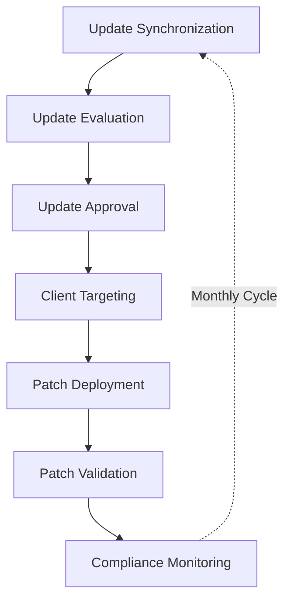
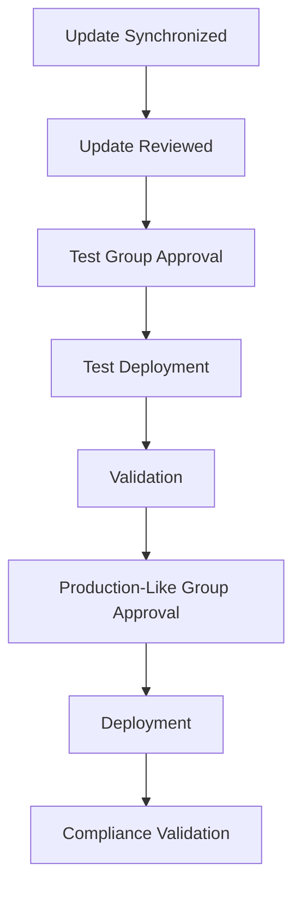
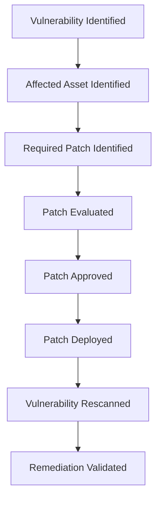

# Patch Management

| Field			    | Value 						  		    		        		|
|-------------------|-------------------------------------------------------------------|
| Document Name 	| Patch Management 			    									|
| Document Version 	| v0.1.0 															|
| Author			| Terry Humphrey 													|
| Status 		 	| Active 															|
| Last Updated 		| 2026-07-29 														|

---

## Table of Contents

- [1. Purpose](#1-purpose)
- [2. Scope](#2-scope)
- [3. Patch Management Overview](#3-patch-management-overview)
- [4. Patch Management Architecture](#4-patch-management-architecture)
- [5. WSUS Infrastructure](#5-wsus-infrastructure)
- [6. Client Targeting](#6-client-targeting)
- [7. Update Classification](#7-update-classification)
- [8. Update Approval Process](#8-update-approval-process)
- [9. Patch Deployment](#9-patch-deployment)
- [10. Maintenance Windows](#10-maintenance-windows)
- [11. Patch Compliance](#11-patch-compliance)
- [12. Patch Validation](#12-patch-validation)
- [13. Vulnerability Management Integration](#13-vulnerability-management-integration)
- [14. SIEM Integration](#14-siem-integration)
- [15. Patch Management Metrics](#15-patch-management-metrics)
- [16. Compliance Alignment](#16-compliance-alignment)
- [17. Future Patch Management Enhancements](#17-future-patch-management-enhancements)
- [18. Related Documentation](#18-related-documentation)

---

# 1. Purpose

## Overview

The Enterprise Security Lab Patch Management process defines how operating system and software updates are identified, evaluated, approved, deployed, and validated across supported Windows systems.

The objective is to demonstrate centralized patch management using Windows Server Update Services (WSUS) while maintaining visibility into update compliance and remediation status.

Patch management supports the broader vulnerability management, security monitoring, and compliance objectives of the Enterprise Security Lab.

---

# 2. Scope

This document covers:

- WSUS infrastructure
- Windows Update management
- Update synchronization
- Update classifications
- Client targeting
- Update approval
- Patch deployment
- Maintenance windows
- Patch compliance
- Patch validation
- Vulnerability management integration
- SIEM integration
- Patch management metrics

This document does not define detailed vulnerability scanning procedures. Those activities are documented separately in `14-Vulnerability-Management.md`.

This document also does not define the detailed Windows Server build standards or security hardening configurations. Those activities are documented separately in the related documentation.

---

# 3. Patch Management Overview

The Enterprise Security Lab uses centralized patch management to control the deployment of Windows updates to managed systems.

WSUS provides a centralized mechanism for:

- Synchronizing Microsoft updates
- Selecting update classifications
- Approving updates
- Targeting systems
- Monitoring update status
- Identifying systems requiring updates
- Tracking patch compliance

The patch management process is designed to reduce exposure to known vulnerabilities while providing controlled deployment and validation.

The patch management framework is documented in Phase 1. Operational compliance tracking, production patch metrics, formal maintenance windows, and automated reporting will be implemented during Phase 2.

## Patch Management Lifecycle

---

# 4. Patch Management Architecture

The patch management architecture is based on centralized WSUS services operating within the Windows Server infrastructure.

## Patch Management Components

| Component             | Host          | Type          | Purpose                                                                       | Status  |
|-----------------------|---------------|---------------|-------------------------------------------------------------------------------|---------|
| WSUS Server           | WIN-WSUS-01   | Server        | Centralized Windows Update management and patch deployment                    | Active  |
| Domain Controller     | WIN-DC-01     | Server        | Receives updates from WSUS; provides Active Directory, DNS, and GPO services  | Active  |
| Windows Workstation   | WIN-PRO-01    | Workstation   | Receives updates from WSUS for endpoint patch validation                      | Active  |

The Domain Controller provides Active Directory and Group Policy services used to configure Windows Update policies and WSUS client behavior.

---

# 5. WSUS Infrastructure

## WSUS Server

| Setting           | Value                          |
|-------------------|--------------------------------|
| Hostname          | WIN-WSUS-01                    |
| Operating System  | Windows Server 2025            |
| Role              | Windows Server Update Services |
| IP Address        | 192.168.1.128                  |
| Domain            | serenity.lab                   |
| Status            | Active                         |

The WSUS server provides centralized update management for supported Windows systems within the Enterprise Security Lab.

## WSUS Responsibilities

The WSUS server is responsible for:

- Synchronizing updates from Microsoft
- Maintaining the update catalog
- Classifying available updates
- Approving updates
- Managing computer groups
- Providing update status information
- Supporting patch compliance monitoring

## Update Synchronization

WSUS should periodically synchronize with Microsoft Update to retrieve information about available updates.

Synchronization should be configured to retrieve only the products and classifications required by the lab environment.

This reduces unnecessary storage requirements and simplifies update management.

---

# 6. Client Targeting

Windows systems should be organized into WSUS computer groups based on their role and patching requirements.

## WSUS Computer Groups

| Computer Group | Systems                  | Purpose                               |
|----------------|--------------------------|---------------------------------------|
| Servers        | WIN-DC-01, WIN-WSUS-01   | Production-like server patching       |
| Workstations   | WIN-PRO-01               | Windows workstation patching          |
| Test           | TBD                      | Initial patch testing                 |
| Exceptions     | TBD                      | Systems requiring special handling    |

Client targeting may be performed using:

- WSUS console targeting
- Group Policy
- Active Directory organizational units
- Registry-based WSUS configuration

## Group Policy Integration

Active Directory Group Policy is used to configure:

- WSUS server location
- Automatic update behavior
- Update installation schedules
- Restart behavior
- Client-side targeting
- Maintenance windows

Windows systems should receive WSUS configuration through centralized Group Policy where practical.

---

# 7. Update Classification

Updates should be evaluated according to their classification and relevance to the lab environment.

Potential update classifications include:

- Security Updates
- Critical Updates
- Updates
- Definition Updates
- Update Rollups
- Feature Packs
- Service Packs
- Drivers

## Update Prioritization

Security-related updates should generally receive the highest priority.

| Priority      | Update Type                               | Recommended Action                        |
|---------------|-------------------------------------------|-------------------------------------------|
| Critical      | Critical security updates                 | Expedite evaluation and deployment        |
| High          | Security updates                          | Prioritize deployment                     |
| Medium        | Important reliability or security updates | Deploy through normal maintenance cycle   |
| Low           | Optional or non-essential updates         | Evaluate before deployment                |
| Informational | Updates with limited operational impact   | Deploy as appropriate                     |

Update classifications should be reviewed periodically to ensure that the WSUS environment is receiving only relevant content.

---

# 8. Update Approval Process

Updates should be evaluated before broad deployment.

The general approval process is:

## Approval Considerations

Before approving an update, the following should be considered:

- Security severity
- Vulnerability exposure
- Affected products
- Known compatibility issues
- Reboot requirements
- System criticality
- Availability of backups
- Maintenance window requirements
- Previous deployment results

## Update Approval Tracking

| Update | KB Article | Classification | Severity | Target Group | Approval Status | Date Approved |
|--------|------------|----------------|----------|--------------|-----------------|---------------|
| TBD    | TBD        | TBD            | TBD      | TBD          | Pending         | TBD           |

---

# 9. Patch Deployment

Approved updates should be deployed to systems according to their assigned WSUS computer group.

Patch deployment should follow a controlled process that minimizes the risk of introducing operational issues.

## Deployment Sequence

1. Synchronize updates.
2. Review newly available updates.
3. Identify security-relevant updates.
4. Approve updates for the test group.
5. Deploy updates to test systems.
6. Validate successful installation.
7. Monitor for errors or unexpected behavior.
8. Approve updates for production-like systems.
9. Deploy updates during the appropriate maintenance window.
10. Validate patch compliance.

## Deployment Status

| Hostname | Update | KB  | Installation Status | Reboot Required | Validation Status |
|----------|--------|-----|---------------------|-----------------|-------------------|
| TBD      | TBD    | TBD | TBD                 | TBD             | TBD               |

---

# 10. Maintenance Windows

Patch deployment should be coordinated with defined maintenance windows.

Maintenance windows provide a controlled period during which updates may be installed and systems may be restarted.

## Maintenance Window

| System Group | Maintenance Window | Restart Allowed | Status  |
|--------------|--------------------|-----------------|---------|
| Test         | TBD                | Yes             | Planned |
| Servers      | TBD                | TBD             | Planned |
| Workstations | TBD                | TBD             | Planned |

## Maintenance Considerations

Maintenance windows should account for:

- System availability
- Update installation duration
- Required system restarts
- Dependencies between systems
- Backup availability
- Validation requirements

Critical infrastructure systems such as the Domain Controller and Elastic Stack infrastructure should be patched in a manner that minimizes disruption to security monitoring and authentication services.

---

# 11. Patch Compliance

Patch compliance measures whether systems have successfully installed required updates.

## Compliance Status

| Hostname    | Required Updates | Installed Updates | Missing Updates | Compliance | Last Check |
|-------------|------------------|-------------------|-----------------|------------|------------|
| WIN-DC-01   | TBD              | TBD               | TBD             | TBD        | TBD        |
| WIN-WSUS-01 | TBD              | TBD               | TBD             | TBD        | TBD        |
| WIN-PRO-01  | TBD              | TBD               | TBD             | TBD        | TBD        |

## Compliance Categories

| Status        | Description                                                       |
|---------------|-------------------------------------------------------------------|
| Compliant     | System has installed all required approved updates.               |
| Non-Compliant | System is missing one or more required updates.                   |
| Pending       | Updates have been approved but have not yet completed deployment. |
| Failed        | One or more updates failed to install.                            |
| Exception     | System is intentionally excluded from standard patching.          |

Non-compliant systems should be investigated and remediated according to the severity and risk associated with the missing updates.

---

# 12. Patch Validation

Patch deployment should be validated after installation.

Validation may include:

- Confirming update installation
- Verifying the KB article is installed
- Confirming the system reports as compliant in WSUS
- Checking for failed updates
- Confirming required services remain operational
- Confirming Elastic Agent remains operational
- Confirming security telemetry continues to reach Elastic
- Confirming systems remain domain-joined and functional

## Validation Results

| Hostname | Update | Validation Method     | Result | Date |
|----------|--------|-----------------------|--------|------|
| TBD      | TBD    | WSUS Compliance Check | TBD    | TBD  |

Patch validation should include both update status and operational validation to ensure that security updates do not negatively affect monitored systems.

---

# 13. Vulnerability Management Integration

Patch management directly supports the vulnerability management process.

Vulnerabilities identified through vulnerability scanning may be remediated through:

- Windows security updates
- Microsoft cumulative updates
- Application updates
- Configuration changes
- Software removal

The vulnerability management process should identify vulnerabilities requiring patch remediation, while WSUS provides the mechanism for managing applicable Microsoft updates.

## Vulnerability-to-Patch Workflow

Patch compliance should be reviewed alongside vulnerability findings to identify systems that remain exposed due to missing updates.

---

# 14. SIEM Integration

Patch management data may be correlated with Elastic Security telemetry to improve visibility into endpoint health and security posture.

Potential SIEM use cases include:

- Identifying non-compliant systems
- Monitoring update installation failures
- Detecting unexpected system restarts
- Correlating vulnerable systems with security alerts
- Monitoring systems following patch deployment
- Identifying security events occurring on systems with missing updates

Patch status may also provide additional context during security investigations.

Combining patch compliance data with Elastic Security telemetry allows analysts to prioritize investigations involving systems with known missing security updates.

For example, a security alert originating from a system with known missing security updates may represent a higher-risk event than the same alert from a fully patched system.

---

# 15. Patch Management Metrics

Patch management metrics should be used to measure update deployment effectiveness and overall patch compliance.

| Metric                                 | Value |
|----------------------------------------|-------|
| Total Managed Systems                  | TBD   |
| Total Systems Compliant                | TBD   |
| Total Systems Non-Compliant            | TBD   |
| Critical Updates Outstanding           | TBD   |
| High-Severity Updates Outstanding      | TBD   |
| Failed Updates                         | TBD   |
| Pending Updates                        | TBD   |
| Patch Compliance Rate                  | TBD   |
| Average Time to Patch Critical Updates | TBD   |
| Average Time to Patch High Updates     | TBD   |

## Patch Compliance Tracking

| System Group | Total Systems | Compliant | Non-Compliant | Compliance Rate |
|--------------|---------------|-----------|---------------|-----------------|
| Servers      | TBD           | TBD       | TBD           | TBD             |
| Workstations | TBD           | TBD       | TBD           | TBD             |
| Test         | TBD           | TBD       | TBD           | TBD             |

---

# 16. Compliance Alignment

Patch management supports multiple security and compliance objectives within the Enterprise Security Lab.

Relevant areas include:

- Configuration Management
- System and Information Integrity
- Risk Assessment
- Security Assessment
- Maintenance
- Continuous Monitoring

Patch management provides evidence that security updates are centrally managed, evaluated, deployed, and validated.

The patch management process also supports vulnerability remediation by providing a controlled mechanism for addressing vulnerabilities associated with Microsoft operating systems and supported products.

Where applicable, patch management activities should be mapped to relevant NIST SP 800-171 requirements.

---

# 17. Future Patch Management Enhancements

Planned or potential future improvements include:

- Complete WSUS computer group configuration
- Implement centralized Group Policy for WSUS client configuration
- Define formal maintenance windows
- Implement test and production-like patching rings
- Establish patch remediation SLAs
- Develop automated patch compliance reporting
- Integrate WSUS compliance data with Elastic Security
- Develop Kibana dashboards for patch compliance
- Correlate missing patches with vulnerability findings
- Implement automated reporting for failed updates
- Expand patch management to additional Windows systems
- Evaluate third-party application patch management capabilities

---

# 18. Related Documentation

| Document                          | Purpose                                                                                                                                                           |
|-----------------------------------|-------------------------------------------------------------------------------------------------------------------------------------------------------------------|
| README.md                         | High-level overview of the Enterprise Security Lab, objectives, architecture, technologies, hardware inventory, capabilities, and documentation index.            |
| 01-Architecture.md                | Overall lab architecture, physical hardware, virtualization layout, server roles, infrastructure components, and system relationships.                            |
| 02-Network-Design.md              | Network architecture, IP addressing, DNS, communication flows, firewall requirements, segmentation, and network security considerations.                          |
| 03-Asset-Inventory.md             | Inventory of physical devices, VMs, operating systems, hostnames, IP addresses, and system roles/ownership.                                                       |
| 04-Active-Directory.md            | Active Directory architecture, OUs, users, groups, naming conventions, GPOs, authentication, and identity management.                                             |
| 05-Certificate-Authority-PKI.md   | Enterprise CA, certificate templates, trust relationships, certificate lifecycle, and PKI implementation.                                                         |
| 06-Server-Build-Standards.md      | Baseline configuration standards for Windows and Linux servers, including naming, security settings, and required services.                                       |
| 07-Elastic-Deployment.md          | Elasticsearch and Kibana installation, configuration, cluster architecture, and core Elastic Stack infrastructure.                                                |
| 08-Elastic-Fleet-Deployment.md    | Fleet Server, agent policies, integrations, enrollment, and centralized agent management.                                                                         |
| 09-Windows-Agent.md               | Elastic Agent deployment, configuration, integrations, validation, and troubleshooting for Windows endpoints.                                                     |
| 10-Linux-Agent.md                 | Elastic Agent deployment, configuration, integrations, validation, and troubleshooting for Linux systems.                                                         |
| 11-Sysmon.md                      | Sysmon installation, configuration, event collection, telemetry, and Elastic integration.                                                                         |
| 12-Elastic-Security.md            | Elastic Security configuration, detection alerting, dashboards, cases, investigations, and analyst workflows.                                                     |
| 13-Detection-Rules.md             | The 30 custom detection rules, KQL, index patterns, severity, risk scores, MITRE ATT&CK mappings, validation status, tuning, and false-positive considerations.   |
| 14-Vulnerability-Management.md    | Vulnerability scanning, risk prioritization, remediation workflows, and verification.                                                                             |
| 16-Incident-Response.md           | Incident response lifecycle, alert triage, investigation, containment, eradication, recovery, and lessons learned.                                                |
| 17-Investigation-Runbooks.md      | New. Step-by-step analyst procedures for investigating high-value alerts and detection scenarios.                                                                 |
| 18-Backup-Recovery.md             | Backup strategy, VM recovery, file restoration, disaster recovery, and recovery validation.                                                                       |
| 19-Security-Hardening.md          | Windows/Linux hardening, security baselines, auditing, logging, and defensive controls.                                                                           |
| 20-NIST-CSF-Mapping.md            | Maps lab capabilities to the NIST Cybersecurity Framework and demonstrates alignment with enterprise security practices.                                          |
| 99-Lab-Journal.md                 | Chronological implementation record, troubleshooting, design decisions, testing, snapshots, and future improvements.                                              |

---

# Revision History

| Version 	| Date 		 | Changes 									    	    |
|-----------|------------|------------------------------------------------------|
| v0.1.0    | 2026-07-29 | Initial Patch Management document created            |

---