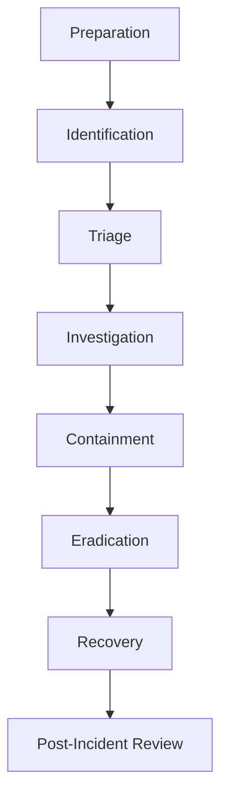
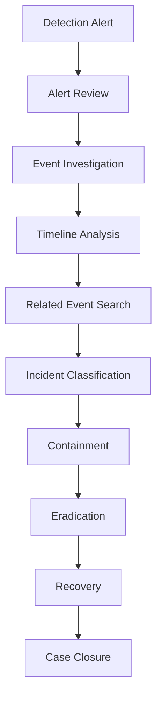
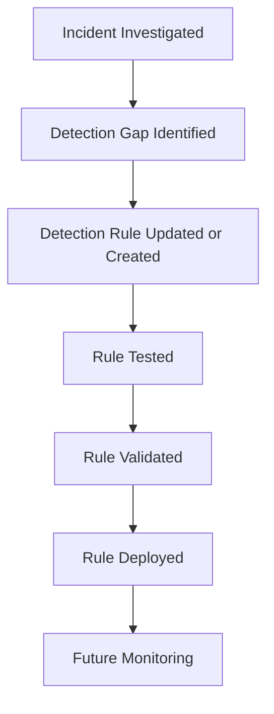

# Incident Response

| Field				| Value 						  		    			        	|
|-------------------|-------------------------------------------------------------------|
| Document Name 	| Incident Response 												|
| Document Version 	| v0.1.0 															|
| Author			| Terry Humphrey 													|
| Status 		 	| Active 															|
| Last Updated 		| 2026-07-30 														|

---

## Table of Contents

- [1. Purpose](#1-purpose)
- [2. Scope](#2-scope)
- [3. Incident Response Overview](#3-incident-response-overview)
- [4. Incident Response Lifecycle](#4-incident-response-lifecycle)
- [5. Incident Identification](#5-incident-identification)
- [6. Alert Triage](#6-alert-triage)
- [7. Incident Classification](#7-incident-classification)
- [8. Investigation](#8-investigation)
- [9. Containment](#9-containment)
- [10. Eradication](#10-eradication)
- [11. Recovery](#11-recovery)
- [12. Post-Incident Activities](#12-post-incident-activities)
- [13. Evidence and Documentation](#13-evidence-and-documentation)
- [14. Elastic Security Integration](#14-elastic-security-integration)
- [15. Detection Engineering Feedback](#15-detection-engineering-feedback)
- [16. Incident Response Metrics](#16-incident-response-metrics)
- [17. Compliance Alignment](#17-compliance-alignment)
- [18. Future Incident Response Enhancements](#18-future-incident-response-enhancements)
- [19. Related Documentation](#19-related-documentation)

---

# 1. Purpose

## Overview

The Enterprise Security Lab Incident Response process defines how security alerts and suspected security incidents are identified, triaged, investigated, contained, eradicated, recovered, and documented.

The objective is to demonstrate a structured incident response capability that integrates security monitoring, detection engineering, endpoint telemetry, vulnerability management, and analyst investigation workflows.

The incident response process is designed to provide a repeatable methodology for responding to security events within the controlled Enterprise Security Lab environment.

---

# 2. Scope

This document covers:

- Incident identification
- Alert triage
- Incident classification
- Security investigation
- Containment
- Eradication
- Recovery
- Post-incident activities
- Evidence collection
- Incident documentation
- Elastic Security integration
- Detection engineering feedback
- Incident response metrics

This document does not define individual detection rules. Those rules are documented separately in `13-Detection-Rules.md`.

This document does not define detailed analyst procedures for specific alerts. Those procedures are documented separately in `17-Investigation-Runbooks.md`.

---

# 3. Incident Response Overview

The Enterprise Security Lab uses a structured incident response process to manage security alerts and suspected incidents.

Security incidents may originate from:

- Elastic Security detection alerts
- Endpoint telemetry
- Sysmon events
- Authentication events
- Network activity
- Vulnerability findings
- Security testing
- Attack simulation
- Manual analyst investigation

The incident response process is intended to ensure that security events are evaluated consistently and that appropriate actions are documented.

## Incident Response Objectives

The incident response process is designed to:

- Detect and identify security incidents
- Determine the scope and severity of incidents
- Preserve relevant evidence
- Contain malicious activity
- Remove the underlying cause of compromise
- Restore affected systems
- Document investigative findings
- Improve detection and response capabilities

---

# 4. Incident Response Lifecycle

The Enterprise Security Lab incident response lifecycle follows the following general process:

Each stage contributes to the overall incident response process.

## Incident Response Phases

| Phase                | Description                                                                               |
|----------------------|-------------------------------------------------------------------------------------------|
| Preparation          | Maintain tools, monitoring, documentation, and procedures required for incident response. |
| Identification       | Detect and confirm potentially malicious activity.                                        |
| Triage               | Determine whether an alert represents a security incident and prioritize response.        |
| Investigation        | Determine what occurred, how it occurred, and what systems were affected.                 |
| Containment          | Limit the scope and impact of malicious activity.                                         |
| Eradication          | Remove malicious artifacts, persistence mechanisms, and underlying vulnerabilities.       |
| Recovery             | Restore systems to a known-good operational state.                                        |
| Post-Incident Review | Document lessons learned and improve security controls.                                   |

---

# 5. Incident Identification

Security incidents may be identified through automated detection or manual analysis.

## Detection Sources

Potential incident sources include:

- Elastic Security alerts
- Custom detection rules
- Sysmon telemetry
- Windows Security event logs
- Active Directory authentication events
- Elastic Agent telemetry
- Vulnerability management findings
- Network monitoring
- Threat intelligence
- Attack simulation

## Initial Identification

When a potentially malicious event is identified, the analyst should determine:

- What occurred
- Which system generated the event
- Which user account was involved
- When the event occurred
- Whether the activity is expected
- Whether additional related events exist
- Whether the event meets the criteria for an incident

---

# 6. Alert Triage

Alert triage is the initial evaluation performed after a security alert is generated.

The objective is to determine whether the alert represents:

- A false positive
- Benign activity
- Suspicious activity
- A confirmed security incident

## Triage Questions

The analyst should evaluate:

- What detection generated the alert?
- What host generated the alert?
- What user was involved?
- What process or activity triggered the detection?
- What occurred immediately before the event?
- What occurred immediately after the event?
- Is the activity expected?
- Is the affected system vulnerable?
- Are related alerts present?
- Is there evidence of persistence?
- Is there evidence of lateral movement?
- Is there evidence of data access or exfiltration?

## Triage Classification

| Classification     | Description                                      | Response                    |
|--------------------|--------------------------------------------------|-----------------------------|
| False Positive     | Alert does not represent suspicious activity.    | Document and close.         |
| Benign             | Activity is legitimate and expected.             | Document and close.         |
| Suspicious         | Activity requires additional investigation.      | Investigate.                |
| Confirmed Incident | Malicious or unauthorized activity is confirmed. | Initiate incident response. |

---

# 7. Incident Classification

Confirmed incidents should be classified according to their nature and potential impact.

## Incident Categories

| Category                   | Description                                                                |
|----------------------------|----------------------------------------------------------------------------|
| Malware                    | Malicious software detected or suspected.                                  |
| Credential Compromise      | User or administrative credentials may be compromised.                     |
| Account Compromise         | Unauthorized access to an account is suspected or confirmed.               |
| Privilege Escalation       | Unauthorized elevation of privileges is detected.                          |
| Persistence                | An attacker establishes mechanisms to maintain access.                     |
| Lateral Movement           | An attacker moves between systems within the environment.                  |
| Defense Evasion            | Activity intended to avoid or disable security controls.                   |
| Execution                  | Unauthorized or suspicious code execution.                                 |
| Discovery                  | Attacker activity intended to identify systems, users, or services.        |
| Command and Control        | Communication with attacker-controlled infrastructure.                     |
| Data Access                | Unauthorized access to sensitive information.                              |
| Vulnerability Exploitation | A vulnerability is exploited to gain access or execute malicious activity. |

## Incident Severity

| Severity  | Description                                                                           | Response Priority |
|-----------|----------------------------------------------------------------------------------------|------------------|
| Critical  | Confirmed compromise of critical infrastructure or widespread malicious activity.      | Immediate        |
| High      | Confirmed compromise or significant malicious activity affecting an important system.  | Urgent           |
| Medium    | Suspicious or confirmed malicious activity with limited scope.                         | Prioritized      |
| Low       | Limited-impact security event requiring investigation or monitoring.                   | Normal           |

---

# 8. Investigation

Incident investigation determines the nature, scope, timeline, and impact of a security incident.

The investigation should use available telemetry to reconstruct attacker activity and determine affected systems.

## Investigation Activities

Investigators may review:

- Process creation events
- Process termination events
- PowerShell activity
- Command-line arguments
- Authentication events
- Account activity
- Network connections
- File creation
- File modification
- Registry changes
- Scheduled tasks
- Services
- Persistence mechanisms
- Security tool activity
- Related Elastic Security alerts

## Investigation Timeline

A chronological timeline should be created when practical.

| Timestamp            | Host       | User               | Event                        | Source             | Significance              |
|----------------------|------------|--------------------|------------------------------|--------------------|---------------------------|
| 2026-07-28 14:23 UTC | WIN-PRO-01 | serenity\thumphrey | powershell.exe launched      | Sysmon Event ID 1  | Initial execution         |
| 2026-07-28 14:24 UTC | WIN-PRO-01 | serenity\thumphrey | LSASS memory access detected | Sysmon Event ID 10 | Credential access attempt |
| 2026-07-28 14:25 UTC | WIN-PRO-01 | serenity\thumphrey | Alert generated              | Elastic Security   | Detection triggered       |
| 2026-07-28 14:31 UTC | WIN-PRO-01 | serenity\thumphrey | Host isolated                | Analyst action     | Containment               |

## Investigation Questions

The investigation should attempt to determine:

- Initial access vector
- Initial affected system
- Account involved
- Execution method
- Persistence mechanism
- Privilege escalation activity
- Lateral movement
- Data accessed
- Systems affected
- Attacker objectives
- Indicators of compromise

---

# 9. Containment

Containment limits the impact of an active security incident.

Containment actions should be selected based on the severity and scope of the incident.

## Potential Containment Actions

Actions may include:

- Isolating an affected endpoint
- Disabling a compromised user account
- Resetting compromised credentials
- Blocking malicious network communication
- Stopping malicious processes
- Disabling malicious services
- Removing systems from the network
- Restricting access to affected resources

## Containment Tracking

| Action              | System | Reason | Performed By | Date | Status |
|---------------------|---------------------|------------------------------------|------------------|------------|----------|
| Host isolation      | WIN-PRO-01          | Credential dumping detected        | Security Analyst | 2026-07-28 | Complete |
| Account disablement | serenity\jayne.cobb | Suspicious authentication activity | Security Analyst | 2026-07-28 | Complete |

Containment activities should preserve relevant evidence whenever practical.

---

# 10. Eradication

Eradication removes the root cause and remaining artifacts associated with the incident.

Potential eradication activities include:

- Removing malware
- Removing persistence mechanisms
- Disabling compromised accounts
- Resetting credentials
- Removing unauthorized software
- Applying security patches
- Correcting insecure configurations
- Removing malicious scheduled tasks
- Removing unauthorized services
- Rebuilding compromised systems

Where a vulnerability contributed to the incident, the vulnerability should be remediated as part of the eradication process.

---

# 11. Recovery

Recovery restores affected systems to a known-good operational state.

Recovery activities may include:

- Restoring systems from known-good backups
- Rebuilding compromised systems
- Reinstalling operating systems
- Reinstalling applications
- Restoring system configurations
- Re-enrolling Elastic Agents
- Restoring network connectivity
- Resetting credentials
- Monitoring systems for recurring malicious activity

## Recovery Validation

Systems should be validated before being returned to normal operations.

Validation may include:

- Confirming malicious activity is no longer present
- Confirming persistence mechanisms have been removed
- Confirming security controls are operational
- Confirming Elastic Agent connectivity
- Confirming expected telemetry is being collected
- Confirming systems are patched
- Confirming vulnerabilities associated with the incident are remediated

---

# 12. Post-Incident Activities

Post-incident activities should be performed after containment, eradication, and recovery are complete.

## Lessons Learned

The post-incident review should evaluate:

- What happened
- How the incident was detected
- What worked well
- What failed
- Whether detection occurred early enough
- Whether sufficient telemetry was available
- Whether response procedures were effective
- Whether additional detections are required
- Whether security controls should be improved

## Corrective Actions

| Finding                             | Corrective Action     | Owner                 | Priority | Status      |
|-------------------------------------|-----------------------|-----------------------|----------|-------------|
| No detection for encoded PowerShell | Create detection rule | Detection Engineering | High     | Complete    |
| Excessive false positives           | Tune KQL logic        | Detection Engineering | Medium   | In Progress |

Post-incident findings should be used to improve the overall security architecture.

---

# 13. Evidence and Documentation

Incident response activities should be documented to preserve an accurate record of the investigation.

Potential evidence includes:

- Elastic Security alerts
- Elastic event records
- Sysmon events
- Windows Event Logs
- Process information
- Network connections
- File hashes
- File metadata
- Command-line arguments
- Authentication records
- Screenshots
- Investigation timelines

> **Note:** The incident records, timelines, evidence samples, and metrics contained in this document are representative examples created to demonstrate incident response workflows within the Enterprise Security Lab. They do not represent real-world security incidents.

## Evidence Tracking

| Evidence ID | Description                 | Source           | Collection Date | Related Incident |
|-------------|-----------------------------|------------------|-----------------|------------------|
| EV-001      | Sysmon process creation log | Sysmon           | 2026-07-28      | INC-2026-001     |
| EV-002      | Elastic alert record        | Elastic Security | 2026-07-28      | INC-2026-001     |
| EV-003      | PowerShell command line     | Sysmon           | 2026-07-28      | INC-2026-002     |

## Incident Record

| Field                 | Value                                 |
|-----------------------|---------------------------------------|
| Incident ID           | INC-2026-001                          |
| Date Identified       | 2026-07-28                            |
| Date Closed           | 2026-07-28                            |
| Severity              | High                                  |
| Category              | Credential Access                     |
| Affected Systems      | WIN-PRO-01                            |
| Affected Users        | serenity\jayne.cobb                   |
| Initial Detection     | DET-HIGH-WIN-SYSMON-005               |
| Root Cause            | Simulated credential dumping activity |
| Containment Actions   | Host isolation                        |
| Eradication Actions   | Malicious process terminated          |
| Recovery Actions      | Endpoint restored                     |
| Final Disposition     | Closed                                |
---

# 14. Elastic Security Integration

Elastic Security provides the primary security monitoring and alerting platform for the Enterprise Security Lab.

Incident response activities may use Elastic Security to:

- Review detection alerts
- Investigate event timelines
- Search endpoint telemetry
- Analyze process activity
- Investigate authentication activity
- Identify related events
- Track security cases
- Document investigation findings

## Elastic Investigation Workflow

Elastic Security cases may be used to maintain an investigation record and associate alerts, evidence, notes, and response actions with an incident.

---

# 15. Detection Engineering Feedback

Incident response activities should provide feedback to the detection engineering process.

Investigation findings may identify:

- Missing detection coverage
- Excessive false positives
- Incomplete telemetry
- Missing event fields
- Required KQL improvements
- New attack techniques
- New detection opportunities

## Detection Improvement Workflow

Detection improvements should be documented in `13-Detection-Rules.md`.

Where applicable, new detection logic should be mapped to the relevant MITRE ATT&CK technique.

---

# 16. Incident Response Metrics

Incident response metrics should be used to evaluate the effectiveness of detection and response activities.

| Metric                                     | Sample Value |
|--------------------------------------------|--------------|
| Total Security Alerts                      | 12           |
| Confirmed Incidents                        | 3            |
| False Positives                            | 5            |
| Suspicious Events                          | 4            |
| Critical Incidents                         | 0            |
| High-Severity Incidents                    | 1            |
| Average Time to Detect                     | 2 minutes    |
| Average Time to Triage                     | 7 minutes    |
| Average Time to Contain                    | 15 minutes   |
| Average Time to Recover                    | 45 minutes   |
| Incidents Requiring Detection Improvements | 2            |

## Incident Tracking

| Incident ID  | Severity | Category          | Date Detected | Date Contained | Date Closed | Status |
|--------------|----------|-------------------|---------------|----------------|-------------|--------|
| INC-2026-001 | High     | Credential Access | 2026-07-28    | 2026-07-28     | 2026-07-28  | Closed |
| INC-2026-002 | Medium   | Execution         | 2026-07-29    | 2026-07-29     | 2026-07-29  | Closed |
| INC-2026-003 | Medium   | Discovery         | 2026-07-30    | 2026-07-30     | 2026-07-30  | Closed |

---

# 17. Compliance Alignment

Incident response supports multiple security and compliance objectives within the Enterprise Security Lab.

Relevant areas include:

- Incident Response
- Risk Assessment
- Security Assessment
- System and Information Integrity
- Audit and Accountability
- Configuration Management
- Continuous Monitoring

The incident response process provides evidence that security events can be identified, investigated, contained, eradicated, and documented.

Incident response activities may also support NIST SP 800-171 requirements related to incident handling and security monitoring.

---

# 18. Future Incident Response Enhancements

Planned or potential future improvements include:

- Develop formal incident severity criteria
- Implement standardized Elastic Security case workflows
- Create investigation runbooks for high-value detections
- Implement automated incident enrichment
- Integrate threat intelligence
- Develop incident response dashboards
- Implement automated containment workflows
- Expand endpoint isolation capabilities
- Improve evidence collection procedures
- Develop incident response tabletop exercises
- Create recurring incident response metrics
- Map incident response procedures to NIST SP 800-171 requirements
- Integrate vulnerability context into incident investigations

---

# 19. Related Documentation

| Document                          | Purpose                                                                                                                                                           |
|-----------------------------------|-------------------------------------------------------------------------------------------------------------------------------------------------------------------|
| README.md                         | High-level overview of the Enterprise Security Lab, objectives, architecture, technologies, hardware inventory, capabilities, and documentation index.            |
| 01-Architecture.md                | Overall lab architecture, physical hardware, virtualization layout, server roles, infrastructure components, and system relationships.                            |
| 02-Network-Design.md              | Network architecture, IP addressing, DNS, communication flows, firewall requirements, segmentation, and network security considerations.                          |
| 03-Asset-Inventory.md             | Inventory of physical devices, VMs, operating systems, hostnames, IP addresses, and system roles/ownership.                                                       |
| 04-Active-Directory.md            | Active Directory architecture, OUs, users, groups, naming conventions, GPOs, authentication, and identity management.                                             |
| 05-Certificate-Authority-PKI.md   | Enterprise CA, certificate templates, trust relationships, certificate lifecycle, and PKI implementation.                                                         |
| 06-Server-Build-Standards.md      | Baseline configuration standards for Windows and Linux servers, including naming, security settings, and required services.                                       |
| 07-Elastic-Deployment.md          | Elasticsearch and Kibana installation, configuration, cluster architecture, and core Elastic Stack infrastructure.                                                |
| 08-Elastic-Fleet-Deployment.md    | Fleet Server, agent policies, integrations, enrollment, and centralized agent management.                                                                         |
| 09-Windows-Agent.md               | Elastic Agent deployment, configuration, integrations, validation, and troubleshooting for Windows endpoints.                                                     |
| 10-Linux-Agent.md                 | Elastic Agent deployment, configuration, integrations, validation, and troubleshooting for Linux systems.                                                         |
| 11-Sysmon.md                      | Sysmon installation, configuration, event collection, telemetry, and Elastic integration.                                                                         |
| 12-Elastic-Security.md            | Elastic Security configuration, detection alerting, dashboards, cases, investigations, and analyst workflows.                                                     |
| 13-Detection-Rules.md             | The 30 custom detection rules, KQL, index patterns, severity, risk scores, MITRE ATT&CK mappings, validation status, tuning, and false-positive considerations.   |
| 14-Vulnerability-Management.md    | Vulnerability scanning, risk prioritization, remediation workflows, and verification.                                                                             |
| 15-Patch-Management.md            | WSUS deployment, update approvals, client targeting, maintenance windows, and patch compliance.                                                                   |
| 17-Investigation-Runbooks.md      | New. Step-by-step analyst procedures for investigating high-value alerts and detection scenarios.                                                                 |
| 18-Backup-Recovery.md             | Backup strategy, VM recovery, file restoration, disaster recovery, and recovery validation.                                                                       |
| 19-Security-Hardening.md          | Windows/Linux hardening, security baselines, auditing, logging, and defensive controls.                                                                           |
| 20-NIST-CSF-Mapping.md            | Maps lab capabilities to the NIST Cybersecurity Framework and demonstrates alignment with enterprise security practices.                                          |
| 99-Lab-Journal.md                 | Chronological implementation record, troubleshooting, design decisions, testing, snapshots, and future improvements.                                              |

---

# Revision History

| Version 	| Date 		 | Changes 									    	    |
|-----------|------------|------------------------------------------------------|
| v0.1.0    | 2026-07-30 | Initial Incident Response document created          |

---