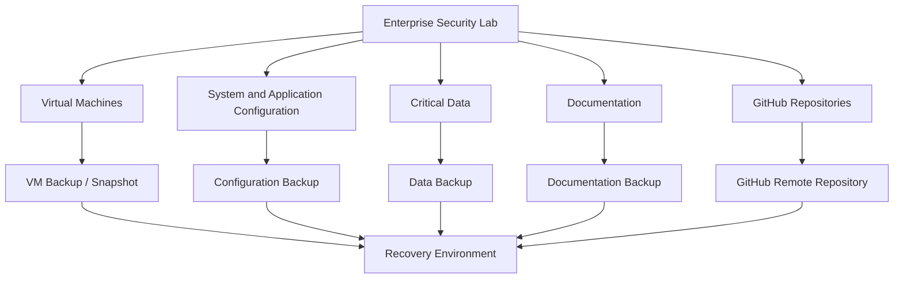

# Backup and Recovery

| Field						 | Value 						  		    				|
|-------------------|-------------------------------------------------------------------|
| Document Name 	| Backup and Recovery 						    					|
| Document Version 	| v0.1.0 															|
| Author			| Terry Humphrey 													|
| Status 		 	| Active 															|
| Last Updated 		| 2026-07-30 														|

---

## Table of Contents

- [1. Purpose](#1-purpose)
- [2. Scope](#2-scope)
- [3. Backup and Recovery Overview](#3-backup-and-recovery-overview)
- [4. Backup Objectives](#4-backup-objectives)
- [5. Backup Architecture](#5-backup-architecture)
- [6. Systems and Data Requiring Backup](#6-systems-and-data-requiring-backup)
- [7. Backup Strategy](#7-backup-strategy)
- [8. Virtual Machine Backup](#8-virtual-machine-backup)
- [9. Configuration Backup](#9-configuration-backup)
- [10. Documentation Backup](#10-documentation-backup)
- [11. Elastic Stack Recovery](#11-elastic-stack-recovery)
- [12. Windows Server Recovery](#12-windows-server-recovery)
- [13. Active Directory Recovery](#13-active-directory-recovery)
- [14. Certificate Authority and PKI Recovery](#14-certificate-authority-and-pki-recovery)
- [15. File and Repository Recovery](#15-file-and-repository-recovery)
- [16. Recovery Procedures](#16-recovery-procedures)
- [17. Recovery Validation](#17-recovery-validation)
- [18. Disaster Recovery](#18-disaster-recovery)
- [19. Backup Security](#19-backup-security)
- [20. Recovery Metrics](#20-recovery-metrics)
- [21. Future Backup and Recovery Enhancements](#21-future-backup-and-recovery-enhancements)
- [22. Related Documentation](#22-related-documentation)

---

# 1. Purpose

## Overview

The Enterprise Security Lab Backup and Recovery document defines the backup strategy, recovery procedures, and disaster recovery considerations for the Enterprise Security Lab.

The purpose of the backup and recovery strategy is to protect critical lab infrastructure, configuration data, documentation, detection engineering work, and security telemetry from accidental deletion, system failure, corruption, or other data loss events.

The strategy is designed to allow the lab to be rebuilt or restored in a controlled and repeatable manner.

---

# 2. Scope

This document covers:

- Backup objectives
- Backup architecture
- Virtual machine backups
- Server configuration backups
- Elastic Stack configuration
- Active Directory recovery
- Certificate Authority and PKI recovery
- Documentation backup
- GitHub repository protection
- File recovery
- Recovery validation
- Disaster recovery
- Backup security

This document applies to the systems and data that support the Enterprise Security Lab.

This document does not define detailed server build procedures or individual application deployment procedures. Those procedures are documented separately in the related documentation.

---

# 3. Backup and Recovery Overview

The Enterprise Security Lab uses a layered backup strategy designed to protect both infrastructure and the configuration required to rebuild the environment.

The backup strategy prioritizes recoverability of:

- Active Directory
- DNS
- Certificate Authority and PKI
- Elastic Stack configuration
- Elastic Agent configuration
- Detection rules
- Sysmon configuration
- Server configurations
- Documentation
- GitHub repositories
- Virtual machines
- Critical lab data

The lab prioritizes configuration-as-code and documented rebuild procedures wherever practical.

Where complete system backups are not available, documented rebuild procedures and configuration backups provide an alternative recovery path.

The lab currently uses multiple backup mechanisms:

- Nightly full backups to a Synology DS918+ NAS
- Hourly incremental backups to the NAS
- Virtual machine snapshots taken before major infrastructure changes
- GitHub repositories for documentation and configuration version control

Snapshots currently exist for:

- WIN-DC-01
- LNX-ELK-01
- WIN-WSUS-01

Snapshots are intended for short-term rollback and recovery assistance and are not considered a replacement for scheduled backups.

---

# 4. Backup Objectives

The primary backup objectives are:

- Prevent permanent loss of critical lab documentation.
- Protect detection engineering work.
- Protect security configurations.
- Preserve Active Directory and PKI configuration.
- Enable recovery of Elastic Stack services.
- Enable recovery of virtual machines.
- Reduce time required to rebuild failed systems.
- Validate that backups can actually be restored.
- Maintain sufficient evidence to reproduce the lab environment.

## Recovery Objectives

| Objective                      | Sample Target |
|--------------------------------|---------------|
| Recovery Point Objective (RPO) | 1 hour        |
| Recovery Time Objective (RTO)  | 4 hours       |
| Maximum Acceptable Data Loss   | 1 hour        |
| Backup Retention               | 30 days       |
| Recovery Validation Frequency  | Quarterly     |

Recovery objectives may be refined as the lab architecture and data requirements mature.

---

# 5. Backup Architecture

The backup strategy uses multiple layers of protection.

---

# 6. Systems and Data Requiring Backup

## Critical Systems

| System        | Primary Function            | Backup Priority |
|---------------|-----------------------------|-----------------|
| WIN-DC-01     | Active Directory / DNS / CA | Critical        |
| LNX-ELK-01    | Elastic Stack / SIEM        | Critical        |
| WIN-WSUS-01   | WSUS / Patch Management     | High            |
| WIN-PRO-01    | Windows Workstation         | Medium          |
| LNX-KALI-01   | Attack Simulation           | Low             |
| LNX-WEB-01    | Apache and MariaDB          | Medium          |

## Critical Data

The following data should be backed up:

- Active Directory configuration
- DNS configuration
- Group Policy configuration
- Certificate Authority database
- Certificate Authority private keys
- Certificate templates
- Elastic configuration
- Docker Compose files
- Elastic Fleet configuration
- Elastic Agent policies
- Detection rules
- Sysmon configuration
- Windows security configuration
- WSUS configuration
- Documentation
- Git repositories
- Scripts
- Custom automation
- Configuration files
- Recovery credentials stored securely

---

# 7. Backup Strategy

The backup strategy uses different protection methods based on the type and importance of the data.

| Data Type             | Backup Method                             | Frequency         | Priority |
|-----------------------|-------------------------------------------|-------------------|----------|
| GitHub Repository     | Remote Repository                         | Continuous        | Critical |
| Documentation         | Git / Synology Backup                     | Continuous        | Critical |
| Detection Rules       | Git / Synology Backup                     | Continuous        | Critical |
| Elastic Configuration | Configuration Backup                      | After Changes     | Critical |
| Sysmon Configuration  | Git / File Backup                         | After Changes     | High     |
| Active Directory      | Nightly NAS Backup / VM Snapshot          | Nightly           | Critical |
| Certificate Authority | Nightly NAS Backup / After Changes        | Nightly           | Critical |
| Virtual Machines      | Nightly NAS Backup / Pre-change Snapshots | Nightly           | High     |
| WSUS Configuration    | Nightly NAS Backup                        | Nightly           | High     |
| Elastic Data          | Nightly NAS Backup / Hourly Incremental   | Hourly / Nightly  | High     |
| Lab Journal           | Git / Synology Backup                     | Continuous        | High     |

Backup frequencies may be adjusted as the lab grows.

---

# 8. Virtual Machine Backup

Virtual machines provide the primary operating environment for many lab systems.

VM backups should protect the ability to recover systems after:

- Operating system corruption
- Application failure
- Configuration errors
- Malware simulation
- Failed updates
- Storage failure
- Accidental deletion

## VM Backup Strategy

VMs should be backed up using one or more of the following:

- Full VM copies
- Exported OVF/OVA appliances
- Hypervisor-level backups
- Host-level storage backups
- Application-specific backups

Snapshots are created before major infrastructure modifications and currently exist for:

- WIN-DC-01
- LNX-ELK-01
- WIN-WSUS-01

Snapshots are intended for rapid rollback after failed changes but are not considered a substitute for scheduled backups.

| Virtual Machine | Backup Type        | Frequency | Snapshot Strategy             |
|-----------------|--------------------|-----------|-------------------------------|
| WIN-DC-01       | Nightly NAS Backup | Nightly   | Snapshot before major changes |
| LNX-ELK-01      | Nightly NAS Backup | Nightly   | Snapshot before major changes |
| WIN-WSUS-01     | Nightly NAS Backup | Nightly   | Snapshot before major changes |
| WIN-PRO-01      | Nightly NAS Backup | Nightly   | As needed                     |
| LNX-WEB-01      | Nightly NAS Backup | Nightly   | As needed                     |
| LNX-KALI-01     | Nightly NAS Backup | Nightly   | As needed                     |

## VM Recovery

VM recovery should follow this general process:

1. Identify the failed VM.
2. Determine whether the VM can be repaired.
3. If repair is not practical, restore the latest known-good backup.
4. Verify network configuration.
5. Verify hostname.
6. Verify DNS resolution.
7. Verify required services.
8. Verify authentication.
9. Verify security telemetry.
10. Validate normal operation.

---

# 9. Configuration Backup

Configuration files should be stored separately from the systems on which they operate whenever practical.

Critical configuration includes:

- Docker Compose files
- Elastic configuration
- Kibana configuration
- Fleet Server configuration
- Elastic Agent policies
- Sysmon configuration
- Windows Group Policy
- Windows server configuration
- WSUS configuration
- DNS configuration
- Firewall configuration
- Scripts
- Automation

Configuration files should be maintained in Git repositories where practical.

This allows configuration changes to be tracked and previous versions to be restored.

---

# 10. Documentation Backup

Lab documentation is considered critical data.

Documentation should be maintained in version-controlled repositories whenever possible.

Critical documentation includes:

- Architecture
- Asset inventory
- Active Directory
- PKI
- Server build standards
- Elastic deployment
- Fleet deployment
- Windows Agent
- Linux Agent
- Sysmon
- Elastic Security
- Detection Rules
- Vulnerability Management
- Patch Management
- Incident Response
- Investigation Runbooks
- Backup and Recovery
- Security Hardening
- NIST CSF Mapping
- Lab Journal

The GitHub repository serves as a remote copy of the documentation and provides version history.

---

# 11. Elastic Stack Recovery

The Elastic Stack is a critical component of the Enterprise Security Lab.

Recovery should prioritize restoration of the following:

- Elasticsearch
- Kibana
- Fleet Server
- Elastic Agent policies
- Integrations
- Detection rules
- Security configuration
- Dashboards
- Cases
- Saved objects
- Critical security data

## Elastic Recovery Process

1. Restore or rebuild the underlying Linux server.
2. Restore network configuration.
3. Verify DNS resolution.
4. Verify CA trust.
5. Restore Docker configuration.
6. Restore Docker Compose configuration.
7. Restore Elasticsearch configuration.
8. Restore Kibana configuration.
9. Restore Fleet Server configuration.
10. Restore required certificates.
11. Start Elasticsearch.
12. Verify Elasticsearch health.
13. Start Kibana.
14. Verify Kibana access.
15. Start Fleet Server.
16. Verify Fleet Server connectivity.
17. Restore or re-enroll Elastic Agents.
18. Restore detection rules and security configuration.
19. Validate telemetry ingestion.
20. Validate alert generation.

## Recovery Validation

The following should be confirmed:

- Elasticsearch is operational.
- Kibana is accessible.
- Fleet Server is reachable.
- Elastic Agents are enrolled.
- Windows telemetry is ingested.
- Sysmon events are searchable.
- Detection rules are present.
- Alerts can be generated.
- Security dashboards function correctly.

---

# 12. Windows Server Recovery

Windows Server recovery procedures apply to systems such as:

- WIN-DC-01
- WIN-WSUS-01
- Other Windows Server systems

## Recovery Process

1. Identify the failed system.
2. Determine whether the system can be repaired.
3. Restore the system from backup if available.
4. Verify hostname.
5. Verify static IP configuration.
6. Verify DNS configuration.
7. Verify domain membership.
8. Verify required server roles.
9. Verify certificates.
10. Verify logging.
11. Verify Elastic Agent connectivity.
12. Verify security telemetry.
13. Validate dependent services.

---

# 13. Active Directory Recovery

Active Directory is a critical dependency for the lab environment.

Recovery of Active Directory must protect:

- Active Directory database
- SYSVOL
- DNS
- Group Policy
- User accounts
- Computer accounts
- Security groups
- Service accounts
- Domain configuration

## Active Directory Recovery Strategy

The preferred recovery method is restoration from a valid System State backup.

If a valid System State backup is unavailable, Active Directory may require a controlled rebuild followed by restoration of documented configuration.

## Recovery Process

1. Identify the failure.
2. Determine whether the Domain Controller can be repaired.
3. Verify availability of System State backup.
4. Restore the Domain Controller if appropriate.
5. Verify Active Directory services.
6. Verify DNS.
7. Verify SYSVOL.
8. Verify Group Policy.
9. Verify domain authentication.
10. Verify certificate services.
11. Verify Elastic Agent connectivity.
12. Validate domain-joined systems.

## Recovery Validation

Validate:

- Domain authentication
- DNS resolution
- Kerberos authentication
- Group Policy processing
- Active Directory replication if applicable
- Certificate services
- Domain-joined workstation access

---

# 14. Certificate Authority and PKI Recovery

The Enterprise Security Lab uses an internal Certificate Authority to support trusted certificates and secure communication.

The CA is a critical recovery dependency because loss of the CA private key or CA database may prevent recovery of trusted certificate infrastructure.

## Critical CA Data

The following should be protected:

- CA database
- CA private key
- CA certificate
- Certificate templates
- Issued certificate records
- CRL configuration
- CA configuration

## Recovery Process

1. Restore the CA server.
2. Restore the CA database.
3. Restore the CA private key.
4. Restore the CA certificate.
5. Restore CA configuration.
6. Verify CA service operation.
7. Verify certificate issuance.
8. Verify certificate trust.
9. Verify CRL availability.
10. Verify Elastic and Linux systems trust the CA.

## Recovery Validation

The following should be validated:

- CA service is operational.
- Root CA certificate is trusted.
- Certificates can be issued.
- Certificates can be validated.
- Elastic services can establish trusted TLS connections.
- Linux systems trust the CA.
- Windows systems trust the CA.

---

# 15. File and Repository Recovery

Files and repositories should be recoverable from independent copies.

## Recovery Sources

Potential recovery sources include:

- GitHub repository
- Local Git repository
- Local file backup
- NAS backup
- VM backup
- Exported configuration
- Cloud storage

## Repository Recovery Process

1. Identify the required repository.
2. Clone the repository from GitHub.
3. Verify repository integrity.
4. Restore required files.
5. Review recent commits.
6. Identify the last known-good version.
7. Restore the required configuration.
8. Validate the restored configuration.

---

# 16. Recovery Procedures

Recovery should be performed in a controlled order based on system dependencies.

## Recommended Recovery Order

1. Network connectivity
2. Domain Controller
3. DNS
4. Certificate Authority
5. Core Windows infrastructure
6. Elastic Stack
7. Fleet Server
8. Elastic Agents
9. WSUS
10. Windows workstations
11. Linux servers
12. Kali Linux
13. Detection rules
14. Dashboards and security configuration
15. Validation and testing

The actual recovery order may vary depending on the failure scenario.

## Recovery Priority

| Priority | Systems                   |
|----------|---------------------------|
| 1        | Network / DNS             |
| 2        | Active Directory          |
| 3        | Certificate Authority     |
| 4        | Elastic Stack             |
| 5        | Fleet Server              |
| 6        | Security Telemetry        |
| 7        | WSUS                      |
| 8        | Workstations              |
| 9        | Attack Simulation Systems |

---

# 17. Recovery Validation

Recovery is not considered complete until restored systems have been validated.

## Validation Checklist

- Hostname is correct
- IP address is correct
- DNS resolution works
- Required services are running
- Authentication works
- Certificates are trusted
- Elastic Agent is connected
- Logs are being ingested
- Sysmon events are searchable
- Detection rules are present
- Alerts can be generated
- Dashboards are accessible
- Network communication is functioning
- Backup jobs are operational
- Documentation reflects the recovered state

## Functional Validation

Recovery testing should verify that the restored system performs its intended role.

For example:

- The Domain Controller authenticates users.
- DNS resolves internal systems.
- The CA issues trusted certificates.
- Elasticsearch accepts telemetry.
- Kibana displays security data.
- Fleet Server manages Elastic Agents.
- Windows systems generate Sysmon telemetry.
- Detection rules generate expected alerts.

---

# 18. Disaster Recovery

Disaster recovery addresses scenarios in which one or more systems cannot be restored in place.

Potential scenarios include:

- Host hardware failure
- Storage failure
- Virtual machine corruption
- Accidental deletion
- Major configuration failure
- Malware affecting lab systems
- Loss of the primary virtualization host
- Loss of critical infrastructure

## Disaster Recovery Strategy

The lab should be recoverable using a combination of:

- VM backups
- Configuration repositories
- GitHub repositories
- Documentation
- System State backups
- CA backups
- Elastic backups
- Recovery procedures

The objective is to restore the minimum required infrastructure first and progressively rebuild the remaining environment.

## Disaster Recovery Priorities

The minimum viable recovery environment should include:

1. Network connectivity
2. DNS
3. Active Directory
4. Certificate Authority
5. Elastic Stack
6. Fleet Server
7. Elastic Agents
8. Security telemetry
9. Detection rules

Other systems may be restored after core security monitoring functionality is operational.

---

# 19. Backup Security

Backups contain sensitive information and must be protected from unauthorized access.

Backup security considerations include:

- Restrict backup access.
- Protect backup credentials.
- Encrypt backups where practical.
- Protect CA private keys.
- Protect Active Directory backups.
- Protect Elastic security configuration.
- Avoid storing secrets in Git repositories.
- Use secure credential storage.
- Maintain multiple backup copies.
- Test restoration from backups.
- Protect backups from accidental deletion.

Backups should be treated as sensitive security assets.

---

# 20. Recovery Metrics

Recovery metrics should be used to measure the effectiveness of the backup and recovery strategy.

> **Note:** Recovery objectives, metrics, and recovery test records shown in this document are representative examples intended to demonstrate backup and recovery capabilities within the Enterprise Security Lab. They do not represent production service-level commitments.

| Metric                        | Sample Value          |
|-------------------------------|-----------------------|
| Last Successful Backup        | 2026-07-30 02:00 UTC  |
| Backup Success Rate           | 99%                   |
| Last Recovery Test            | 2026-07-25            |
| Recovery Test Result          | Successful            |
| Average Recovery Time         | 2 hours               |
| Recovery Point Achieved       | 1 hour                |
| Systems Successfully Restored | 3                     |
| Failed Recovery Tests         | 0                     |
| Backup Storage Utilization    | 1.4 TB                |

## Recovery Test Tracking

| Test ID | System      | Test Date  | Result  | Recovery Time | Issues                       |
|---------|-------------|------------|---------|---------------|------------------------------|
| RT-001  | WIN-DC-01   | 2026-07-25 | Success | 95 minutes    | None                         |
| RT-002  | LNX-ELK-01  | 2026-07-26 | Success | 70 minutes    | Fleet re-enrollment required |
| RT-003  | WIN-WSUS-01 | 2026-07-27 | Success | 110 minutes   | None                         |
| RT-004  | LNX-WEB-01  | 2026-07-29 | Success | 80 minutes    | None                         |
---

# 21. Future Backup and Recovery Enhancements

Planned or potential future improvements include:

- Define formal RPO and RTO targets.
- Implement scheduled VM backups.
- Implement automated configuration backups.
- Implement Active Directory System State backups.
- Implement Certificate Authority backups.
- Implement Elastic snapshot repositories.
- Add off-host backup storage.
- Add encrypted backup storage.
- Implement backup monitoring.
- Automate backup verification.
- Conduct scheduled recovery tests.
- Document full disaster recovery procedures.
- Implement backup retention policies.
- Evaluate immutable backup storage.
- Maintain an offline recovery copy of critical documentation.
- Automate infrastructure rebuild procedures.

---

# 22. Related Documentation

| Document                          | Purpose                                                                                                                                                           |
|-----------------------------------|-------------------------------------------------------------------------------------------------------------------------------------------------------------------|
| README.md                         | High-level overview of the Enterprise Security Lab, objectives, architecture, technologies, hardware inventory, capabilities, and documentation index.            |
| 01-Architecture.md                | Overall lab architecture, physical hardware, virtualization layout, server roles, infrastructure components, and system relationships.                            |
| 02-Network-Design.md              | Network architecture, IP addressing, DNS, communication flows, firewall requirements, segmentation, and network security considerations.                          |
| 03-Asset-Inventory.md             | Inventory of physical devices, VMs, operating systems, hostnames, IP addresses, and system roles/ownership.                                                       |
| 04-Active-Directory.md            | Active Directory architecture, OUs, users, groups, naming conventions, GPOs, authentication, and identity management.                                             |
| 05-Certificate-Authority-PKI.md   | Enterprise CA, certificate templates, trust relationships, certificate lifecycle, and PKI implementation.                                                         |
| 06-Server-Build-Standards.md      | Baseline configuration standards for Windows and Linux servers, including naming, security settings, and required services.                                       |
| 07-Elastic-Deployment.md          | Elasticsearch and Kibana installation, configuration, cluster architecture, and core Elastic Stack infrastructure.                                                |
| 08-Elastic-Fleet-Deployment.md    | Fleet Server, agent policies, integrations, enrollment, and centralized agent management.                                                                         |
| 09-Windows-Agent.md               | Elastic Agent deployment, configuration, integrations, validation, and troubleshooting for Windows endpoints.                                                     |
| 10-Linux-Agent.md                 | Elastic Agent deployment, configuration, integrations, validation, and troubleshooting for Linux systems.                                                         |
| 11-Sysmon.md                      | Sysmon installation, configuration, event collection, telemetry, and Elastic integration.                                                                         |
| 12-Elastic-Security.md            | Elastic Security configuration, detection alerting, dashboards, cases, investigations, and analyst workflows.                                                     |
| 13-Detection-Rules.md             | The 30 custom detection rules, KQL, index patterns, severity, risk scores, MITRE ATT&CK mappings, validation status, tuning, and false-positive considerations.   |
| 14-Vulnerability-Management.md    | Vulnerability scanning, risk prioritization, remediation workflows, and verification.                                                                             |
| 15-Patch-Management.md            | WSUS deployment, update approvals, client targeting, maintenance windows, and patch compliance.                                                                   |
| 16-Incident-Response.md           | Incident response lifecycle, alert triage, investigation, containment, eradication, recovery, and lessons learned.                                                |
| 17-Investigation-Runbooks.md      | New. Step-by-step analyst procedures for investigating high-value alerts and detection scenarios.                                                                 |
| 19-Security-Hardening.md          | Windows/Linux hardening, security baselines, auditing, logging, and defensive controls.                                                                           |
| 20-NIST-CSF-Mapping.md            | Maps lab capabilities to the NIST Cybersecurity Framework and demonstrates alignment with enterprise security practices.                                          |
| 99-Lab-Journal.md                 | Chronological implementation record, troubleshooting, design decisions, testing, snapshots, and future improvements.                                              |

---

---

# Revision History

| Version 	| Date 		 | Changes 									    	    |
|-----------|------------|------------------------------------------------------|
| v0.1.0    | 2026-07-30 | Initial Backup and Recovery document created         |

---

