# Enterprise Security Lab: ELK SIEM, Detection Engineering & NIST SP 800-171 Documentation 

This repository documents the design, implementation, and operation of an enterprise-inspired security monitoring environment using the Elastic Stack. It includes architecture documentation, deployment guides, operational procedures, and the ongoing development of NIST SP 800-171 security control documentation.

**Note:** During the development of this lab, I expanded the scope to better align with my strategic learning objectives. When assessing the environment as part of that scope expansion, I determined that the existing lab architecture would create additional limitations as the scope expanded.

Rather than continue modifying an environment that was not designed for the long-term goals of the project, I used the opportunity to redesign the lab architecture from the ground up. As such, there are still existing documentation artifacts on GitHub that reflect the old lab architecture. I have noted those spots in the documentation status section.

---

## Table of Contents

- [Project Overview](#project-overview)
- [Project Objectives](#project-objectives)
- [Environment Overview](#environment-overview)
- [Repository Structure](#repository-structure)
- [Documentation](#documentation)
- [Technologies Used](#technologies-used)
- [Current Project Status](#current-project-status)
- [Learning Goals](#learning-goals)
- [Skills Demonstrated](#skills-demonstrated)
- [Future Enhancements](#future-enhancements)
- [Screenshots](#screenshots)
- [Getting Started](#getting-started)
- [Disclaimer](#disclaimer)
- [Author](#author)
- [License](#license)

---

# Project Overview

The Enterprise Security Lab is a self-hosted cybersecurity training environment. It is designed to simulate the technologies and workflows that are commonly found in small enterprise Security Operations Centers (SOC).

The primary goal of this project is to develop practical, hands-on experience with SIEM administration, centralized logging, endpoint monitoring, Active Directory, detection engineering, and incident response while producing professional documentation that demonstrates the design, implementation, and operation of the environment.

This repository documents the ongoing lifecycle of the lab, including architecture design, deployment, configuration, security monitoring, validation, and planned enhancements.

---

# Project Objectives

- Build a functional Elastic Stack SIEM environment
- Deploy and manage Elasticsearch, Kibana, and Fleet Server
- Configure centralized log collection from Windows and Linux systems
- Deploy and manage Elastic Agents
- Implement Active Directory Domain Services
- Improve Windows visibility using Sysmon
- Create and test custom detection rules
- Practice security investigations and incident response
- Produce professional, reproducible technical documentation

---

# Environment Overview

## Infrastructure

| Component             | Technology            |
|-----------------------|-----------------------|
| Hypervisor            | Oracle VirtualBox     |
| Linux Platform        | Rocky Linux 9.8       |
| Windows Server        | Windows Server 2025   |
| Windows Client        | Windows 11 Pro        |
| SIEM Platform         | Elastic Stack 8.13.4  |
| Container Platform    | Docker                |

---

## Core Components

- Elasticsearch
- Kibana
- Fleet Server
- Elastic Agent
- Active Directory
- DNS
- Sysmon 

---

# Repository Structure

```mermaid
flowchart TD
ROOT["enterprise-security-lab-nist-800-171"]
ROOT --> README["README.md"]
ROOT --> LICENSE["LICENSE"]
ROOT --> DOCUMENTATION["docs/"]
ROOT --> SCRIPTS["scripts/"]
ROOT --> SCREENSHOTS["screenshots/"]
DOCUMENTATION --> D01["01-Architecture.md"]
DOCUMENTATION --> D02["02-Network-Design.md"]
DOCUMENTATION --> D03["03-Asset-Inventory.md"]
DOCUMENTATION --> D04["04-Active-Directory.md"]
DOCUMENTATION --> D05["05-Certificate-Authority.md"]
DOCUMENTATION --> D06["06-Server-Build-Standards.md"]
DOCUMENTATION --> D07["07-Elastic-Deployment.md"]
DOCUMENTATION --> D08["08-Elastic-Fleet-Deployment.md"]
DOCUMENTATION --> D09["09-Windows-Agent.md"]
DOCUMENTATION --> D10["10-Linux-Agent.md"]
DOCUMENTATION --> D11["11-Sysmon.md"]
DOCUMENTATION --> D12["12-Elastic-Security.md"]
DOCUMENTATION --> D13["13-Detection-Rules.md"]
DOCUMENTATION --> D14["14-Vulnerability-Management.md"]
DOCUMENTATION --> D15["15-Patch-Management.md"]
DOCUMENTATION --> D16["16-Incident-Response.md"]
DOCUMENTATION --> D17["17-Investigation-Runbooks.md"]
DOCUMENTATION --> D18["18-Backup-Recovery.md"]
DOCUMENTATION --> D19["19-Security-Hardening.md"]
DOCUMENTATION --> D20["20-NIST-CSF-Mapping.md"]
DOCUMENTATION --> D99["99-Lab-Journal.md"]
```

---

# Documentation

| Document                          | Description                                                                                                                                                           |
|-----------------------------------|-------------------------------------------------------------------------------------------------------------------------------------------------------------------|
| 01-Architecture.md                | Overall lab architecture, physical hardware, virtualization layout, server roles, infrastructure components, and system relationships.                            |
| 02-Network-Design.md              | Network architecture, IP addressing, DNS, communication flows, firewall requirements, segmentation, and network security considerations.                          |
| 03-Asset-Inventory.md             | Inventory of physical devices, VMs, operating systems, hostnames, IP addresses, and system roles/ownership.                                                       |
| 04-Active-Directory.md            | Active Directory architecture, OUs, users, groups, naming conventions, GPOs, authentication, and identity management.                                             |
| 05-Certificate-Authority-PKI.md   | Enterprise CA, certificate templates, trust relationships, certificate lifecycle, and PKI implementation.                                                         |
| 06-Server-Build-Standards.md      | Baseline configuration standards for Windows and Linux servers, including naming, security settings, and required services.                                       |
| 07-Elastic-Deployment.md          | Elasticsearch and Kibana installation, configuration, cluster architecture, and core Elastic Stack infrastructure.                                                |
| 08-Elastic-Fleet-Deployment.md    | Fleet Server, agent policies, integrations, enrollment, and centralized agent management.                                                                         |
| 09-Windows-Agent.md               | Elastic Agent deployment, configuration, integrations, validation, and troubleshooting for Windows endpoints.                                                     |
| 10-Linux-Agent.md                 | Elastic Agent deployment, configuration, integrations, validation, and troubleshooting for Linux systems.                                                         |
| 11-Sysmon.md                      | Sysmon installation, configuration, event collection, telemetry, and Elastic integration.                                                                         |
| 12-Elastic-Security.md            | Elastic Security configuration, detection alerting, dashboards, cases, investigations, and analyst workflows.                                                     |
| 13-Detection-Rules.md             | The 30 custom detection rules, KQL, index patterns, severity, risk scores, MITRE ATT&CK mappings, validation status, tuning, and false-positive considerations.   |
| 14-Vulnerability-Management.md    | Vulnerability scanning, risk prioritization, remediation workflows, and verification.                                                                             |
| 15-Patch-Management.md            | WSUS deployment, update approvals, client targeting, maintenance windows, and patch compliance.                                                                   |
| 16-Incident-Response.md           | Incident response lifecycle, alert triage, investigation, containment, eradication, recovery, and lessons learned.                                                |
| 17-Investigation-Runbooks.md      | New. Step-by-step analyst procedures for investigating high-value alerts and detection scenarios.                                                                 |
| 18-Backup-Recovery.md             | Backup strategy, VM recovery, file restoration, disaster recovery, and recovery validation.                                                                       |
| 19-Security-Hardening.md          | Windows/Linux hardening, security baselines, auditing, logging, and defensive controls.                                                                           |
| 20-NIST-CSF-Mapping.md            | Maps lab capabilities to the NIST Cybersecurity Framework and demonstrates alignment with enterprise security practices.                                          |
| 99-Lab-Journal.md                 | Chronological implementation record, troubleshooting, design decisions, testing, snapshots, and future improvements.                                              |

---

# Technologies Used

- Elastic Stack
- Elasticsearch
- Kibana
- Fleet Server
- Elastic Agent
- Docker
- Rocky Linux 9.8
- Windows Server 2025
- Windows 11 Pro
- Active Directory Domain Services
- DNS
- Sysmon
- Oracle VirtualBox

---

# Current Project Status

Status: Active Development

## Documentation Status

This project is actively under development. Documentation is published incrementally as individual lab components are implemented, validated, and tested.

Completed documentation represents implemented and validated capabilities. Documents marked as in progress may contain partial configurations, design decisions, and planned implementation details.

| Document                          | Status        | Notes                                                                                                                 |
|-----------------------------------|---------------|-----------------------------------------------------------------------------------------------------------------------|
| 01-Architecture.md                | Completed     |                                                                                                                       |
| 02-Network-Design.md              | Completed     |                                                                                                                       |
| 03-Asset-Inventory.md             | Completed     |                                                                                                                       |
| 04-Active-Directory.md            | Completed     |                                                                                                                       |
| 05-Certificate-Authority-PKI.md   | Planned       |                                                                                                                       |
| 06-Server-Build-Standards.md      | Planned       |                                                                                                                       |
| 07-Elastic-Deployment.md          | Completed     |                                                                                                                       |
| 08-Elastic-Fleet-Deployment.md    | Completed     |                                                                                                                       |
| 09-Windows-Agent.md               | Completed     |                                                                                                                       |
| 10-Linux-Agent.md                 | Planned       |                                                                                                                       |
| 11-Sysmon.md                      | Planned       |                                                                                                                       |
| 12-Elastic-Security.md            | Planned       |                                                                                                                       |
| 13-Detection-Rules.md             | Completed     |                                                                                                                       |
| 14-Vulnerability-Management.md    | Planned       |                                                                                                                       |
| 15-Patch-Management.md            | Planned       |                                                                                                                       |
| 16-Incident-Response.md           | Planned       |                                                                                                                       |
| 17-Investigation-Runbooks.md      | Planned       |                                                                                                                       |
| 18-Backup-Recovery.md             | Planned       |                                                                                                                       |
| 19-Security-Hardening.md          | Planned       |                                                                                                                       |
| 20-NIST-CSF-Mapping.md            | Planned       |                                                                                                                       |

There are one additional documentation item to call out:

- Screenshots - These screenshots are all from the original architecture. They will be deprecated and removed.

## Project Status

Completed:

- Initial project planning
- Windows DC Server deployment
- Active Directory deployment
- Rocky Linux deployment
- Initial design documentation
- Elastic Stack deployment
- PKI Configuration
- Windows Workstation deployment
- Fleet configuration
- Windows endpoint deployment
- Elastic Agent enrollment
- Sysmon deployment
- Initial detection engineering implementation
- Initial incident response workflows

In Progress:

- Kali Linux deployment
- Attack simulation

Planned:

- Threat hunting scenarios
- Additional Windows and Linux systems

---

# Learning Goals

This project is intended to develop practical experience with:

- SIEM Administration
- Security Monitoring
- Endpoint Visibility
- Active Directory
- Windows Administration
- Linux Administration
- Detection Engineering
- MITRE ATT&CK Framework
- Incident Response
- Security Operations Center (SOC) Workflows

---

# Skills Demonstrated

This project demonstrates practical experience with:

## SIEM Administration

- Elasticsearch
- Kibana
- Fleet Server
- Elastic Agent Management
- Dashboard creation
- Log ingestion and analysis

## Systems Administration

- Rocky Linux
- Windows Server 2025
- Windows 11
- Docker
- VirtualBox

## Identity Management

- Active Directory Domain Services
- DNS
- Group Policy
- Domain administration

## Security Operations

- Endpoint monitoring
- Detection engineering
- Threat hunting
- Security investigations
- Incident response workflows
- Public Key Infrastructure

## Documentation

- Technical documentation
- Architecture design
- Deployment procedures
- Configuration management
- Troubleshooting documentation

---

# Future Enhancements

Planned improvements include:

- Deploy additional Windows workstations
- Deploy additional Linux servers
- Add Kali Linux attack workstation
- Develop threat hunting playbooks
- Expand incident response documentation
- Automate portions of the deployment process
- Complete remaining attack simulation scenarios and validation
- Finalize and tune detection rules
- Expand MITRE ATT&CK coverage
- Build Guides

---

# Screenshots

Screenshots will be added as the environment reaches additional implementation milestones.

Planned screenshots include:

## Elastic Stack

- Kibana Security Overview dashboard
- Elasticsearch cluster health
- Fleet Server status
- Agent enrollment status

## Active Directory

- Domain Controller configuration
- Active Directory Users and Computers
- DNS configuration
- Group Policy configuration

## Security Operations

- Security alerts
- Detection rule execution
- Timeline investigations
- Host activity views
- Certificate Authority

## Lab Infrastructure

- Virtual machine inventory
- Network architecture
- Deployment diagrams

---

# Getting Started

This repository documents the design, deployment, and operation of an Elastic Stack SIEM home lab.

The documentation is being organized to provide a reproducible reference for deploying and operating the environment. As the architecture is redesigned, some earlier documentation remains as historical reference and will be updated or deprecated.

Each document builds upon the previous one and includes explanations of both the implementation steps and the reasoning behind key design decisions.

## Prerequisites

To reproduce this lab you should have:

- Basic Linux administration knowledge
- Basic Windows Server administration knowledge
- Familiarity with virtualization concepts
- Oracle VirtualBox
- Rocky Linux installation media
- Windows Server 2025 installation media
- Windows 11 Pro installation media
- Reliable Internet access for software downloads

## Hardware Requirements

Minimum recommended:

- Modern multi-core processor
- 32GB RAM recommended
- 500GB available storage
- Hardware virtualization enabled
- SSD storage recommended

This lab was designed around:

- Intel Mac Mini (16GB RAM)
- Intel Mac Mini (8GB RAM)
- Intel MacBook Pro (8GB RAM)
- Apple Silicon MacBook Air (32GB RAM)

## Deployment Order

The documentation is organized in the recommended review order used to understand, deploy, and operate the environment.

1. Architecture
2. Initial Design
3. Elastic Deployment
4. Elastic Fleet Deployment
5. Windows Active Directory
6. Windows Agent Deployment
7. Sysmon
8. Elastic Security
9. Detection Rules
10. Incident Response

The Lab Journal documents the complete implementation timeline and troubleshooting process throughout the project.

---

# Disclaimer

This environment is intended solely for educational, research, and portfolio purposes. All systems are deployed within a controlled home lab environment and are not intended for production use.

---

# Author

Terry Humphrey

Cybersecurity Home Lab Project

GitHub: https://github.com/terhumphrey

LinkedIn: https://www.linkedin.com/in/terhumphrey/

# License

This project is licensed under the MIT License. See the LICENSE file for details.
