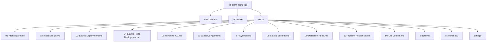

# Elastic Stack SIEM Home Lab

A hands-on cybersecurity home lab implementing Elastic SIEM, Active Directory, endpoint monitoring, detection engineering, and incident response workflows.

---

## Table of Contents

- [Project Overview](#project-overview)
- [Project Objectives](#project-objectives)
- [Environment Overview](#environment-overview)
- [Repository Structure](#repository-structure)
- [Documentation](#documentation)
- [Technologies Used](#technologies-used)
- [Current Project Status](#current-project-status)
- [Learning Goals](#learning-goals)
- [Skills Demonstrated](#skills-demonstrated)
- [Future Enhancements](#future-enhancements)
- [Screenshots](#screenshots)
- [Getting Started](#getting-started)
- [Disclaimer](#disclaimer)
- [Author](#author)
- [License](#license)

---

# Project Overview

The Elastic Stack SIEM Home Lab is a self-hosted cybersecurity training environment. It is designed to simulate the technologies and workflows that are commonly found in small enterprise Security Operations Centers (SOC).

The primary goal of this project is to develop practical, hands-on experience with SIEM administration, centralized logging, endpoint monitoring, Active Directory, detection engineering, and incident response while producing professional documentation that demonstrates the design, implementation, and operation of the environment.

This repository documents the complete lifecycle of the lab, including the initial design, deployment, configuration, security monitoring, and future enhancements.

---

# Project Objectives

- Build a functional Elastic Stack SIEM environment
- Deploy and manage Elasticsearch, Kibana, and Fleet Server
- Configure centralized log collection from Windows and Linux systems
- Deploy and manage Elastic Agents
- Implement Active Directory Domain Services
- Improve Windows visibility using Sysmon
- Create and test custom detection rules
- Practice security investigations and incident response
- Produce professional, reproducible technical documentation

---

# Environment Overview

## Infrastructure

| Component             | Technology            |
|-----------------------|-----------------------|
| Hypervisor            | Oracle VirtualBox     |
| Linux Platform        | Rocky Linux 9.8       |
| Windows Server        | Windows Server 2025   |
| Windows Client        | Windows 11 Pro        |
| SIEM Platform         | Elastic Stack 8.13.4  |
| Container Platform    | Docker                |

---

## Core Components

- Elasticsearch
- Kibana
- Fleet Server
- Elastic Agent
- Active Directory
- DNS
- Sysmon (Planned)

---

# Repository Structure

---

# Documentation

| Document                          | Description                                                                                                                                                   |
|-----------------------------------|---------------------------------------------------------------------------------------------------------------------------------------------------------------|
| 01-Architecture.md                | Documents the overall architecture, infrastructure, networking, identity services, and system relationships.                                                  |
| 02-Initial-Design.md              | Documents the original objectives, requirements, constraints, technology selections, and architectural decisions.                                             |
| 03-Elastic-Deployment.md          | Documents the installation and deployment of Elasticsearch, Kibana, Docker, and the initial Elastic Stack environment.                                        |
| 04-Elastic-Fleet-Deployment.md    | Documents Elastic Fleet deployment, Fleet Server configuration, Elastic Agent enrollment, agent policies, integrations, and centralized endpoint management.  |
| 05-Windows-AD.md                  | Documents Active Directory, DNS, organizational structure, and identity management configuration.                                                             |
| 06-Windows-Agent.md               | Documents the deployment, enrollment, and configuration of Elastic Agents on Windows endpoints.                                                               |
| 07-Sysmon.md                      | Documents Sysmon installation, configuration, and Windows endpoint visibility improvements.                                                                   |
| 08-Elastic-Security.md            | Documents Elastic Security configuration, including detections, alerts, cases, and analyst workflows.                                                         |
| 09-Detection-Rules.md             | Documents custom detection rules, testing procedures, and MITRE ATT&CK mappings.                                                                              |
| 10-Incident-Response.md           | Documents incident response workflows, investigations, evidence collection, and lessons learned.                                                              |
| 99-Lab-Journal.md                 | Documents implementation progress, troubleshooting, design decisions, and lessons learned throughout the project.                                             |

---

# Technologies Used

- Elastic Stack
- Elasticsearch
- Kibana
- Fleet Server
- Elastic Agent
- Docker
- Rocky Linux 9.8
- Windows Server 2025
- Windows 11 Pro
- Active Directory Domain Services
- DNS
- Sysmon
- Oracle VirtualBox

---

# Current Project Status

Status: Active Development

Completed:

- Initial project planning
- Architecture documentation
- Initial design documentation
- Elastic Stack deployment
- Active Directory deployment

In Progress:

- Fleet configuration
- Windows endpoint deployment
- Elastic Agent enrollment

Planned:

- Sysmon deployment
- Detection engineering
- Incident response workflows
- Threat hunting scenarios
- Attack simulation
- Additional Windows and Linux systems

# Learning Goals

This project is intended to develop practical experience with:

- SIEM Administration
- Security Monitoring
- Endpoint Visibility
- Active Directory
- Windows Administration
- Linux Administration
- Detection Engineering
- MITRE ATT&CK Framework
- Incident Response
- Security Operations Center (SOC) Workflows

# Skills Demonstrated

This project demonstrates practical experience with:

## SIEM Administration

- Elasticsearch
- Kibana
- Fleet Server
- Elastic Agent Management
- Dashboard creation
- Log ingestion and analysis

## Systems Administration

- Rocky Linux
- Windows Server 2025
- Windows 11
- Docker
- VirtualBox

## Identity Management

- Active Directory Domain Services
- DNS
- Group Policy
- Domain administration

## Security Operations

- Endpoint monitoring
- Detection engineering
- Threat hunting
- Security investigations
- Incident response workflows

## Documentation

- Technical documentation
- Architecture design
- Deployment procedures
- Configuration management
- Troubleshooting documentation

# Future Enhancements

Planned improvements include:

- Deploy additional Windows workstations
- Deploy additional Linux servers
- Add Kali Linux attack workstation
- Deploy Sysmon across Windows systems
- Create custom Elastic detection rules
- Implement MITRE ATT&CK mappings
- Simulate common attack scenarios
- Develop threat hunting playbooks
- Expand incident response documentation
- Automate portions of the deployment process

# Screenshots

Screenshots will be added as the environment reaches additional implementation milestones.

Planned screenshots include:

## Elastic Stack

- Kibana Security Overview dashboard
- Elasticsearch cluster health
- Fleet Server status
- Agent enrollment status

## Active Directory

- Domain Controller configuration
- Active Directory Users and Computers
- DNS configuration
- Group Policy configuration

## Security Operations

- Security alerts
- Detection rule execution
- Timeline investigations
- Host activity views

## Lab Infrastructure

- Virtual machine inventory
- Network architecture
- Deployment diagrams

---

# Getting Started

This repository documents the design, deployment, and operation of an Elastic Stack SIEM home lab.

The documentation is organized to follow the same order used during the original implementation, allowing the environment to be recreated from scratch.

Each document builds upon the previous one and includes explanations of both the implementation steps and the reasoning behind key design decisions.

## Prerequisites

To reproduce this lab you should have:

- Basic Linux administration knowledge
- Basic Windows Server administration knowledge
- Familiarity with virtualization concepts
- Oracle VirtualBox
- Rocky Linux installation media
- Windows Server 2025 installation media
- Windows 11 Pro installation media
- Reliable Internet access for software downloads

## Hardware Requirements

Minimum recommended:

- Modern multi-core processor
- 32GB RAM recommended
- 500GB available storage
- Hardware virtualization enabled
- SSD storage recommended

This lab was designed around:

- Intel Mac Mini (16GB RAM)
- Apple Silicon MacBook Air (32GB RAM)

## Deployment Order

The documentation is organized in the recommended review order used to understand, deploy, and operate the environment.

1. Architecture

2. Initial Design

3. Elastic Deployment

4. Elastic Fleet Deployment

5. Windows Active Directory

6. Windows Agent Deployment

7. Sysmon

8. Elastic Security

9. Detection Rules

10. Incident Response

The Lab Journal documents the complete implementation timeline and troubleshooting process throughout the project.

# Disclaimer

This environment is intended solely for educational, research, and portfolio purposes. All systems are deployed within a controlled home lab environment and are not intended for production use.

# Author

Terry Humphrey

Cybersecurity Home Lab Project

GitHub: https://github.com/terhumphrey

LinkedIn: https://www.linkedin.com/in/terhumphrey/

# License

This project is licensed under the MIT License. See the LICENSE file for details.